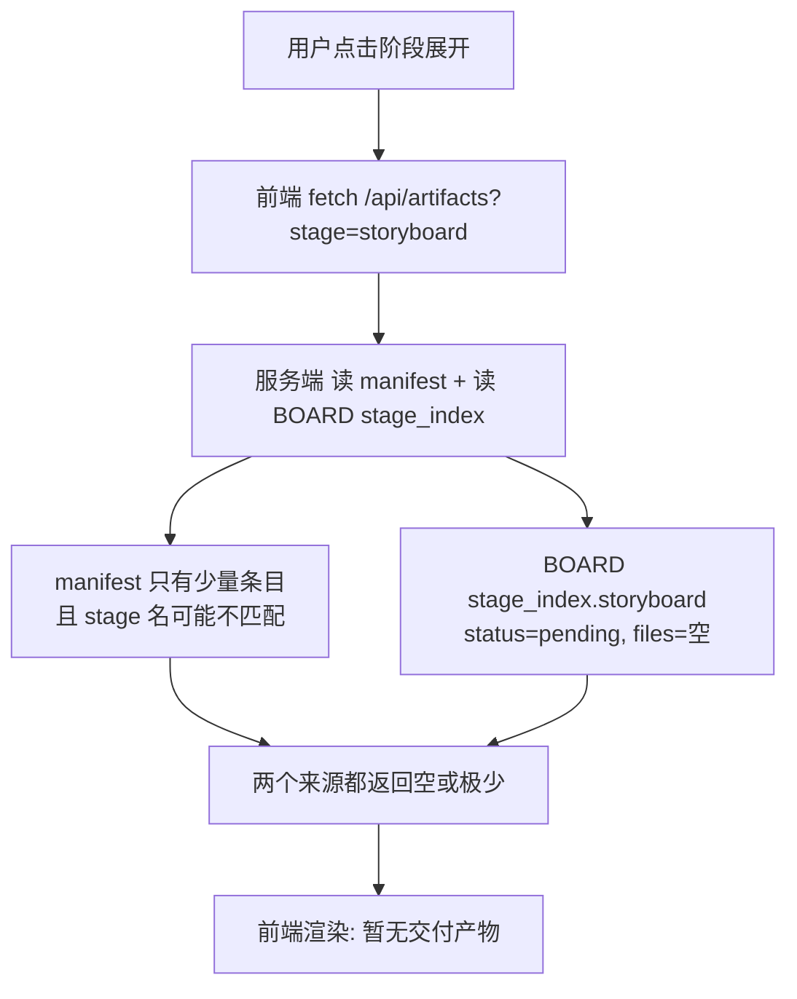
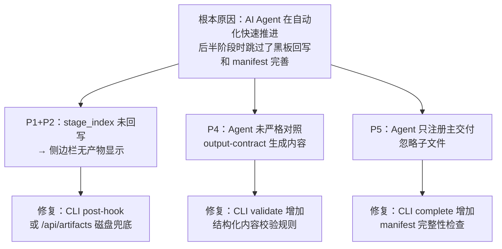

# SceneForge Web Console — worldcup 项目全流程问题清单与分析

> 基于 `projects/worldcup` 最新全流程测试结果

---

## 问题总览

| # | 类别 | 严重度 | 问题 |
|---|------|--------|------|
| P1 | 侧边栏产物显示 | 🔴 高 | 已完成阶段展开后显示"暂无交付产物"或产物数量为 0 |
| P2 | 黑板状态脱节 | 🔴 高 | `PROJECT_BOARD.md` 后半段 stage_index 全是 `pending` + 空文件列表 |
| P3 | AI 回复重复 | 🟡 中 | 聊天界面偶尔出现同一条 AI 回复渲染两次 |
| P4 | 产物内容不规范 | 🟡 中 | 输出文件结构与 output-contract 规范存在差距 |
| P5 | manifest 不完整 | 🟡 中 | `artifacts.manifest.yaml` 只注册了主交付，缺少 details 和子文件 |

---

## P1：侧边栏产物显示缺失

### 现象
左侧栏中 storyboard / audio / video_prompts / publish 等已完成阶段，点击展开后显示「暂无交付产物」或数量为 0。

### 根因链



**根因 1：`PROJECT_BOARD.md` 后半段 stage_index 没有被 AI Agent 回写**

看 [PROJECT_BOARD.md](file:///Users/tangwujun/Documents/trae_projects/scene_forge/projects/worldcup/PROJECT_BOARD.md#L313-L380)：

```yaml
storyboard:
    status: pending     # ← 应为 completed
    active_version:     # ← 应为 v1
    files:
      primary:          # ← 空！应为 outputs/storyboard_pack_1_all.md
      outputs: []       # ← 空！
```

storyboard / audio / video_prompts / publish 四个阶段的 `stage_index` 全部是 `pending + 空文件`，尽管 `PROJECT_STATE.json` 中它们都是 `completed`。

这意味着 AI Agent 在执行后半阶段时**只推进了 CLI 状态机，但没有回写 PROJECT_BOARD.md 的 stage_index**。

**根因 2：`artifacts.manifest.yaml` 缺少子文件注册**

[artifacts.manifest.yaml](file:///Users/tangwujun/Documents/trae_projects/scene_forge/projects/worldcup/artifacts.manifest.yaml) 只有 10 个条目（每阶段一个主交付），但磁盘上实际有 24 个 output 文件 + 15 个 detail 文件。design 阶段有 5 个 prompt 文件和 5 个 detail 文件，但 manifest 只注册了 `outputs/design.md` 一条。

**根因 3：`/api/artifacts` 的双来源合并逻辑对 pending board 无能为力**

[server.ts L448-L530](file:///Users/tangwujun/Documents/trae_projects/scene_forge/apps/web-console/server/server.ts#L448-L530) 的 API 先读 manifest，再读 board 的 stage_index.files 做补充。但当 board 的 files 全是空的时候，补充源也无效。

### 修复方案

1. **核心修复（AI Agent 侧）**：在 skill 中强化 stage_index 回写纪律——`cli.js complete` 成功后，必须把落盘的文件路径回写到 board 的 `stage_index.{stage}.files` 和 `status`
2. **工程防线（Web Console 侧）**：在 `/api/artifacts` API 中增加**第三来源**——当 manifest 和 board 都返回空时，扫描磁盘 `outputs/` 目录，按文件名推断阶段归属，作为兜底

---

## P2：PROJECT_BOARD 与 PROJECT_STATE 状态脱节

### 现象

| 字段 | PROJECT_STATE.json | PROJECT_BOARD.md |
|------|-------------------|-----------------|
| storyboard.status | `completed` | `pending` |
| audio.status | `completed` | `pending` |
| video_prompts.status | `completed` | `pending` |
| publish_review.status | `ready` | `pending` |

### 根因

AI Agent（Claude）在执行后半流程时采取了"快速通过"模式：

1. 读取了上游 handoff → 生成了内容并写入磁盘文件
2. 调用 `cli.js start/complete` 推进了 CLI 状态机
3. **但跳过了 PROJECT_BOARD.md 的 stage_patches / stage_index 更新**

这在 `cli.js complete` 的设计中是合理的——CLI 只管 `PROJECT_STATE.json`，board 的回写是 AI Agent 的责任。但 Agent 在自动化快速推进时经常遗漏这一步。

### 修复方案

1. **方案 A（推荐）**：在 `cli.js complete --stage <stage>` 的逻辑中增加一个 post-hook，自动从 manifest 和磁盘文件反推 stage_index 并 patch 进 BOARD
2. **方案 B**：在 web console 的 `/api/state` 或 `/api/artifacts` 中做"自动对账"——检测到 STATE 为 completed 但 BOARD 为 pending 时，自动同步 board

---

## P3：AI 回复显示重复

### 现象

AI 回复内容偶尔在聊天界面渲染两次（完全相同的内容出现两条气泡）。

### 可能根因

查看 [liveBubbleAccumulator.ts](file:///Users/tangwujun/Documents/trae_projects/scene_forge/apps/web-console/server/liveBubbleAccumulator.ts) 的去重逻辑：

```typescript
function appendChunk(previous, incoming) {
  if (incoming === previous) return previous;     // 完全相同 → 跳过
  if (incoming.startsWith(previous)) return incoming; // incoming 包含 previous → 替换
  if (previous.endsWith(incoming)) return previous;   // previous 尾部已有 → 跳过
  return previous + incoming;                         // 否则追加
}
```

**问题场景**：当 streaming 结束后，server 通过 `assistant_message` 事件推送最终内容。如果 stream delta 已经累积了完整内容，而 assistant_message 又再次推送相同内容，但它们作为**不同 bubble ID** 到达前端，前端会渲染两条。

去重逻辑只在**同一 bubble** 内去重（同 ID 追加/替换），但无法阻止**两个不同 ID 的 bubble 包含相同文本内容**。

### 修复方案

1. **方案 A**：在 [server.ts](file:///Users/tangwujun/Documents/trae_projects/scene_forge/apps/web-console/server/server.ts) 的 WebSocket 消息处理中，增加跨 bubble 内容去重——当新 bubble 的 `content` 与前一条 `text` 类型 bubble 的 content 完全相同或是子串时，跳过推送
2. **方案 B**：在前端 `VariantB.tsx` 的 bubble 过滤逻辑中，对相邻的同类型 text bubble 做内容去重

---

## P4：产物内容不符合 output-contract 规范

### P4.1 角色设计提示词

**规范要求**（[output-contract.md](file:///Users/tangwujun/Documents/trae_projects/scene_forge/.agents/skills/scene-design-builder/references/output-contract.md#L359-L376)）：

| 要求项 | 规范 | worldcup 实际 |
|--------|------|---------------|
| 视角 | 正面/3-4/侧面/背面 四视角 | ✅ 有 |
| 轮廓剪影区 | 必须 | ✅ 有 |
| 剧本驱动表情 | 6-9 个 | ✅ 6 个表情 + 3 微表情 |
| 微表情 | 2-4 个 | ✅ 3 个 |
| 动作姿态 | 4-6 个 | ✅ 6 个 |
| 道具交互 | 至少 1 个 | ✅ 有 |
| 服装配件区 | 至少 1 组 | ✅ 详细 |
| 比例对照 | 角色间比较 | ⚠️ 只有人与足球对比，缺少角色间对比 |
| 物理/安全边界 | 必须 | ✅ 有 |
| 表现力扩展边界 | 动画物理/卡通伤害/反差 | ❌ 缺失（虽然本项目关闭了 expressive_animation，但应声明关闭） |

**结论**：角色设计提示词 **基本合规**，但缺少角色间比例对照和 expressive_animation 关闭声明。

### P4.2 分镜内容

**规范要求**（[storyboard output-contract.md](file:///Users/tangwujun/Documents/trae_projects/scene_forge/.agents/skills/scene-storyboard-director/references/output-contract.md)）：

| 要求项 | worldcup 实际 |
|--------|---------------|
| 总板包含 storyboard_prompt_pack 标题 | ✅ 有 |
| 包结构表 + Hero Shot | ✅ 有 |
| 四线连续性 | ✅ 有（空间/动作/情绪/光影） |
| 桥接帧 | ✅ 有 |
| **双版故事板 prompt（控制版+风格版）** | ❌ **完全缺失** |
| **MasterPrompt 12 格总板** | ❌ **完全缺失** |
| 详细分镜清单 | ⚠️ 有 shotlist 但放在 details/ |
| beat_skeleton.md | ❌ 缺失 |
| video_generation_units.md | ❌ 缺失（但在 script 阶段有） |
| 质量校验报告 | ❌ 缺失 |

> [!CAUTION]
> **分镜阶段最大问题**：没有生成 `ControlBoard`（控制版）和 `StyleBoard`（风格版）prompt，也没有 `MasterPrompt` 总板。这些是 output-contract 的核心交付要求，也是视频提示词阶段的重要上游输入。

### P4.3 视频提示词

**规范要求**（[video-prompt output-contract.md](file:///Users/tangwujun/Documents/trae_projects/scene_forge/.agents/skills/scene-video-prompt-builder/references/output-contract.md#L250-L260)）：

| 要求项 | worldcup 实际 |
|--------|---------------|
| 中英文双版导演长版 | ✅ 每个 pack 含中英文 |
| pack_audio_execution_plan | ✅ 有 |
| segment_sound_execution | ✅ 有 |
| Segment + Shot + Timecode 双层结构 | ✅ 有（镜头号 + 时间码） |
| 全局执行前导 (global_execution_preamble) | ❌ 只在 pack 内用了一行提示，没有结构化前导块 |
| 项目级全局规则 (project_level_global_rules) | ❌ 缺失 |
| 段技术控制块 (segment_technical_control_block) | ❌ 缺失 |
| 负向约束 | ✅ 有 |
| 视觉锚词 | ✅ 有 |
| quality_check 自审报告 | ❌ 缺失 |
| blocking_continuity / prop_state_continuity | ❌ 缺失 |
| prompt_trace 上游追溯 | ❌ 缺失 |
| **四层有序结构**（preamble → rules → control → shots） | ❌ **缺失**，目前只有"音频表+中英文prompt"两层 |

> [!WARNING]
> 视频提示词的**内容质量尚可**（每个 pack 有具体的镜头描述、音频计划、负向约束），但**结构不符合 output-contract 的四层有序规范**。缺少 global_execution_preamble、project_level_global_rules、segment_technical_control_block 三个结构化层级。

---

## P5：manifest 注册不完整

### 现象

[artifacts.manifest.yaml](file:///Users/tangwujun/Documents/trae_projects/scene_forge/projects/worldcup/artifacts.manifest.yaml) 只有 10 条记录，每阶段仅注册 1 个主交付 `final/primary`。

### 实际磁盘文件数

| 类别 | 文件数 | manifest 注册数 |
|------|--------|----------------|
| outputs/ | 24 个 | 10 个 |
| details/ | 15 个 | 0 个 |

design 阶段：5 个 prompt + 1 个 design.md = 6 个 output 文件，但 manifest 只有 `design-md` 一条。

### 影响

侧边栏展开 design 阶段时，最多只能看到 1 个文件（manifest 来源），而不是全部 6 个 prompt 文件。

### 修复方案

AI Agent 落盘产物时必须同步注册到 manifest。可以在 `cli.js complete` 的校验环节增加 manifest 完整性检查。

---

## 原因总结：为什么会出现这些问题



核心矛盾：**CLI 状态机只校验"是否有主交付文件 + frontmatter 格式"，不校验"黑板是否回写了 stage_index"和"manifest 是否完整注册了所有文件"**。

---

## 修复优先级建议

| 优先级 | 问题 | 修复方向 | 工作量 |
|--------|------|---------|--------|
| 🔴 P0 | P1+P2 侧边栏无产物 | `/api/artifacts` 增加磁盘扫描兜底 + CLI post-hook 自动同步 board | 中 |
| 🟡 P1 | P3 回复重复 | server 端跨 bubble 内容去重 | 小 |
| 🟡 P2 | P5 manifest 不完整 | CLI complete 时从磁盘反推 manifest 条目 | 中 |
| 🟢 P3 | P4 内容不规范 | CLI validate 增加结构化 section heading 和层级校验 | 大（需逐 skill 配置） |
