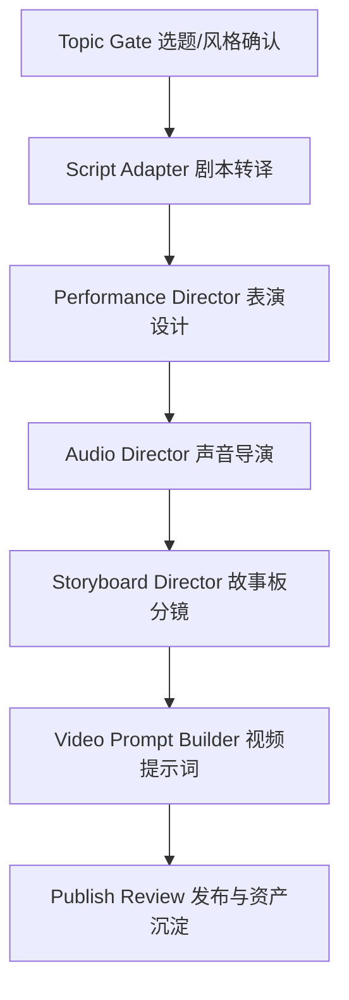
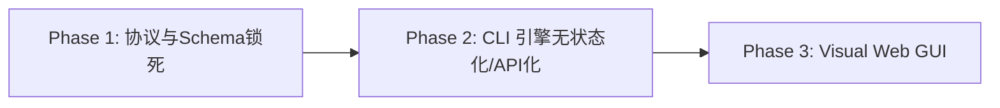

# SceneForge 架构分析与演进规划报告

本报告基于 `.handoff/` 记录以及 `/var/folders/` 下的架构审查报告，针对 SceneForge 现存的**规则执行偏差**、**上下文漂移**以及未来**可视化流程执行与 CLI 协同**的演进方向进行深度分析，并提供具体可落地的架构方案。

---

## 一、 对项目的核心理解与当前痛点

### 1. 项目本质与执行流
SceneForge 是一个**高度专业化、多阶段协同的 AI 自媒体/动画短片内容生成管线**。它通过编排不同的阶段角色（Topic Gate选题闸门 -> Script剧本 -> Performance表演 -> Audio声音 -> Storyboard分镜 -> Video Prompt视频提示词），将创作者的原始创意最终翻译为高质量的、具备一致性约束的 AI 绘图与视频提示词包。

### 2. 当前核心痛点：规则“软约束”导致的跑偏
在真实运行中，Agent 常常出现**不遵守规则、体裁生成错误、使用禁用词、将中间草稿误当成最终交付**等问题。

其根本原因在于当前的**“规则三件套”配置模式**：
*   **重复与口径漂移**：同一个不变量同时用 prose（自然语言）书写在 `SKILL.md`（行为约束）、`output-contract.md`（产物约束）和 `board-protocol.md`（状态约束）中，导致维护困难，修改时容易漏掉。
*   **纯文本校验薄弱**：校验闸门（Quality Gate）全靠 Agent 在 `review` 阶段“自查自纠”。在上下文充满长篇大论时，Agent 极易对某些文本规则视而不见或“妥协性通过”。
*   **浅模块漏水**：`scene-forge` 作为一个总控，同时把项目发现、路由判断、文件合并、兼容降级等逻辑揉在一起，缺乏清晰的物理分界（Seam）。

---

## 二、 避免上下文漂移（Context Drift）的系统性方案

由于每个阶段都会产生大量的“长文本产物”（例如详细的分镜说明、中英文对照、声音轨道铺设等），如果任由其堆积在 Agent 的上下文窗口中，必然导致**注意力溃散（Token Pressure）**和**不遵守准则**。

我们提出以下三个层级的解决方案，通过**物理隔离、状态压缩和机器级强校验**来杜绝上下文漂移：

### 1. 主交付物与中间稿的“生命周期物理分离”（Artifact Taxonomy）
将每个阶段产生的文件分为四种状态，**Agent 在执行后续阶段时，默认只被允许读取上一阶段的 Final 状态文件**：

| 产物分类 | 存储位置与命名 | 读取策略 (Downstream Read) | 作用 |
| :--- | :--- | :--- | :--- |
| **Preview** | `projects/<slug>/details/<stage>/preview_*.md` | **禁止下游读取** | 供用户首轮审查，展示风格或分镜的多重候选，不作为生成基座。 |
| **Draft** | `projects/<slug>/details/<stage>/draft_*.md` | **禁止下游读取** | 逐镜头细节、中间推理过程、草稿、临时数据。 |
| **Review** | `projects/<slug>/details/<stage>/review_*.md` | **禁止下游读取** | 校验检查项清单、差异对比、自查报告。 |
| **Final** | `projects/<slug>/outputs/<stage>_pack*.md` | **仅允许读取此文件** | 最终收尾后合并的、纯粹干净的主交付件（如正式提示词包、声音合成块）。 |

> [!IMPORTANT]
> **切断泄漏链**：严禁下游阶段（如 `video-prompt`）直接读取上游（如 `storyboard`）的 `draft_*` 或 `preview_*`。上游必须有且仅有一个 `final` 文件作为下游的 `source_intake`。

### 2. 按需上下文压缩与“交接协议化”（Stage Handoff Compression）
与其让 Agent 自己去大海捞针式地阅读上游全套文件，不如在每个阶段结束时，由该阶段 Agent 自动生成一份**极度压缩的 `Stage Handoff`（交接单元）**，写入 `PROJECT_BOARD.md` 的状态树或独立的 `handoff.json` 中：

*   **做法**：在阶段 Review Gate 通过后，触发一个 Handoff 汇编动作，把该阶段对下阶段最关键的决策（如风格家族、物理遮罩、核心声音情绪、禁止词列表）提炼为不足 1000 tokens 的结构化 Key-Value 数据。
*   **效果**：后续 Agent 启动时，只加载 `PROJECT_BOARD.md` 的 Handoff 数据以及 `outputs/` 中的 Final 文件，上下文杂质降低 90%。

### 3. 引入“机器可执行”的 Schema 校验器（Headless Linter）
这是阻断“绕过规则”的最强手段。将 Prose 规则升级为 **文档 + 校验脚本**：

*   **规则落盘为 JSON Schema**：定义分镜包、视频提示词包的 JSON/YAML Schema，规定必须含有字段（例如必须包含 `pack_audio_execution_plan`、`segment_sound_execution` 等）。
*   **本地 Validator 拦截**：在 `scene-forge` 推进状态前，自动静默运行一个轻量 Python/Node 脚本（例如 `rtk python validate.py --stage storyboard`）。
    *   校验文件命名规范
    *   校验 Schema 结构
    *   使用正则表达式或关键词匹配检测敏感词（如演员真名、IP 泄露）
*   **反馈回路**：如果 Lint 失败，直接将报错信息喂回给 Agent 并强行打回当前阶段。**只有机器校验通过，状态机才允许推进到 Completed。**

---

## 三、 类似 Open-Design 的可视化流程执行与 CLI 协同设想

您提到的 `nexu-io/open-design` 模式是一个极好的终局设想。通过构建一个可视化 UI，能够把“黑盒式的 CLI 交互”变成“白盒式的状态流转与即时干预”。

### 1. 架构演进三步走（在现有流程优化后）

*   **Phase 1 (当前)：协议与 Schema 锁死**
    *   先按本报告第二章，把主交付物、Handoff 格式和 Validator 脚本在 CLI 侧写死。保证在没有 UI 的情况下，CLI 本身是百分之百严谨的。
*   **Phase 2：CLI 引擎无状态化与 API 化**
    *   将 `scene-forge` 引擎封装为标准的命令行工具，支持 API 输出模式。例如：
        *   `scene-forge status --json`：输出当前项目的阶段状态树、当前卡点、未通过的质量门。
        *   `scene-forge run --stage <stage> --preview`：仅生成预览，不改变状态。
        *   `scene-forge approve --stage <stage>`：推进状态。
*   **Phase 3：Visual Web GUI (前端控制台)**
    *   构建一个轻量本地 Web 页面（如基于 Vite + React/Svelte + Tailwind）。
    *   前端通过 Node/Python 后端调用 `scene-forge` CLI 的 JSON API 来渲染管道图（Timeline Canvas）。

### 2. CLI 与 GUI 的双向实时协同机制

要在界面上实现“边执行、边聊天修正、边查看产物”，可以采用以下集成方案：

#### 方案 A：Model Context Protocol (MCP) 桥接（推荐）
*   **原理**：利用 Anthropic 推出的 MCP 协议。将 SceneForge 引擎实现为一个 **MCP Server**。
*   **工作流**：
    1.  当您在 GUI 界面上点击“生成 Script 预览”时，前端向 Claude / Codex CLI 发送一个指令。
    2.  Agent 借助 MCP 工具（如 `read_project_board`、`generate_script`）进行上下文收集与代码生成。
    3.  Agent 将产物直接写入本地工作区，GUI 的文件监听器（File Watcher）实时捕获 `details/` 或 `outputs/` 下的变化，并在界面右侧渲染 Markdown 渲染视图或 Diff 视窗。

#### 方案 B：双工 WebSocket 终端（Live Chat Panel）
*   **原理**：GUI 内部嵌入一个伪终端窗口，将 `claude cli` 的标准输入输出重定向到界面中。
*   **工作流**：
    1.  **流式查看**：Agent 在执行分镜设计时，界面上的“镜头网格 (Shot Grid)”会随着 Agent 写入文件而实时点亮、展开。
    2.  **打断与聊天修正**：在 Agent 执行过程中，如果您在聊天框输入“这里动作幅度不要这么大，换成微表情”，该输入直接作为 stdin 送给正在挂起的 Agent 进程，Agent 接收到修正指令后，原地修改文件并重新生成。
    3.  **阶段审核可视化**：每一个 Gate（如 `storyboard_quality_check`）在界面上呈现为红绿灯。红色时，点击可直接查看 Linter 输出的具体错误行；绿色时，呈现 "Approve" 按钮，用户点击后触发状态变更。

---

## 四、 后续行动路线建议

在您准备优化现有流程时，建议遵循以下优先级逐步推进：

1.  **第一步（立即执行）**：建立 `CONTEXT.md` 描述 SceneForge 的核心领域概念，编写 1~2 篇 ADR（架构决策记录）将状态机逻辑和主交付体裁规则落盘。
2.  **第二步（本周）**：在 `.agents/skills/scene-forge/` 下编写第一个 `validator.py`，专门对 `storyboard` 阶段的 outputs 进行 Schema、敏感词和声音块存在的机器校验，在 `board-protocol.md` 中把这一机器校验作为 Completed 状态的硬性前置条件。
3.  **第三步（本周五）**：规范化 `outputs/` 与 `details/` 的物理隔离，只给下游 Agent 暴露 Final 文件。
4.  **第四步（下阶段）**：将 CLI 命令标准化（统一 JSON 结构输出），为开发 GUI 奠定无状态的后端接口基础。
