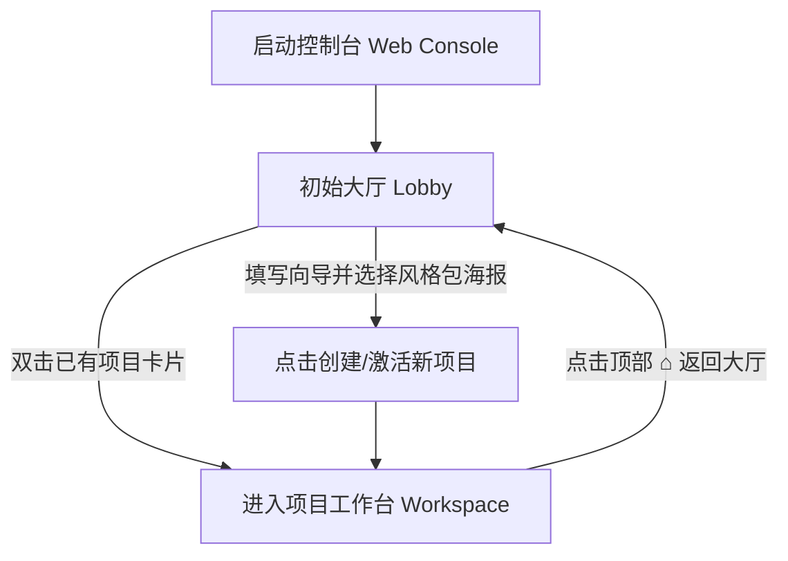

# SceneForge v9 Web 控制台 UI 设计与交互说明文档

本设计文档旨在固化 SceneForge v9 Web Console 的界面功能点、交互逻辑、版面布局和转场细节。本规范在正式编码开发前作为唯一的设计标准，并为后续 UI 视觉风格的设计演进提供基准依据。

---

## 1. 核心交互流程与生命周期 (Lobby to Workspace)

控制台采用 **“两阶段流转”** 的设计模式，将项目的初始化与制作过程进行物理隔离：



### 1.1 项目欢迎大厅 (Lobby)
*   **状态表现**：当后台 `status` 接口返回未绑定具体项目目录（或手动点击“返回大厅”）时呈现。整个大厅为沉浸式全屏布局。
*   **左侧：最近编辑项目卡片组**
    *   **项目发现逻辑**：后端 Express 自动读取 workspace 根目录下的目录列表，并检查该目录下是否存在 `PROJECT_STATE.json`。如存在，将其作为项目实例拉取到大厅。
    *   **卡片样式**：卡片为 20% 半透明磨砂底色，显示项目名称（Slug）、最后修改时间（格式化为 `YYYY-MM-DD HH:MM`）以及当前处于的制作阶段（以小徽章表示）。
    *   **交互**：
        *   单击卡片：卡片周围亮起 1px 的主题高亮边框，右侧向导显示该项目的基本配置。
        *   双击卡片：触发过渡动画（Lobby 大厅整体 `opacity: 0; transform: scale(0.98)` 渐隐，耗时 300ms 缓动），然后正式渲染加载并展示工作台（Workspace）。
*   **右侧：新建项目表单向导 (Project Wizard)**
    *   **表单字段**：
        1.  `项目目录名称`（必填，英文字符，限制正则 `^[a-zA-Z0-9_-]+$`，自动排重）。
        2.  `选题核心想法 (Concept)`（多行文本，限制 300 字内）。
    *   **风格包选择卡片墙 (Style Poster Cards)**：
        *   平铺展示检测到的风格 ID 卡片。
        *   在当前无配图情况下，卡片以 **“极简渐变色（CSS Gradient）+ 风格名 + 核心 Emoji”** 呈现（例如：*迪士尼3D ➜ 橙紫渐变卡 + 🎭*；*经典胶片 ➜ 炭灰渐变卡 + 🎬*）。
        *   点击卡片：卡片右上角亮起 `✓` 选中图标，并触发 `scale(0.97)` 的“按压下去”物理回弹动效。
    *   交互：点击 `[🚀 创建并激活项目]`，向后端发送初始化指令。

---

## 2. 工作台界面布局与版面框架 (Main Workspace Layout)

为最大化核心工作区的视野，工作台放弃原先的“垂直三栏”布局，采用 **「顶部步进轨 + 下方左右双大面板」** 结构：

```
+-----------------------------------------------------------------------------+
| 🎬 SceneForge v9   [项目名: Demo] [风格: 迪士尼]              [⚙️]  [🌓 切换主题] |
+-----------------------------------------------------------------------------+
|  Timeline Track:  (1) 💡选题  ==>  (2) ✍️剧本  ==>  (3) 🎭表演  ==>  (4) 🔊声音 ...|
+-----------------------------------------------------------------------------+
|                     |                                                       |
|  [💻]对话模式切换    |  [📄 outputs/script.md        ] [▼ 产物切换]           |
|  +----------------+ |  +-------------------------------------------------+  |
|  |                | |  | [Quick Copy Dock (提示词快捷聚合提取板)]         |  |
|  |  Agent Bubble  | |  |  - 角色A Prompt [📋]  - 场景B Prompt [📋]        |  |
|  |  (Thought fold)| |  +-------------------------------------------------+  |
|  |                | |  |                                                 |  |
|  |  User Bubble   | |  |   Markdown Rendered Area (正文阅读区)            |  |
|  |                | |  |                                                 |  |
|  |                | |  |   [💡 ValidationError Inspector (行定位)]       |  |
|  +----------------+ |  |    - 行 23: 包含禁用词 "震惊" [🔍 定位]          |  |
|  | Action Dock    | |  |                                                 |  |
|  | [🚀 START]     | |  |                                                 |  |
|  +----------------+ |  |                                                 |  |
|  | Input Box      | |  |                                                 |  |
|  +----------------+ |  +-------------------------------------------------+  |
|                     |                                                       |
+-----------------------------------------------------------------------------+
```

### 2.1 顶置横向阶段 Timeline 滑轨 (Timeline Track)
*   **功能**：平铺展示 Topic Gate 到 Publish Review 的 7 个开发阶段节点。
*   **状态与过渡动效**：
    *   `ready`：灰色，待激活。
    *   `in_progress`：橙黄呼吸灯闪烁（`animation: pulse 1.5s infinite`）。
    *   `review_failed`：红色微光，代表校验被打回。
    *   `completed`：绿色，常亮。
*   **交互逻辑**：
    *   **节点 Hover**：触发 `scale(1.03)` 的上浮微动，并伴随主题色的外阴影（`box-shadow: 0 4px 15px rgba(...)`）。
    *   **节点 Click（联动切换）**：点击任意节点，右侧预览区会瞬间切换到该阶段对应的文件。如该阶段有多个文件，默认加载 `kind = 'final'` 的最佳产物。

---

## 3. 产物浏览与提示词极速拷贝 (Artifacts & Copier)

### 3.1 预览区多文件切换查看 (Artifact Selector)
*   右侧预览区头部放置一个 **「产物文件下拉框」**，读取自 `artifacts.manifest.yaml`：
    *   当点击 Timeline 中的任意阶段时，该下拉框会动态列出该阶段名下登记的所有文件（包括 Draft、Review 或者是 Final 级别文件）。
    *   用户在下拉框点选后，右侧正文区立即 Fetch 对应文件的 Markdown 内容并进行优雅的排版渲染。

### 3.2 提示词一键快速拷贝 (Prompt Copier)
影视生成流极度依赖向外部平台拷贝 Prompt，界面提供两重快速通道：

1.  **正文内高亮提示词卡 (Prompt Cards)**：
    *   **提取正则**：在渲染 Markdown 时，通过解析器匹配特定的代码块（如 ````prompt` / ````flux` / ````video-prompt`），将其拦截并不渲染为普通 code 代码块，而是渲染为独立的“提示词卡片”。
    *   **复制交互反馈 (Visual Feedback)**：
      *   卡片右上角放置 **`[📋 Copy]`** 按钮。
      *   点击后，按钮图标和文字在 **200ms 内渐变为 `[✓ Copied]`**，卡片背景泛起一层绿色微光动画，1.5 秒后平滑复原。
2.  **预览区头部快捷聚合提取板 (Quick Copy Dock)**：
    *   在文件路径栏正下方放置一个可折叠/展开的抽屉区域。
    *   扫描并列出文档中所有的 Prompts 清单（如：`· 角色 - 少女爱丽丝 [📋]`、`· 场景 - 荒凉废墟 [📋]`）。
    *   交互：点击清单中的复制按钮，同样触发上述复制交互反馈，无需滑动翻阅长文档。

---

## 4. 报错与警报分层机制 (Errors & Alerts)

为避免生硬的报错打断创作心流，系统区分业务报错与硬性系统故障：

### 4.1 Agent 业务报错与行高亮定位 (ValidationError Inspector)
*   **呈现方式**：Agent 校验失败时，直接在中间的**聊天流**里由 AI 导演温和反馈（例如：“我的导演校验未通过，发现了一些细节排版瑕疵，具体已列在右侧看板中，请您调整下”）。
*   **ValidationError 看板**：
    *   预览区右侧或底部会切出红色边框的辅助板，将 `validation_report.json` 里的错误以卡片展示。
    *   卡片附带 **`[🔍 定位]`** 键。
    *   **行高亮交互 (Line Highlight & Scroll)**：
      *   点击 `[🔍 定位]`，右侧正文渲染区域会自动平滑滚动（`scrollIntoView({ behavior: 'smooth' })`）将出错的那一行置于视窗中央。
      *   该行背景会亮起淡红色的高亮提示，并闪烁 3 次（每次闪烁耗时 400ms），随后恢复正常，指引效果极强。

### 4.2 程序级硬报错 (System Alerts)
*   如果是底层连接断开、文件系统硬性锁定，或命令行崩溃，则在页面最上方弹窗全局的红色 **「警报横幅」**，且在解决前无法进行工作台操作。

---

## 5. 对话终端与流程控制 (PTY & Action Dock)

### 5.1 操作按钮聊天框闭环 (Action Dock)
*   快捷宏按钮（Start/Validate/Complete）全部剥离自 Pipeline，集成在**聊天输入框的顶部上方**。
*   根据当前活跃阶段的状态动态呈现当前核心操作：
    *   `ready` 阶段 ➜ 显示 `[🚀 开启当前阶段 (Start)]`。
    *   `in_progress` / `review_failed` 阶段 ➜ 显示 `[🔍 格式校验 (Validate)]` 和 `[✓ 确认提交 (Complete)]`。
    *   **交互效果**：点击按钮时，按钮置灰并显示加载动画（Spinner），同时自动在后台 PTY 向 Agent 发送命令。命令执行完毕且状态广播变更后，按钮恢复可用状态并更新。

### 5.2 对话会话双模式一键切换 (Terminal Toggle)
*   **精美气泡模式 (Chat View - 默认)**：将原始终端输出清洗。Agent 的 thought 思考逻辑和 tool 命令调用自动折叠，仅显示清爽的人机白话聊天。
*   **开发者终端模式 (Terminal Mode - 极客模式)**：
    *   点击对话区右上角的 **`[💻 终端 (Terminal)]`** 切换按钮。
    *   **转场动画**：对话面板与 PTY 窗口之间执行 **180度水平卡片翻转 (Card Flip 3D Transition)**，伴随微妙的景深缩放和旋转（`transform: rotateY(180deg)`，耗时 400ms 缓动），展现极高的工业级质感。

---

## 6. 双风格主题与热配置

*   **双主题切换**：
    *   控制台提供右上角主题热切换开关，可在 **Cinema Studio Dark (深暗金影院风)** 和 **Modern Light & Dark (现代 SaaS 极简冷灰风)** 之间自由切换。
*   **热配置管理**：
    *   顶栏项目元数据展示区提供 **`[⚙️ 配置]`** 齿轮按钮。
    *   点击后，在屏幕中央弹出一个毛玻璃质感的配置弹窗（Modal）。
    *   **配置项**：
      1.  `director_style_id`（风格包，提供当前可用风格的下拉点选）。
      2.  `project_name`（项目别名/用于大厅显示的名称）。
    *   保存时，向后端发送写入请求，由后端重写物理 `PROJECT_STATE.json` 文件。

---

## 7. 样式系统与 CSS 设计规范 (Design Token)

为保障两套风格的一致性与扩展性，全量样式由以下统一的 CSS 变量驱动：

### 7.1 HSL 设计令牌 (Design Tokens)

| Token 变量名 | Cinema Studio Dark (深暗金) | Modern Light (极简明亮) |
| :--- | :--- | :--- |
| `--bg-main` | `hsl(220, 20%, 5%)` (深墨黑) | `hsl(210, 20%, 98%)` (纸张灰) |
| `--bg-panel` | `hsl(220, 20%, 8%)` (炭灰) | `hsl(0, 0%, 100%)` (纯白) |
| `--bg-card` | `hsla(220, 20%, 12%, 0.75)` (带毛玻璃) | `hsla(210, 20%, 96%, 0.8)` (淡灰) |
| `--border-color`| `hsla(220, 20%, 30%, 0.15)` | `hsla(0, 0%, 0%, 0.08)` |
| `--text-title` | `hsl(0, 0%, 100%)` (亮白) | `hsl(0, 0%, 0%)` (纯黑) |
| `--text-body` | `hsl(210, 10%, 80%)` (银灰) | `hsl(0, 0%, 30%)` (深灰) |
| `--color-accent` | `hsl(42, 78%, 56%)` (暖琥珀金) | `hsl(250, 100%, 50%)` (皇家蓝) |

### 7.2 规范定律 (General Guidelines)
*   **圆角体系**：面板为 `border-radius: 12px`；卡片为 `8px`；输入框及按钮为 `6px`；大厅海报为 `16px`。
*   **过渡律 (Transition)**：全局微动效统一采用 `transition: all 0.25s cubic-bezier(0.4, 0, 0.2, 1)`，避免生硬跳变。
*   **毛玻璃定律**：所有弹层与浮窗必须带有 `backdrop-filter: blur(12px)` 与 `-webkit-backdrop-filter: blur(12px)`，保障通透感。
