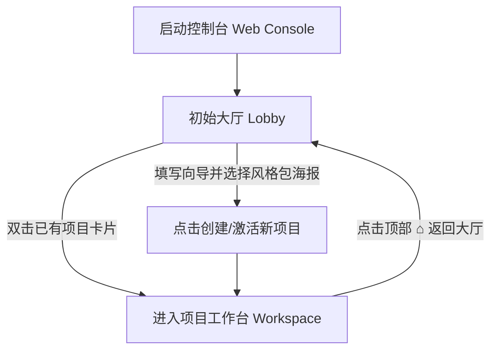

# SceneForge v9 Web 控制台 UI 设计与交互说明文档

> **最后更新**: 2026-06-09 — 同步至实际代码实现状态  
> **标记说明**: ✅ 已实现 | ⏳ 计划中 | ❌ 已废弃

本设计文档旨在固化 SceneForge v9 Web Console 的界面功能点、交互逻辑、版面布局和转场细节。本规范在正式编码开发前作为唯一的设计标准，并为后续 UI 视觉风格的设计演进提供基准依据。

---

## 0. 技术栈与组件库（2026-06 更新）

### 0.1 前端技术栈 ✅
- **UI 组件库**: [shadcn/ui](https://ui.shadcn.com/)（基于 Radix 原语 + Tailwind CSS）
- **图标**: [lucide-react](https://lucide.dev/)
- **样式**: Tailwind CSS v3 + CSS 变量设计令牌
- **滚动条**: shadcn ScrollArea（Radix ScrollArea 原语）
- **构建**: Vite + React 18 + TypeScript

### 0.2 已集成 shadcn 组件 ✅
Button, Card, Input, Textarea, Badge, Alert, Collapsible, Tooltip, Separator, ScrollArea

### 0.3 UI 主题 ✅
当前统一使用 **Swiss Neo-Geek Grid（Variant B）** 作为唯一 UI 主题，基于 Apple 设计语言（SF 字体、毛玻璃、暗黑底）。原计划的双主题热切换（Cinema Dark / Modern Light）已简化为单主题。

### 0.4 后端 AI 桥接 ✅
- Claude Code CLI (`--print` 非交互模式) + `--session-id` / `--resume` 实现会话隔离
- 首次消息自动注入项目上下文（AGENTS.md + 管线阶段 + 项目状态）
- 每个 WebSocket 连接分配独立 UUID，多连接会话不串

---

## 1. 核心交互流程与生命周期 (Lobby to Workspace)

控制台采用 **“两阶段流转”** 的设计模式，将项目的初始化与制作过程进行物理隔离：


```mermaid
graph TD
    A[启动控制台 Web Console] --> B[初始大厅 Lobby]
    B -->|双击已有项目卡片| C[进入项目工作台 Workspace]
    B -->|填写向导并选择风格包海报| D[点击创建/激活新项目]
    D --> C
    C -->|点击顶部 ⌂ 返回大厅| B
```

### 1.1 项目欢迎大厅 (Lobby) ✅

*   **状态表现**：当 `GET /api/projects/active` 返回 `{ active: false }` 时呈现。全屏深色背景 + 径向渐变。
*   **技术实现**：Lobby.tsx，使用 shadcn/ui Card/Button/Input/Textarea/Badge/Alert/ScrollArea 组件。
*   **左侧：最近编辑项目卡片组**
    *   **项目发现逻辑**：`GET /api/projects` 扫描 `projects/` 子目录，排除 `_template` 和 `.` 开头目录，读取每个项目的 PROJECT_STATE.json。
    *   **卡片样式**：圆角卡片 + 毛玻璃效果（`backdrop-blur-xl`），hover 上浮 `translate-y-0.5` + 阴影，选中状态亮蓝边框。
    *   **卡片内容**：Folder 图标 + 项目 slug + 进度文字（N/M 阶段已完成）+ 最后修改日期 + 进度条。
    *   **交互**：
        *   单击卡片：边框高亮为主题蓝色。
        *   双击卡片：调用 `POST /api/projects/active` 激活项目，前端切换至工作台。
*   **右侧：新建项目表单向导 (Project Wizard)**
    *   **表单字段**：`项目目录名称`（Input 组件）+ `选题核心想法`（Textarea 组件）。
    *   **风格包选择卡片墙**：四张渐变色卡片（lucide 图标 + 风格名），选中态 `ring-2 ring-white/80 ring-offset-2`，带 `✓` 标记。
    *   **交互**：点击 `[创建并激活项目]` → `POST /api/projects` → 后端创建目录 + 初始化 PROJECT_STATE.json + 设为活跃 → 前端直通工作台。
    *   **加载态**：Spinner（Loader2 图标）+ “正在扫描本地工作区项目...”。
    *   **空态**：Folder 图标 + “还没有任何项目” 提示。
*   **滚动条**：左侧卡片区使用 ScrollArea 组件，定制细条滑块。

---

## 2. 工作台界面布局与版面框架 (Main Workspace Layout) ✅

工作台采用 **三栏 + 顶栏** 布局（VariantB.tsx）：

```
+-----------------------------------------------------------------------------+
| [⌂ 返回] SF SceneForge  [V9] [NEO-GEEK]  [项目名] [连接状态]  [历史] [+ 新会话] |
+-----------------------------------------------------------------------------+
| 左侧 Stages  |  中间 Chat / Feed          |  右侧 Preview                    |
| (270px)      |  (1.2fr)                   |  (1.1fr)                         |
|              |                            |                                  |
| [01 选题]    |  AI DIRECTOR bubble        |  📄 outputs/script.md            |
|   🟢 ready   |  User bubble               |                                  |
| [02 剧本]    |  💡 Agent Thought          |  Markdown 渲染内容               |
|   🟡 running |  ⚙️ Tool Execution         |                                  |
| [03 表演]    |                            |                                  |
|   ⬜ ready   |  ── Action Dock ──         |                                  |
| ...          |  当前阶段: Script | 进行中  |                                  |
|              |  ── Input ──               |                                  |
|              |  [输入框] [⏹停止/发送]     |                                  |
+-----------------------------------------------------------------------------+
```

### 2.1 左侧阶段面板 (Stage Sidebar) ✅
*   **功能**：垂直展示 7 个阶段的状态卡片，**只读展示**，不可点击切换。
*   **阶段自动跟踪**：`activeStage` 从 PROJECT_STATE.json 的 `current_stage` 自动读取，若未设置则取第一个未完成阶段。
*   **状态视觉**：
    *   `ready`：灰色标记
    *   `in_progress`：黄色脉冲
    *   `review_failed`：红色标记
    *   `completed`：绿色徽章
*   **滚动条**：左侧面板使用 ScrollArea 组件。

---

## 3. 产物浏览与预览 (Artifacts Preview) ✅ / ⏳

### 3.1 右侧预览区 ✅
*   右侧面板显示当前活跃阶段的最优产物（优先级：`final > review > draft > preview`）。
*   从 `GET /api/artifacts?stage=<stage>` 获取产物列表，加载 `GET /api/file?path=<path>` 渲染 Markdown。
*   未写盘时展示优雅占位文字：”此阶段的物理产物文件尚未正式生成...”
*   **滚动条**：预览区使用 ScrollArea 组件。

### 3.2 产物选择器与 Prompt 拷贝 ⏳
*   原设计的产物文件下拉框、Prompt 卡片高亮提取、Quick Copy Dock 等功能尚未实现，标记为后续 Phase。

---

## 4. 报错与警报 ⏳

原设计的 ValidationError 行高亮定位看板和程序级硬报错横幅尚未实现。当前：
*   Claude 的自然语言反馈作为主要错误通知渠道。
*   FileWatcher 检测到 PROJECT_STATE.json 变更时自动刷新前端状态。

---

## 5. 聊天驱动与流程控制 (Claude-Driven Workflow) ✅

### 5.1 操作栏 ✅
*   ❌ 旧的 CLI 宏按钮（START/VALIDATE/COMPLETE）已移除。
*   ✅ 当前显示为状态栏：展示当前阶段名 + 状态徽章 + “通过对话驱动 Claude 推进管线” 提示。
*   **管线推进方式**：用户与 Claude 对话，Claude 读取项目状态后自主决定下一步操作。所有阶段推进通过自然语言对话完成。

### 5.2 停止与发送按钮 ✅
*   空闲时：显示 **发送** 按钮
*   Claude 执行中：显示红色 **⏹ 停止** 按钮（发送 SIGINT 中断当前操作，会话保持）
*   新会话：点击 **+ 新会话** 生成新 UUID，清空聊天但保留历史可查

### 5.3 会话历史面板 ✅（新增）
*   点击 header **「历史」按钮** → 右侧滑出 380px 面板，展示该项目所有历史会话
*   数据来源：`GET /api/sessions` → 读取 `~/.claude/projects/` 下对应项目目录的 JSONL 会话文件
*   每条显示：首条消息预览 + 日期时间 + 消息条数
*   点击某条会话 → 加载完整对话记录替换当前气泡
*   面板使用 ScrollArea + 毛玻璃背景 + slideInRight 动画

### 5.4 Claude 上下文注入 ✅（新增）
*   WebSocket 连接建立后，首次消息自动注入上下文：
    - 要求 Claude 读取 `./AGENTS.md` 理解仓库约束
    - 告知当前项目名和路径 `projects/<slug>/`
    - 展示管线阶段顺序和当前项目状态
    - 指定产物输出路径和阶段推进规则
*   后续消息通过 `--resume <sessionId>` 保持上下文连续
*   每个 WebSocket 连接独立 UUID，多项目/多连接永不串

### 5.5 终端模式切换 ❌
*   原设计的双模式一键切换（Chat View ↔ Terminal View + Card Flip 3D 动画）已废弃。当前仅保留 Chat View。

---

## 6. 主题与配置 ⏳

*   **双主题切换**：已简化为单一 Variant B（Swiss Neo-Geek Grid）。原计划的热切换开关未实现。
*   **配置弹窗**：`[⚙️ 配置]` Modal 和 director_style_id / project_name 编辑功能未实现。

---

## 7. 样式系统与 CSS 设计规范 ✅

### 7.1 当前设计令牌
当前使用 Tailwind CSS 变量 + shadcn/ui 默认令牌：

| Token | 用途 |
|:---|:---|
| `--background: 222.2 47% 11%` | 主背景 |
| `--foreground: 210 40% 98%` | 主文字 |
| `--primary: 217.2 91% 60%` | 主题蓝 |
| `--accent: 43 74% 56%` | 强调金 |
| `--muted-foreground: 215 16% 65%` | 次级文字 |
| `--radius: 0.5rem` | 全局圆角 |

### 7.2 Variant B 专属变量
定义在 `variant-b-layout.css` 中：`--accent-cyan`, `--accent-magenta`, `--accent-green`, `--accent-yellow`, `--bg-dark-b`, `--border-b` 等。

### 7.3 字体
- 正文：Outfit（Google Fonts）
- 等宽：JetBrains Mono
- 衬线：Lora（预览区）

---

## 8. 后端 API 接口清单 ✅（新增）

| 端点 | 方法 | 说明 |
|:---|:---|:---|
| `/api/projects` | GET | 扫描 projects/ 返回所有项目列表 |
| `/api/projects` | POST | 新建项目（创建目录 + PROJECT_STATE.json） |
| `/api/projects/active` | GET | 返回当前活跃项目元数据 |
| `/api/projects/active` | POST | 设置/清除活跃项目 `{ projectSlug }` |
| `/api/artifacts?stage=` | GET | 基于活跃项目返回指定阶段产物 |
| `/api/file?path=` | GET | 读取活跃项目下的文件（沙箱边界保护） |
| `/api/sessions` | GET | 返回活跃项目的 Claude 历史会话列表 |
| `/api/sessions/:id` | GET | 返回指定会话的完整消息记录 |
| WebSocket | WSS | Claude 桥接：stdin 输入 → Claude --print → 流式气泡输出 |

### 8.1 WebSocket 消息协议

| type | 方向 | 说明 |
|:---|:---|:---|
| `stdin` | → | 用户输入文本 |
| `cancel` | → | 中断当前 Claude 进程（SIGINT） |
| `new_session` | → | 新建 Claude 会话（新 UUID） |
| `macro` | → | 快捷指令（start/validate/complete） |
| `output` | ← | Claude 输出气泡 `{ bubbles: [...] }` |
| `run_status` | ← | 执行状态 `{ running: true/false }` |
| `workspace_update` | ← | 文件变更通知 `{ file, event, projectState }` |
