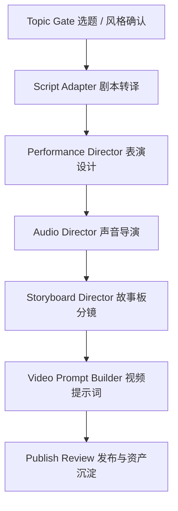
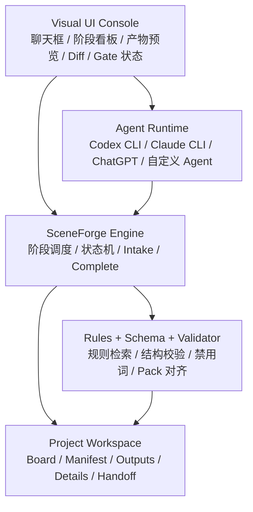
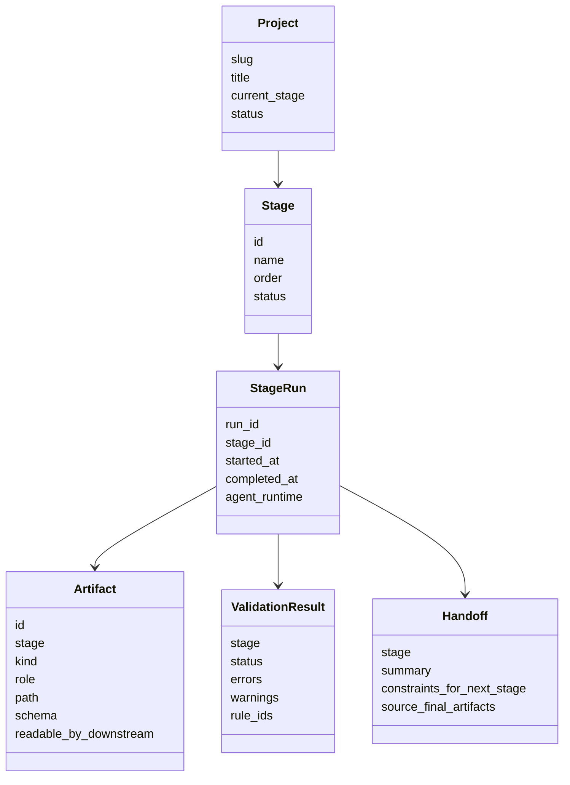
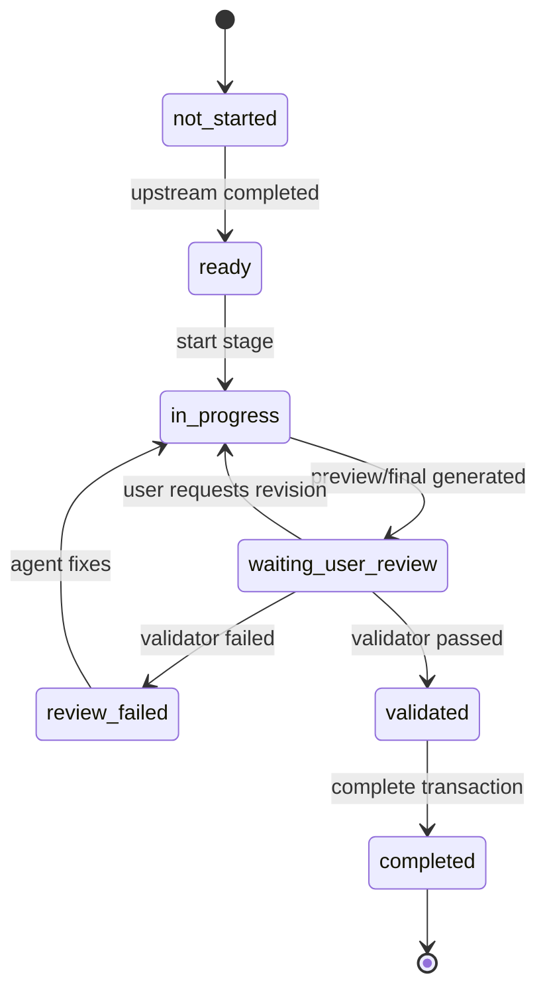
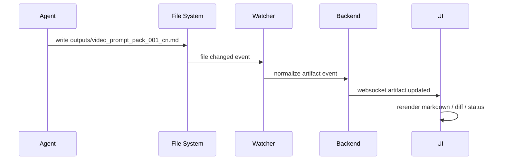
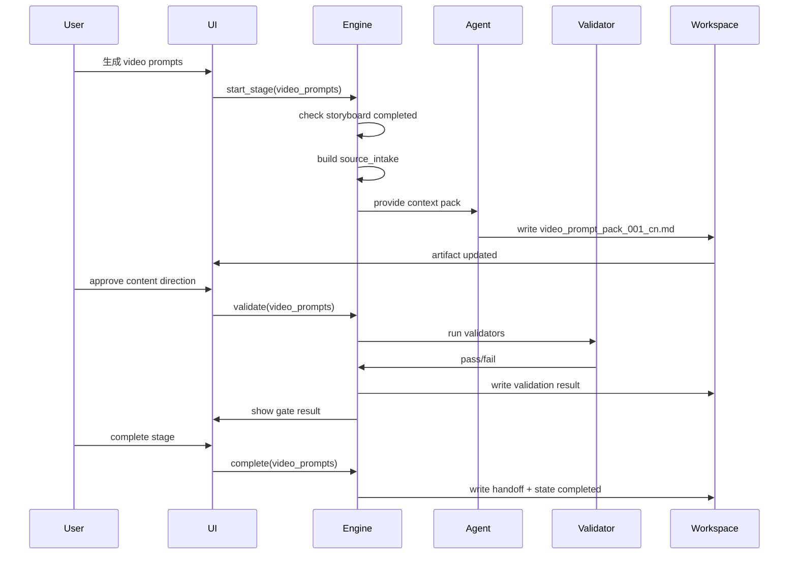

# SceneForge v9 架构演进设计文档

> 版本：v0.1  
> 目标阶段：SceneForge v9 设计草案  
> 适用范围：SceneForge 多阶段 AI 视频 / 动画 / 自媒体内容生成管线  
> 核心目标：从“Agent 阅读长协议后尽量遵守”升级为“代码程序控制阶段承接、规则检索、状态推进、产物校验与 UI 实时呈现”的工程化创作系统。

---

## 目录

1. 背景与问题定义
2. v9 总体目标
3. v9 架构原则
4. 总体架构分层
5. 核心领域对象模型
6. 阶段生命周期与状态机设计
7. Artifact 产物模型与 Manifest 设计
8. 规则系统：从 prose 规则到 Rule Engine
9. Schema 与 Validator 设计
10. Source Intake：阶段上下文输入控制
11. Handoff：阶段间压缩交接协议
12. Agent / Codex CLI / Claude CLI 协作模型
13. UI 界面化架构设计
14. UI 实时产物查看与文件监听机制
15. 聊天框创作模式设计
16. CLI JSON API 设计
17. CLI Wrapper 与聊天桥接设计
18. 项目目录结构建议
19. 关键流程示例
20. 安全边界与防跑偏机制
21. v9 分阶段落地路线图
22. 后续扩展方向
23. 总结

---

# 1. 背景与问题定义

SceneForge 当前已经形成了较完整的多阶段内容生成流程：



它的本质不是一个简单 Prompt 模板项目，而是一个专业化、多阶段、强约束的 AI 内容生产管线。每个阶段都会产生不同类型的创作产物，并且下游阶段必须继承上游阶段的关键决策。

当前 v8 体系中已经意识到三类核心问题：

1. **规则软约束问题**  
   规则主要写在 `SKILL.md`、`output-contract.md`、`board-protocol.md` 等长文本协议中，执行层虽然“读到了规则”，但仍可能绕过规则、误解规则或妥协性通过。

2. **上下文漂移问题**  
   每个阶段都会生成大量 preview、draft、review、final 等文件，如果下游 Agent 自行扫描目录，很容易把中间稿、说明稿、参数表、compiled prompt 误当成正式主交付。

3. **状态推进不够硬问题**  
   当前 review gate 很多仍然依靠 Agent 自查，缺少独立 validator/linter 作为真正的 Completed 前置条件。Agent 既是生成者，又是审查者，容易出现“自己生成、自己放行”的问题。

v9 的核心任务，就是把这些“软规则”和“软流程”升级为代码程序可控制、可校验、可追踪、可视化的硬架构。

---

# 2. v9 总体目标

v9 的目标不是简单增加更多规则，而是重构 SceneForge 的执行架构。

## 2.1 核心升级方向

从：

```text
多 Skill 文档协议 + Agent 自觉遵守 + 人工检查
```

升级为：

```text
领域对象模型 + Artifact Manifest + Rule Engine + Schema Validator + Transactional State Machine + CLI/API + UI Console
```

## 2.2 v9 要解决的问题

v9 需要解决以下问题：

| 问题 | v8 表现 | v9 目标 |
|---|---|---|
| 规则分散 | 同一规则写在多个文档里 | 单一规则源，文档由规则生成或同步 |
| 规则不可执行 | Agent 按自然语言理解 | Rule Engine + Validator 执行 |
| 中间稿误读 | draft / preview 被下游误当 final | Artifact Manifest 明确可读边界 |
| 状态推进太软 | Agent 自查后写 completed | 只有程序 validator 通过才能 completed |
| 上下文污染 | 下游阶段自行扫目录 | Source Intake 只暴露允许读取的文件 |
| UI 缺失 | 终端里看进度和文件 | Web UI 实时查看阶段、产物、错误、diff |
| Agent 编排不稳定 | 靠提示词手动承接 | 程序控制阶段前置条件、输入、输出、校验 |

## 2.3 v9 的用户体验目标

最终希望用户可以在 UI 界面中完成以下体验：

1. 在一个聊天框里和 Codex CLI / Claude CLI / 其他 Agent 聊天创作。
2. 左侧看到项目阶段流转图。
3. 中间看到当前阶段的聊天与执行记录。
4. 右侧实时查看阶段产物、Markdown 渲染、diff、validator 错误。
5. 每个阶段开始前，程序自动完成规则检索、source intake、状态检查。
6. 每个阶段结束后，程序自动执行 schema 校验、禁用词检测、pack 对齐检查、handoff 生成。
7. 用户只需要做创作判断和 approve，不需要手动翻目录和检查协议。

---

# 3. v9 架构原则

## 3.1 Agent 只负责生成，不负责最终放行

Agent 可以生成内容、修复内容、解释内容，但不能直接决定阶段 completed。

阶段完成必须由程序控制：

```text
Agent 生成产物
  -> Validator 校验
  -> ValidationResult pass
  -> State Machine 推进
  -> Stage Completed
```

## 3.2 下游不能自行选择上游文件

下游阶段不应该扫描整个项目目录，也不应该自己判断哪个文件像最终稿。

下游只能读取系统生成的：

```text
source_intake.json
```

里面列出的 allowed sources 才能进入上下文。

## 3.3 主交付和中间稿必须物理隔离

产物必须分层：

```text
preview  预览候选，不给下游读
draft    中间稿，不给下游读
review   审查记录，不给下游读
final    主交付，下游默认只读它
```

## 3.4 规则必须有机器表达

自然语言文档可以保留，但不能作为唯一规则源。

每条硬规则应该有：

```text
rule_id
适用阶段
严重级别
机器校验逻辑
错误信息
修复建议
```

## 3.5 CLI 先硬化，UI 后界面化

不要过早做 GUI。底层 CLI / Engine 必须先支持稳定 JSON API：

```bash
scene-forge status --json
scene-forge intake --stage video_prompts --json
scene-forge validate --stage storyboard --json
scene-forge complete --stage storyboard
scene-forge artifacts --stage storyboard --json
```

UI 只是调用这些 API 的可视化外壳。

---

# 4. 总体架构分层

v9 建议采用五层架构：



## 4.1 UI Console 层

负责：

- 聊天交互
- 阶段状态展示
- 文件实时预览
- Markdown 渲染
- Diff 查看
- Validator 错误展示
- 用户 approve / reject / retry 操作

UI 不直接改状态，只调用 Engine API。

## 4.2 Agent Runtime 层

负责：

- 与用户对话
- 根据规则和输入生成阶段产物
- 根据 validator 错误修复产物
- 通过 CLI Wrapper 聊天嵌入与 UI 实时同步

支持多种 Agent：

```text
Codex CLI
Claude CLI
ChatGPT
本地模型 Agent
自定义工作流 Agent
```

## 4.3 SceneForge Engine 层

负责：

- 项目发现
- 阶段状态机
- 阶段启动前检查
- source intake 生成
- artifact manifest 维护
- validator 调用
- completed 状态推进
- handoff 生成
- JSON API 输出

这是 v9 最核心的控制层。

## 4.4 Rules / Schema / Validator 层

负责：

- 阶段规则检索
- 产物 schema 校验
- 文件命名校验
- pack 对齐校验
- segment 完整性校验
- 禁用词检测
- 规则 ID 输出

## 4.5 Project Workspace 层

负责保存实际项目数据：

```text
PROJECT_BOARD.md
PROJECT_STATE.json
artifacts.manifest.yaml
source_intake.json
handoffs/*.json
outputs/*.md
details/**/*.md
validation/*.json
```

---

# 5. 核心领域对象模型

v9 应该先定义统一领域对象，避免继续围绕散乱 Markdown 文件堆规则。

## 5.1 核心对象

```text
Project
Stage
StageRun
Artifact
ArtifactManifest
Pack
Segment
Shot
Rule
Gate
ValidationResult
SourceIntake
Handoff
AgentSession
```

## 5.2 对象关系



## 5.3 Stage 状态

建议标准化阶段状态：

```text
not_started
ready
in_progress
waiting_user_review
review_failed
validated
completed
blocked
skipped
```

其中：

- `waiting_user_review`：产物已生成，等待用户审美/内容确认。
- `review_failed`：机器校验失败，需要 Agent 修复。
- `validated`：机器校验通过，但还未 completed。
- `completed`：状态机正式放行，可供下游读取。

---

# 6. 阶段生命周期与状态机设计

## 6.1 标准阶段生命周期

每个阶段都应该遵循统一生命周期：



## 6.2 阶段启动前置检查

阶段开始前，Engine 必须执行：

```text
1. 检查上游 required stages 是否 completed
2. 检查当前阶段是否已存在未完成 run
3. 生成 source_intake.json
4. 检索当前阶段适用规则
5. 准备 agent context pack
6. 锁定当前阶段写入目录
```

示例命令：

```bash
scene-forge start --stage storyboard --project huafei-wall-crash --json
```

输出：

```json
{
  "project": "huafei-wall-crash",
  "stage": "storyboard",
  "status": "ready",
  "source_intake": "projects/huafei-wall-crash/runtime/source_intake.storyboard.json",
  "ruleset": "rulesets/storyboard.v1",
  "write_scope": [
    "projects/huafei-wall-crash/details/storyboard/",
    "projects/huafei-wall-crash/outputs/"
  ]
}
```

## 6.3 阶段完成事务

阶段 completed 不允许手写。必须通过：

```bash
scene-forge complete --stage storyboard --project huafei-wall-crash
```

内部事务：

```text
1. 读取 PROJECT_STATE.json
2. 读取 artifacts.manifest.yaml
3. 执行 required validators
4. 生成 validation_result.json
5. 如果失败：写入 review_failed，不推进
6. 如果成功：写入 validated
7. 生成 stage handoff
8. 更新 PROJECT_BOARD.md / PROJECT_STATE.json
9. 标记 completed
10. 释放下游阶段 ready 条件
```

## 6.4 为什么要事务化

事务化的价值是：

```text
Agent 不能绕过状态机
用户不能误把未校验产物推进下游
UI 不能直接改 completed
所有 completed 都有 validation evidence
```

---

# 7. Artifact 产物模型与 Manifest 设计

## 7.1 Artifact Taxonomy

v9 必须把产物分成四类：

| kind | 路径建议 | 下游读取 | 用途 |
|---|---|---|---|
| preview | `details/<stage>/preview_*.md` | 禁止 | 候选方案、风格预览、用户初审 |
| draft | `details/<stage>/draft_*.md` | 禁止 | 中间稿、shotlist、director notes、参数表 |
| review | `details/<stage>/review_*.md` | 禁止 | 自查、差异对比、validator 修复记录 |
| final | `outputs/<stage>_pack*.md` | 允许 | 主交付、下游生成基座 |

## 7.2 Artifact Manifest

每个项目必须有：

```text
projects/<project_slug>/artifacts.manifest.yaml
```

示例：

```yaml
version: 1
project: huafei-wall-crash
artifacts:
  - id: storyboard_pack_001_cn
    stage: storyboard
    kind: final
    role: primary_delivery
    path: outputs/storyboard_pack_001_cn.md
    pack_id: pack_001
    language: zh
    schema: storyboard_prompt_pack.v1
    readable_by_downstream: true
    created_by_run: run_storyboard_20260608_001

  - id: storyboard_draft_shotlist_001
    stage: storyboard
    kind: draft
    role: working_notes
    path: details/storyboard/draft_shotlist_001.md
    readable_by_downstream: false
```

## 7.3 下游读取策略

下游阶段不能自行扫描文件，只能通过 Engine 查询：

```bash
scene-forge artifacts --from storyboard --readable-by video_prompts --json
```

Engine 只返回：

```text
kind = final
readable_by_downstream = true
role = primary_delivery 或 required_context
```

## 7.4 Final Artifact 的 Frontmatter

建议所有 final markdown 都带 YAML frontmatter：

```md
---
schema: video_prompt_pack.v1
stage: video_prompts
artifact_id: video_prompt_pack_001_cn
kind: final
role: primary_delivery
pack_id: pack_001
language: zh
source_storyboard_pack: pack_001
contains:
  - pack_audio_execution_plan
  - segment_sound_execution
---

# Video Prompt Pack 001 中文版
```

这可以让 Markdown 同时满足：

```text
人类可读
机器可检索
机器可校验
UI 可分类渲染
```

---

# 8. 规则系统：从 prose 规则到 Rule Engine

## 8.1 当前三类规则

当前规则大致分布在：

```text
SKILL.md                  行为规则
output-contract.md         产物规则
board-protocol.md          状态规则
```

v9 应该改成：

```text
SKILL.md                  只保留 Agent 行为与交互边界
.rules/*.yaml             机器可读规则源
.schemas/*.json           产物结构 schema
.validators/*             可执行校验逻辑
docs/generated/*.md       从规则生成的人类说明文档
```

## 8.2 规则分类

| 规则类型 | 示例 | v9 存放位置 |
|---|---|---|
| 行为规则 | 不跨项目扫描、不默认重跑项目 | `SKILL.md` |
| 产物规则 | video prompt 必须包含声音块 | `.rules/stages/video_prompts.yaml` + schema |
| 状态规则 | validator 通过才可 completed | `.rules/state_machine.yaml` |
| 禁用词规则 | 演员名、IP 名、品牌名禁止进入正文 | `.rules/forbidden_terms.yaml` |
| 读取规则 | 下游只能读 final | `.rules/artifact_taxonomy.yaml` |

## 8.3 Rule ID 设计

每条硬规则必须有 ID。

示例：

```yaml
rules:
  SF-ART-001:
    title: Downstream stages can only read final artifacts
    severity: error
    applies_to: all
    check: artifact_read_scope

  SF-SB-001:
    title: Storyboard must provide control and style prompt versions
    severity: error
    applies_to: storyboard
    check: storyboard_dual_prompt_versions

  SF-VP-001:
    title: Video prompt packs must align with storyboard packs
    severity: error
    applies_to: video_prompts
    check: video_prompt_pack_alignment

  SF-VP-002:
    title: Each video prompt pack must include pack_audio_execution_plan
    severity: error
    applies_to: video_prompts
    check: required_section
    section: pack_audio_execution_plan

  SF-VP-003:
    title: Each segment must include segment_sound_execution
    severity: error
    applies_to: video_prompts
    check: required_segment_block
    block: segment_sound_execution
```

## 8.4 Rule Engine 的职责

Rule Engine 不一定一开始很复杂，初版可以只是 YAML + Python/Node loader。

职责：

```text
1. 根据 stage 加载规则
2. 根据 artifact schema 加载校验项
3. 根据 state_machine 加载 completed 前置条件
4. 输出可执行 validator plan
5. 给 UI / Agent 提供规则摘要
```

---

# 9. Schema 与 Validator 设计

## 9.1 Validator 分层

建议分三层：

```text
Level 1: Artifact Lint
- 文件是否存在
- 命名是否正确
- manifest 是否完整
- frontmatter 是否存在

Level 2: Schema Validate
- 字段是否完整
- 必须 section 是否存在
- pack_id / segment_id 是否符合结构

Level 3: Semantic Guard
- 禁用词
- 演员名 / IP 名 / 品牌名
- storyboard 与 video prompt pack 对齐
- total_shots > 12 是否拆包
- 中间稿是否误标 final
```

## 9.2 Validator 输出格式

所有 validator 输出统一 JSON：

```json
{
  "project": "huafei-wall-crash",
  "stage": "video_prompts",
  "status": "failed",
  "validated_at": "2026-06-08T17:30:00+08:00",
  "errors": [
    {
      "rule_id": "SF-VP-002",
      "severity": "error",
      "artifact": "outputs/video_prompt_pack_001_cn.md",
      "message": "Missing required section: pack_audio_execution_plan",
      "suggestion": "Add a pack-level audio execution plan before Segment 01."
    },
    {
      "rule_id": "SF-VP-003",
      "severity": "error",
      "artifact": "outputs/video_prompt_pack_001_cn.md",
      "segment_id": "segment_03",
      "message": "Missing segment_sound_execution block.",
      "suggestion": "Add BGM, Foley-SFX, Ambience and Silence fields."
    }
  ],
  "warnings": []
}
```

## 9.3 Storyboard Validator 初版

重点校验：

```text
SF-SB-001 是否存在控制版故事板 Prompt
SF-SB-002 是否存在风格版故事板 Prompt
SF-SB-003 多包模式是否按 pack 对齐
SF-SB-004 total_shots > 12 时是否拆包
SF-SB-005 final artifact 是否不是 shotlist / director notes / parameter table
SF-SB-006 每个 shot 是否有连续性信息
SF-SB-007 中英版本是否按要求存在
```

## 9.4 Video Prompt Validator 初版

重点校验：

```text
SF-VP-001 是否与 storyboard pack 对齐
SF-VP-002 是否包含 pack_audio_execution_plan
SF-VP-003 每个 segment 是否包含 segment_sound_execution
SF-VP-004 segment_sound_execution 是否包含 BGM / Foley-SFX / Ambience / Silence
SF-VP-005 是否存在中英 pack 文件
SF-VP-006 是否只落整片长版而缺少 pack 文件
SF-VP-007 是否出现演员名 / IP 名 / 品牌 / 片场真实名称
SF-VP-008 copy-ready prompt block 是否存在
```

## 9.5 禁用词检测

禁用词配置：

```yaml
forbidden_terms:
  actor_names:
    severity: error
    terms: []
  ip_names:
    severity: error
    terms: []
  brands:
    severity: warning
    terms: []
  real_studio_names:
    severity: error
    terms: []
```

每个项目也可以有项目级 override：

```text
projects/<slug>/rules/forbidden_terms.override.yaml
```

---

# 10. Source Intake：阶段上下文输入控制

## 10.1 为什么需要 Source Intake

v9 中，阶段之间的上下承接不能靠 Agent 自己读目录。

每个阶段执行前，Engine 生成：

```text
runtime/source_intake.<stage>.json
```

它是当前阶段唯一合法上下文入口。

## 10.2 Source Intake 示例

```json
{
  "project": "huafei-wall-crash",
  "stage": "video_prompts",
  "generated_at": "2026-06-08T17:40:00+08:00",
  "allowed_sources": [
    {
      "stage": "storyboard",
      "artifact_id": "storyboard_pack_001_cn",
      "path": "outputs/storyboard_pack_001_cn.md",
      "kind": "final",
      "role": "primary_delivery",
      "pack_id": "pack_001"
    },
    {
      "stage": "audio",
      "artifact_id": "audio_handoff",
      "path": "handoffs/audio.handoff.json",
      "kind": "handoff",
      "role": "constraints_for_next_stage"
    }
  ],
  "forbidden_patterns": [
    "details/storyboard/preview_*",
    "details/storyboard/draft_*",
    "details/storyboard/review_*"
  ],
  "required_rulesets": [
    "video_prompts.v1",
    "artifact_taxonomy.v1",
    "forbidden_terms.v1"
  ]
}
```

## 10.3 Agent 上下文包

Agent 启动当前阶段时，只给它：

```text
1. 当前阶段任务说明
2. source_intake.json
3. allowed_sources 中的 final artifacts
4. 当前阶段规则摘要
5. 输出路径和格式约束
```

不要把整个项目历史和所有 draft 塞进上下文。

---

# 11. Handoff：阶段间压缩交接协议

## 11.1 Handoff 的定位

Handoff 不是主交付物，不替代 outputs。

它是下游阶段启动时的“关键决策索引”。

## 11.2 Handoff 示例

```yaml
stage: audio
version: 1
source_final_artifacts:
  - outputs/audio_pack.md
handoff_to:
  - storyboard
  - video_prompts
decision_summary:
  tone: "克制、紧张、压抑"
  bgm_arc: "低频铺底 -> 短暂停顿 -> 撞击后残响"
constraints_for_next_stage:
  must_preserve:
    - "静默点必须保留"
    - "撞击声不能喜剧化"
  must_avoid:
    - "不要使用明确品牌名"
    - "不要出现演员真名"
```

## 11.3 Handoff 生成时机

Handoff 应在 validator 通过后生成：

```text
final artifacts generated
  -> validator passed
  -> handoff generated
  -> stage completed
```

这样可以保证 handoff 总是基于已通过校验的正式产物。

---

# 12. Agent / Codex CLI / Claude CLI 协作模型

## 12.1 v9 中 Agent 的角色

Agent 不再是全流程控制者，而是阶段执行者。

Agent 负责：

```text
生成 preview
生成 draft
生成 final artifact
根据 validator 错误修复
与用户讨论创作方向
```

Engine 负责：

```text
开始阶段
准备输入
限制读取范围
校验输出
推进状态
维护 board
生成 handoff
```

## 12.2 Codex CLI / Claude CLI 接入方式 (Claudian 风格 CLI Wrapper)

v9 放弃繁琐且有安全隔离局限的 MCP Server 模式，转而采用以 **UI 嵌入/桥接 CLI 终端（CLI Wrapper Chat Model）** 为核心的轻量接入架构。该设计参考了 Obsidian 插件 [YishenTu/claudian](https://github.com/YishenTu/claudian) 的核心理念。

### 12.2.1 核心设计原理 (Claudian-style CLI Wrapper)

```text
┌──────────────────────────────────────────────────────────────────┐
│                         Web UI Console                           │
│                                                                  │
│  ┌─────────────────┐  User Input  ┌───────────────────────────┐  │
│  │   Chat Input    ├─────────────►│    Pseudo-Terminal (pty)  │  │
│  └─────────────────┘              │  Host: node-pty           │  │
│                                   │  CMD: claude / codex cli  │  │
│  ┌─────────────────┐              └─────────────┬─────────────┘  │
│  │  Chat Bubble UI │◄───────────────────────────┘                │
│  └────────▲────────┘         Stream Output (stdout/stderr)       │
│           │                                                      │
│           │ Parsing ANSI / Markdown / Diff                       │
│  ┌────────┴────────┐              ┌───────────────────────────┐  │
│  │  Output Parser  │              │    SceneForge Engine      │  │
│  └─────────────────┘              │    (cli.ts / engine.ts)   │  │
│                                   └─────────────┬─────────────┘  │
│  ┌─────────────────┐  Read / Watch              │ Writes         │
│  │  File Viewer /  │◄───────────────────────────┘                │
│  │  Stage Board    │       outputs/ & details/                   │
│  └─────────────────┘                                             │
└──────────────────────────────────────────────────────────────────┘
```

1. **终端子进程托管 (Subprocess Hosting via PTY)**：
   * 在 UI Console 运行期（或本地 GUI 进程中），通过 Node.js 的 `node-pty`（在 Windows 上使用 `powershell.exe`，在 Unix 上使用 `bash`）直接 spawn 启动 `claude` 或 `codex` 的 CLI 子进程。
   * 工作目录（Cwd）锁死在当前 SceneForge 仓库根目录下。
2. **终端流解析器 (Terminal Output Parser)**：
   * 监听子进程的 `stdout` 和 `stderr`。通过 ANSI Escape Code 过滤与 Markdown 语义分析，实时提取文字输出、代码块修改以及命令执行状态。
   * 将终端输出的文本流实时转译并渲染为结构化的 UI 聊天气泡，而对于 Agent 尝试运行命令、进行文件 Diff 等底层动作，则以可视化卡片展示。
3. **输入流劫持与注入 (Keystroke Injection)**：
   * 用户在 GUI 聊天框输入消息后，UI 将字符串直接作为键盘输入（`pty.write()`）注入子进程的 `stdin`，并附加回车符。
   * 提供“半自动交互引导”：当用户在 UI 界面点击“开始阶段”、“应用验证”或“完成阶段”时，UI 自动向 PTY stdin 写入 `/run scene-forge start --stage script` 或类似的 CLI 指令，代替用户输入。
4. **工作区状态热重载 (Workspace File Watching)**：
   * 依赖 CLI 进程天然的本地操作权限：Agent 生成的 `details/` 预览和 `outputs/` 最终产物会直接落盘。
   * UI Console 启动 `fs.watch` 监听工作区，实时更新左侧 Pipeline 板块的 Validator 信号、右侧 Final 产物面板 and Diff 视窗。

### 12.2.2 为什么选择 CLI Wrapper 不是 MCP Server

*   **免除复杂的 MCP 通信成本**：不需要在本地运行一个 MCP JSON-RPC Server 并解决端口占用、多实例寻址等问题。
*   **完整保留 CLI 原生工具链**：Claude CLI 自身带有极其强大的 Shell 访问、交互确认、Diff 渲染和安全沙箱拦截机制，通过 CLI Wrapper 可以直接“白嫖”这些成熟的功能，UI 仅需做一层漂亮的渲染外壳。
*   **完美的断开与恢复（PTY Persistence）**：PTY 会话可以在后端持久化，即使前端页面刷新，终端子进程依然在运行，重新连接即可恢复聊天状态。

## 12.3 推进顺序

```text
Phase 1: CLI JSON API 稳定化 (status / start / validate / complete)
Phase 2: node-pty 终端桥接与 stdout ANSI 结构化解析器
Phase 3: 界面集成 Xterm.js (底层日志) 与 Chat UI (高层气泡) 双重视角
Phase 4: 文件监听器 (fs.watch) 与 UI 产物实时刷新
Phase 5: 聊天输入框快捷指令路由与宏指令注入
```

---

# 13. UI 界面化架构设计

## 13.1 UI 总体布局

建议 UI 采用三栏结构：

```text
┌────────────────────────────────────────────────────────────┐
│ 顶部：项目选择 / 当前阶段 / 全局状态 / 运行按钮              │
├───────────────┬───────────────────────┬────────────────────┤
│ 左侧阶段看板   │ 中间聊天创作区          │ 右侧产物查看区       │
│ Pipeline       │ Chat with Agent        │ Artifacts / Diff    │
│ Gate 状态      │ Codex/Claude CLI       │ Validator / Preview │
└───────────────┴───────────────────────┴────────────────────┘
```

## 13.2 左侧：阶段看板

展示：

```text
Topic Gate
Script
Performance
Audio
Storyboard
Video Prompts
Publish Review
```

每个阶段显示：

```text
状态：ready / in_progress / review_failed / completed
主交付数量
validator 状态
最近更新时间
是否可进入下一阶段
```

## 13.3 中间：聊天创作区

功能：

```text
和 Codex CLI / Claude CLI 聊天
显示 Agent 流式输出
允许用户插入修正指令
支持阶段上下文自动注入
显示当前 Agent 正在写入哪个文件
```

## 13.4 右侧：产物查看区

Tabs：

```text
Final Outputs
Preview
Draft
Review
Handoff
Validation
Diff
```

默认展示 final outputs。

Draft / Preview 需要显式切换，并标记：

```text
此文件不会作为下游生成基座
```

## 13.5 底部：Gate / Validator 面板

展示每条规则状态：

```text
✅ SF-VP-001 pack 对齐通过
❌ SF-VP-002 缺少 pack_audio_execution_plan
❌ SF-VP-003 segment_03 缺少 Silence 字段
⚠️ SF-VP-007 发现疑似品牌词
```

用户点击错误，可以跳转到文件对应位置。

---

# 14. UI 实时产物查看与文件监听机制

## 14.1 文件监听目标

用户希望“在 UI 上实时查看产物”。这需要后端监听项目工作区文件变化。

监听对象：

```text
outputs/**/*.md
details/**/*.md
artifacts.manifest.yaml
PROJECT_STATE.json
validation/**/*.json
handoffs/**/*.json
```

## 14.2 技术方案

可选方案：

```text
Node: chokidar
Python: watchdog
Rust: notify
```

推荐初期用 Node + chokidar，因为 UI 后端通常更容易与 Vite/React/Svelte 集成。

## 14.3 实时更新链路



## 14.4 WebSocket 事件设计

```json
{
  "event": "artifact.updated",
  "project": "huafei-wall-crash",
  "stage": "video_prompts",
  "artifact_id": "video_prompt_pack_001_cn",
  "path": "outputs/video_prompt_pack_001_cn.md",
  "kind": "final",
  "timestamp": "2026-06-08T17:50:00+08:00"
}
```

Validator 更新：

```json
{
  "event": "validation.updated",
  "project": "huafei-wall-crash",
  "stage": "video_prompts",
  "status": "failed",
  "error_count": 2,
  "warning_count": 1
}
```

阶段状态更新：

```json
{
  "event": "stage.status_changed",
  "project": "huafei-wall-crash",
  "stage": "storyboard",
  "from": "waiting_user_review",
  "to": "completed"
}
```

---

# 15. 聊天框创作模式设计

## 15.1 用户理想体验

用户在 UI 聊天框中输入：

```text
继续生成 storyboard 阶段，镜头不要太多，重点突出撞墙前的停顿。
```

系统内部不应该只是把这句话直接丢给 Agent。

而是应该执行：

```text
1. 判断当前项目
2. 判断当前阶段
3. 检查上游是否 completed
4. 生成 storyboard source_intake
5. 检索 storyboard rules
6. 组装 Agent context pack
7. 启动 Codex/Claude CLI
8. 监听产物写入
9. 运行 validator
10. 把错误或通过状态反馈到 UI
```

## 15.2 Chat Command Router

UI 中的聊天输入需要经过一个 router：

```text
用户自然语言
  -> intent detection
  -> project/stage resolution
  -> command plan
  -> Engine API
  -> Agent Runtime
```

示例 intent：

```text
start_stage
revise_artifact
validate_stage
complete_stage
compare_versions
show_artifact
explain_error
```

## 15.3 人机协作边界

用户负责：

```text
审美判断
创作方向
是否接受某个版本
是否进入下一阶段
```

程序负责：

```text
能不能进入阶段
读哪些文件
写哪些文件
产物是否合规
是否允许 completed
```

Agent 负责：

```text
把用户意图转成阶段产物
根据错误修复文件
解释差异和改动
```

---

# 16. CLI JSON API 设计

UI 状态同步和命令行交互都建立在 CLI JSON API 之上。

## 16.1 status

```bash
scene-forge status --project huafei-wall-crash --json
```

输出：

```json
{
  "project": "huafei-wall-crash",
  "current_stage": "storyboard",
  "stages": [
    {
      "id": "topic_gate",
      "status": "completed"
    },
    {
      "id": "storyboard",
      "status": "waiting_user_review",
      "validators": {
        "status": "not_run"
      }
    }
  ]
}
```

## 16.2 start

```bash
scene-forge start --stage video_prompts --project huafei-wall-crash --json
```

输出 source intake、ruleset、write scope。

## 16.3 intake

```bash
scene-forge intake --stage video_prompts --project huafei-wall-crash --json
```

只返回允许当前阶段读取的输入文件。

## 16.4 validate

```bash
scene-forge validate --stage video_prompts --project huafei-wall-crash --json
```

输出 validation result。

## 16.5 complete

```bash
scene-forge complete --stage video_prompts --project huafei-wall-crash --json
```

只有 validator pass 才能推进。

## 16.6 artifacts

```bash
scene-forge artifacts --stage storyboard --project huafei-wall-crash --json
```

返回该阶段所有 artifacts，并按 kind 分类。

## 16.7 rules

```bash
scene-forge rules --stage video_prompts --project huafei-wall-crash --json
```

返回当前阶段规则摘要，供 Agent 和 UI 展示。

---

# 17. CLI Wrapper 与聊天桥接设计 (Claudian 风格终端集成)

为了将 Codex CLI / Claude CLI 嵌入到 GUI 界面中并提供无感知的聊天协作体验，本章详细设计了基于 Claudian 风格的终端子进程代理与解析架构。

> **参考开源项目**：[YishenTu/claudian](https://github.com/YishenTu/claudian) - Obsidian 的 Claude Code / Codex CLI 界面化集成桥接插件。

## 17.1 终端虚拟化架构 (PTY Bridge)

系统不要求 Agent 支持 MCP 协议，而是通过在 Web Console（本地 Node 服务）中构建一个 Pseudo-Terminal (PTY) 桥接器来运行 `claude` 或 `codex` 命令行客户端：

```javascript
import pty from 'node-pty';

class TerminalBridge {
  constructor(workspacePath) {
    this.ptyProcess = pty.spawn(process.platform === 'win32' ? 'powershell.exe' : 'zsh', [], {
      name: 'xterm-color',
      cols: 80,
      rows: 30,
      cwd: workspacePath,
      env: process.env
    });

    // 启动后立即自动进入交互式 CLI
    this.ptyProcess.write('claude\r');
  }

  write(message) {
    this.ptyProcess.write(message);
  }

  onOutput(callback) {
    this.ptyProcess.onData((data) => {
      callback(data);
    });
  }
}
```

## 17.2 终端流实时解析器 (Terminal Output Parser)

PTY 输出的内容包含大量的 ANSI 颜色转义字符和控制字符。Parser 需要对其进行实时转译，以维持美观 of Web UI：

1. **ANSI 过滤与转换**：
   * 将原始的 ANSI 颜色流转换为适用于 HTML 的 CSS 类名（或直接对接 Web 端的 Xterm.js 进行基础显示）。
2. **Markdown 提取与气泡隔离**：
   * 使用正则表达式检测 Agent 输出流中的 `Thinking...`、`Tool Calls` 以及 Markdown 主文本块。
   * 将连续的文本输出合并为一个 Chat Bubble，隐藏冗余的 CLI 加载进度条，只向用户渲染格式化后的 markdown。
3. **Diff 与文件写入监听**：
   * 捕获形如 `modified: <filepath>` 的终端标志，或者通过识别 Agent 执行的代码修改 Diff 块，将其转化为界面上的“产物更新”状态提示卡片。

## 17.3 聊天框上下文注入与宏指令路由 (Prompt Injection)

用户在 UI 聊天框中进行的常规输入会原封不动地发给子进程，但特定的交互事件会触发特定的“隐式宏注入”：

1. **阶段前置注入 (Intake Injector)**：
   * 当用户点击“开始 `<stage>` 阶段”时，UI 并不只是发出指令，而是会自动向 PTY 悄悄注入：
     ```text
     /run scene-forge intake --stage <stage>
     ```
     然后将系统生成的 `source_intake` 内容组装成一段隐藏 Prompt（例如 `[SYSTEM] 正在进入 script 阶段，当前输入为...`）写入 stdin，保证 Agent 拥有绝对干净且限制好的上下文。
2. **校验被打回时的错误注入 (Validator Feedback)**：
   * 如果 `validate` 失败，UI 会在聊天界面呈现一个按钮“发送错误给 Agent”，点击后会将 Validator 返回 of JSON 报错格式化为人类可读的提示信息输入到 stdin 中，引导 Agent 进行精准修复：
     ```text
     /run scene-forge validate
     [SYSTEM] 校验未通过，错误明细如下：
     - outputs/storyboard_pack01.md 缺少 pack_audio_execution_plan 字段。
     请根据本阶段 output-contract 规范进行修正。
     ```

## 17.4 UI 状态同步与 CLI 执行双线一致性

```text
┌──────────────────────────┐         PTY Spawn          ┌──────────────────────────┐
│  User Chat / GUI Action  ├───────────────────────────►│   Claude / Codex CLI     │
└──────────────────────────┘                            └────────────┬─────────────┘
                                                                     │
                                                                     │ Writes files
                                                                     ▼
┌──────────────────────────┐         fs.watch           ┌──────────────────────────┐
│  Web Console GUI View    │◄───────────────────────────┤   outputs/ & details/    │
└──────────────────────────┘                            └──────────────────────────┘
```

1. **无需 MCP 状态同步**：因为 Agent 仍然是以本地 CLI 进程运行在同一个工作区文件夹中，它写入的所有临时文件、草稿、MANIFEST.json 都会直接改变磁盘上的文件状态。
2. **无状态 GUI 视图**：GUI 前端通过一个全局的 `fs.watch` 机制监听整个项目工作区。每当 Agent 写入新的分镜草稿或更新 board，前端界面通过解析最新生成的 `PROJECT_STATE.json` 来刷新阶段看板、文件树和 Diff 视窗，从而实现 GUI 和 CLI 的状态双向完全一致。

---

# 18. 项目目录结构建议 (pnpm Workspaces Monorepo)

v9 采用 **pnpm Workspaces** 单体多包 (Monorepo) 结构来组织项目。这可以隔离依赖，防止幽灵依赖 (Phantom Dependencies) 泄漏，并加速构建与共享开发依赖。

根目录下包含一个 `pnpm-workspace.yaml` 指向各个包。

```text
scene_forge/
  pnpm-workspace.yaml             # pnpm workspaces 配置文件
  package.json                    # 根目录全局 package.json (开发配置与工程命令)
  tsconfig.json                   # 根目录全局 TS 配置基座
  .gitignore                      # Git 忽略规则

  packages/                       # 核心模块与共享库
    engine/                       # @scene-forge/engine (CLI 引擎与校验库)
      package.json
      tsconfig.json
      src/
        cli.ts                    # 命令行入口
        engine.ts                 # 状态管理与核心协调器
        project.ts                # 项目路径与 Manifest 管理
        state_machine.ts          # 事务状态机
        intake_builder.ts         # 下游输入生成器
        rule_loader.ts            # 规则读取加载器
        validators/               # 校验规则模块
          base.ts
          artifact_lint.ts
          storyboard_validator.ts
          video_prompts_validator.ts
          forbidden_terms_validator.ts

  apps/                           # 运行应用
    web-console/                  # @scene-forge/web-console (可视化控制台)
      package.json
      tsconfig.json
      index.html
      src/                        # 前端 UI (Vite + React)
      server/                     # 后端 Express PTY 桥接服务器
        server.ts
        TerminalBridge.ts
        OutputParser.ts
        FileWatcher.ts

  .rules/                         # 规则数据层 (YAML 存储，独立于代码逻辑)
    artifact_taxonomy.yaml
    state_machine.yaml
    forbidden_terms.yaml
    stages/
      topic_gate.yaml
      script.yaml
      performance.yaml
      audio.yaml
      storyboard.yaml
      video_prompts.yaml

  .schemas/                       # 阶段产物强约束 JSON Schema
    artifact_manifest.schema.json
    source_intake.schema.json
    handoff.schema.json
    validation_result.schema.json
    storyboard_prompt_pack.schema.json
    video_prompt_pack.schema.json

  projects/                       # 项目数据存放区
    PROJECT_INDEX.md
    <project_slug>/
      PROJECT_BOARD.md
      PROJECT_STATE.json
      artifacts.manifest.yaml
      runtime/
        source_intake.storyboard.json
        source_intake.video_prompts.json
      validation/
        storyboard.validation.json
        video_prompts.validation.json
      handoffs/
        audio.handoff.json
        storyboard.handoff.json
      details/
        storyboard/
          preview_*.md
          draft_*.md
          review_*.md
        video_prompts/
          preview_*.md
          draft_*.md
          review_*.md
      outputs/
        storyboard_pack_001_cn.md
        storyboard_pack_001_en.md
        video_prompt_pack_001_cn.md
        video_prompt_pack_001_en.md
```

---

# 19. 关键流程示例

## 19.1 从 Storyboard 到 Video Prompts



## 19.2 Validator 失败后的修复闭环

```text
validate failed
  -> UI 展示 rule_id 和错误位置
  -> 用户点击“让 Agent 修复”
  -> Agent 只接收 validation_result + 对应 artifact
  -> Agent 修改文件
  -> 文件 watcher 更新 UI
  -> 再次 validate
```

这里不需要重新把全项目上下文塞给 Agent，减少 token 压力。

---

# 20. 安全边界与防跑偏机制

## 20.1 防跨项目污染

规则：

```text
默认不读取其他项目历史产物
默认只读当前项目 PROJECT_INDEX / PROJECT_BOARD / source_intake
跨项目引用必须显式用户授权
```

## 20.2 防中间稿泄漏

规则：

```text
下游 source_intake 不返回 preview/draft/review
UI 默认也不把 draft 注入聊天上下文
Agent write scope 不允许把 draft 标成 final
```

## 20.3 防状态误推进

规则：

```text
completed 只能由 scene-forge complete 写入
complete 内部必须读取 validation_result
validation_result 必须是当前 artifact hash 对应的结果
```

## 20.4 防旧校验结果复用

ValidationResult 应记录 artifact hash：

```json
{
  "artifact_hashes": {
    "outputs/video_prompt_pack_001_cn.md": "sha256:xxxx"
  }
}
```

如果文件修改后 hash 变化，旧 validation_result 自动失效。

---

# 21. v9 分阶段落地路线图

## Phase 0：设计冻结

交付：

```text
docs/SceneForge-v9-架构演进设计文档.md
ADR-001-artifact-taxonomy.md
ADR-002-transactional-stage-machine.md
ADR-003-rule-engine-and-validator.md
```

目标：先统一边界，不急于实现 GUI。

## Phase 1：Artifact Manifest + Taxonomy

交付：

```text
.rules/artifact_taxonomy.yaml
.schemas/artifact_manifest.schema.json
artifacts.manifest.yaml 生成与更新逻辑
scene-forge artifacts --json
```

解决：中间稿和主交付边界不清。

## Phase 2：Source Intake

交付：

```text
.schemas/source_intake.schema.json
intake_builder.ts
scene-forge intake --stage <stage> --json
```

解决：下游上下文输入不可控。

## Phase 3：Storyboard / Video Prompts Validator

交付：

```text
storyboard_validator.ts
video_prompts_validator.ts
forbidden_terms_validator.ts
validation_result.schema.json
scene-forge validate --stage <stage> --json
```

解决：review gate 软约束。

## Phase 4：Transactional Complete

交付：

```text
state_machine.yaml
scene-forge complete --stage <stage>
PROJECT_STATE.json
validation hash checking
```

解决：Agent 自己放行阶段。

## Phase 5：Handoff 生成

交付：

```text
handoff.schema.json
handoff_builder.ts
handoffs/<stage>.handoff.json
```

解决：阶段之间上下文压缩和关键决策继承。

## Phase 6：CLI JSON API 稳定化

交付：

```text
status/start/intake/rules/artifacts/validate/complete 全部 --json
统一错误码
统一事件输出
```

为 UI 产物同步和命令行交互打基础。

## Phase 7：Web Console MVP

交付：

```text
项目选择
阶段看板
聊天终端嵌入
Markdown 产物预览
Validator 错误展示
文件 watcher + websocket
```

解决：从终端迁移到界面化。

## Phase 8：Claudian 风格 CLI Wrapper 与聊天桥接

交付：

```text
node-pty terminal hosting
stdout ANSI/Markdown stream parser
Chat Command Injection module
CLI stdout 实时流转 Chat Bubble
```

解决：将 Agent 交互无缝嵌入 UI 聊天框。

## Phase 9：多 Agent Runtime 与协作创作

交付：

```text
Codex CLI adapter
Claude CLI adapter
OpenAI/ChatGPT adapter
本地模型 adapter
Agent session history
阶段级 prompt context pack
```

---

# 22. 后续扩展方向

## 22.1 版本化产物与 Diff

每次 Agent 修改 final artifact，都可以产生版本：

```text
outputs/.versions/video_prompt_pack_001_cn.v001.md
outputs/.versions/video_prompt_pack_001_cn.v002.md
```

UI 支持 diff：

```text
v001 vs v002
当前版本 vs validator 修复后版本
中文 pack vs 英文 pack
storyboard pack vs video prompt pack
```

## 22.2 可视化 Shot Grid

Storyboard 阶段可以在 UI 中展示镜头网格：

```text
Shot 01 | 画面 | 构图 | 动作 | 连续性 | Prompt CN | Prompt EN
Shot 02 | ...
```

Video Prompts 阶段可以展示 Segment 卡片：

```text
Segment 01
- copy-ready prompt
- camera
- motion
- subject
- audio execution
```

## 22.3 规则可视化编辑器

后续可以把 `.rules/*.yaml` 做成 UI 表单。

例如：

```text
添加禁用词
启用/关闭某个 validator
修改 total_shots 拆包阈值
配置某个阶段 required outputs
```

但必须保证：UI 修改后写回机器规则源，而不是只改显示层。

## 22.4 项目模板系统

未来可以支持不同类型项目模板：

```text
短视频剧情类
AI 动画连续剧
产品广告片
悬疑故事短片
口播转视觉短片
```

每个模板定义：

```text
阶段序列
默认规则集
默认风格候选
默认 validator
默认 UI 布局
```

## 22.5 批量项目与资产沉淀

当 v9 稳定后，可以增加：

```text
项目资产库
角色库
场景库
声音风格库
镜头语言库
Prompt pattern library
```

但这些资产库不能破坏当前原则：

```text
默认不跨项目读取历史产物
只有用户显式选择资产，才进入 source_intake
```

---

# 23. 总结

SceneForge v9 的核心不是“写更多提示词规则”，而是建立一套真正可执行的创作工程架构。

最终目标是：

```text
用户在 UI 聊天框里创作
Agent 负责生成和修复
程序负责规则检索、上下文控制、状态推进和产物校验
UI 负责实时查看、审查、diff 和 approve
```

v9 应该坚持以下主线：

```text
Artifact Manifest
  -> Source Intake
  -> Rule Engine
  -> Schema Validator
  -> Transactional State Machine
  -> CLI JSON API
  -> Web UI Console
  -> CLI Wrapper / 聊天桥接与文件监听
```

这样 SceneForge 才能从“终端里的多 Skill 文档流程”，升级成一个真正稳定、可视化、可扩展的 AI 内容生产系统。

最关键的一句话是：

> Agent 可以犯错，但系统不能让错误产物进入下一阶段。

