# 极速山道滑板追逐战 声音导演方案 (Cinematic Audio Director Plan) - v1.0

本文件为 `girls-skateboard-chase` 项目的声音导演方案。声音不仅是背景填充，更是动画电影叙事的重要支柱。本方案将剧本节奏、角色微表情与极限动作转化为动画电影级的声效与配乐规划。

---

## 1. 角色配音导演设计 (Voice Acting Direction)

两名女孩的配音风格需形成鲜明反差，以凸显开朗活力型与沉稳技巧型的性格张力。

### 女孩 A (开朗活力型速度手)
*   **声线特征**：明亮、高亢、爽朗，说话时带有丰富的语调起伏。在高速滑行中伴随明显的呼吸声与用力时的短促叹气。
*   **台词配音细节**：
    *   **S02 (3.5s)**：*“输了的请吃冰！”* —— 语速快，充满挑衅与自信的笑意，尾音上扬，伴随标志性的大笑。
    *   **S07 (17.5s)**：*“好狡猾！别想跑！”* —— 语速急促，带有一点被反超后的震惊和“吃瘪”的可爱气恼感，尾音拉长。
    *   **S13 (34.0s)**：*“谢啦，借风一用！”* —— 调皮、得意地大喊，带有阴谋得逞的坏笑与喘息。
    *   **S16 (44.5s)**：*“太爽啦！并排冲！”* —— 极度兴奋的齐声狂呼，声带微微沙哑，顶着迎面强风的嘶吼感。
*   **气口与次级声音**：
    *   **S04**：起跑时用力的粗重哈气声。
    *   **S12**：尾随气流区时屏住呼吸的低频喘息。
    *   **S19**：滚入草地时失去平衡的惊呼，随即转化为松弛的开怀大笑。

### 女孩 B (沉稳技巧型特技手)
*   **声线特征**：冷静、柔和、清澈，说话速度均匀，带有一种胸有成竹的从容感。
*   **台词配音细节**：
    *   **S02 (4.5s)**：*“看你的板吧！”* —— 语气轻松平稳，带着淡淡的自信，尾音伴有轻微的轻笑。
    *   **S07 (16.5s)**：*(Wink 眨眼吐舌做鬼脸)* —— 短促轻快的吐舌吐气声（“Bleh~”），伴随狡黠的低笑。
    *   **S16 (44.5s)**：*“太爽啦！并排冲！”* —— 彻底释放压力的齐声欢呼，与女孩 A 的高亢形成和声，清脆而明亮。
*   **气口与次级声音**：
    *   **S09**：空中起跳（Ollie）时轻盈的哼气声。
    *   **S11**：落地重力缓冲时闷哼一声（“唔”）。
    *   **S19**：在草地上翻滚时的轻微闷响，随即转化为释怀的欢笑。

---

## 2. 拟音与音效设计 (Foley & Sound Effects Plan)

针对每个镜头的具体物理反馈，制定非写实的动画电影级拟音。

| 镜头号 | 拟音/声效触发点 (Foley/SFX Trigger) | 声音设计与材质质感 (Sound Design & Texture) | 表现力动画音效 (Stylized Cartoon SFX) |
| :--- | :--- | :--- | :--- |
| **S01** | 晨雾风摆 | 遥远的山谷微风，松树枝叶轻微的沙沙声。 | 无。 |
| **S03** | 空中击掌 (High-five) | 干燥、清脆的手掌相碰声。击掌瞬间加入少许高频金属清脆感以凸显默契。 | 击掌瞬间微弱的“叮——”闪光音效。 |
| **S04** | 起跑点板蹬地 | 哨声（短促、明亮、清脆）。鞋底在沥青路面粗糙的“沙、刷”蹬地声，聚氨酯板轮急转的低频嗡鸣。 | 板轮启动的短促拉链掠过声（“Whoosh”）。 |
| **S05** | 弯道侧滑手套擦地 | 戴护具的手掌摩擦沥青的“呲呲——”锐利摩擦音。板轮抱死侧滑的“吱——”（Screech）刺耳声。 | 伴随气流撕裂声，白烟喷出时带有卡通吹气感（“Puff”）。 |
| **S06** | 贴路肩内弯切入 | 板轮高速碾过路肩石的连续颠簸敲击声（“嗒嗒嗒嗒嗒”）。 | 无。 |
| **S08** | 高速碾压落叶区 | 干燥落叶被滑板高速压碎的“咔嚓咔嚓”高频碎裂声。 | 无。 |
| **S09** | 双人空中特技起跳 | 女孩 B 点板起跳“啪！”（Wood Pop），女孩 A 翻板时鞋底擦过砂纸的“刷”声。 | 空中滑行带有轻微的软性风速划过音（“Whoosh”）。 |
| **S10** | 空中碰板尾 (Board-tap) | **核心拟音**：清脆、结实、带有一点空心回响的木质碰撞声（“Clack!”）。 | 碰撞瞬间周围环境杂音瞬间被吸干（静默一拍），突出撞击的纯粹质感。 |
| **S11** | 特技落地缓冲 | 滑板支架与桥钉落地反弹的结实金属撞击声（“哐当”），以及避震橡胶的沉闷形变声。 | 落地瞬间膝盖缓冲加入夸张的“橡胶回弹”（Boing）音效。 |
| **S12** | 气流牵引跟随 | 直道高频振动声，高速风阻在头盔边缘的“猎猎”风声。 | 气流环绕的涡流风声（“Wub-wub”）。 |
| **S13** | 肩膀碰擦 (Shoulder bump) | 两人运动防风衣布料高速摩擦的“沙啦”声。 | 卡通弹簧声（“Squeak”），表现物理碰撞的友好性与弹性。 |
| **S14** | 马尾扫过镜头 | 高速发丝抽击空气的鞭哨声。 | 夸张的速度划过声（“Vrooom”）。 |
| **S15** | 侧弯下沉滑行 | 两个滑板同时侧滑，聚氨酯车轮在路面上极度变形的尖锐摩擦声。 | 无。 |
| **S16** | 双人并漂火花 | **高潮拟音**：滑板金属支架（Trucks）直接擦地发出的刺耳金属磨削声（“Grrr-Shhhh”）。 | **火花音效**：叠加上万个微小卡通金色粒子爆裂的高频“噼啪”闪烁音（Sparkle Chime）。 |
| **S17** | 出弯浓烟消散 | 摩擦声渐弱，板轮带正后重新滚动的“隆隆”沉稳声。 | 风吹云雾散开的“Fffff”风声。 |
| **S18** | 冲过终点线 | 彩带被身体冲断的脆响（“哗啦”）。 | 伴随冲线加入卡通礼花爆开的“Pop”声。 |
| **S19** | 草地受身翻滚 | 滑板板身斜插入草地、切碎泥土的粗糙“嚓嚓”声，两人身体在草坪翻滚的闷响与衣物草屑摩擦声。 | 翻滚阻尼采用非写实的“软枕头闷响”（Whump）。 |
| **S20** | 躺地碰拳定格 | 皮手套相碰的沉闷撞击声。 | 碰拳瞬间，背景中闪烁镜头光晕，伴随微弱的微风风铃声（Chime）。 |

---

## 3. 环境与背景音床 (Ambient Soundscapes)

环境音床随角色海拔高度与运动状态动态流动，拒绝机械平铺。

*   **Zone A (山顶起点, 0-10s)**：清晨山谷空旷的远景风声，树叶沙沙作响，松鸡或远处的清脆鸟鸣。空气质感干净、微冷。
*   **Zone B (S弯与直角弯, 10-20s, 40-50s)**：弯道石壁反射的滑行回声。风阻声在入弯漂移时由于速度下降而减弱，在出弯时陡然增大。
*   **Zone C (障区与直道, 20-40s)**：高速滑行的风啸声（Wind Howl）。在女孩 A 尾随女孩 B 的“气流区”（S12）时，女孩 A 处的风阻啸叫声陡然变小，转化为高频的空气涡流声。
*   **Zone D (山脚终点, 50-60s)**：山谷风声减弱，终点处的空气质感更加温暖。隐约夹杂着远处终点拱门飘带摆动与鸟雀鸣叫声。

---

## 4. 音乐主题与情绪曲线 (Musical Score & Rhythm)

配乐风格为 **Skate Punk（滑板朋克）** 与 **Vibrant Electronic Synths（活力电音合成器）** 的跨界融合，展现皮克斯式的热血青春与速度博弈。

```mermaid
gantt
    title 60秒音乐情绪与节奏曲线
    dateFormat  X
    axisFormat %s
    section 音乐状态
    前奏/悬念蓄力 (0-7.5s) :active, 0, 8
    节奏爆发与竞速驱动 (7.5-25s) :crit, 8, 25
    半空特技静默/慢放 (25-28s) :active, 25, 28
    节奏回弹与崎岖拉锯 (28-40s) : 28, 40
    双漂火花视觉Climax (40-50s) :crit, 40, 50
    冲线释放与友情暖流 (50-60s) :active, 50, 60
```

### 音乐节奏与结构设计
*   **速度设定**：恒定 160 BPM (竞速节奏)。
*   **配乐配器**：高增益电吉他强力和弦（Power Chords）、快速清脆的朋克鼓点（Snare Roll/Double Time）、明亮的复古模拟合成器琶音（Arpeggio）。
*   **结构与情绪卡点**：
    1.  **0.0s - 3.0s (S01)**：无打击乐。低沉的合成器长音（Pad）缓缓吸入，营造起点对峙的微风悬念感。
    2.  **3.0s - 7.5s (S02-S03)**：电吉他切音（Muted Guitar Riff）加入，带出调皮的弹跳感。在 **7.5s（起跑哨声）** 瞬间，朋克鼓点轰然爆发，全频段乐器推满，竞速大幕拉开。
    3.  **7.5s - 25.0s (S04-S09)**：极速推进。电吉他与合成器旋律交替领先，与两个女孩的超车动作同步起伏。
    4.  **25.0s - 28.0s (S10) [静默点]**：**空中碰板尾瞬间（Hero Shot 1）**。音乐实施**极度高通滤波（High-pass Filter）或完全瞬间静音（Mute）**。乐器声完全消失，只留下一声孤零零的、在山谷中带回声的滑板木质相撞声“Clack!”，以及风声的微弱呼吸。
    5.  **28.0s - 40.0s (S11-S14)**：落地（28.0s）刹那，重音贝斯和爆裂的鼓点瞬间“砸”回地面。在 **30.0s - 33.0s（气流牵引）** 阶段，音乐高频被轻微压暗，模拟风阻对耳膜的压迫；**33.0s 肩膀相碰**瞬间，吉他滑音（Pick Slide）划过，音乐恢复明亮。
    6.  **40.0s - 50.0s (S15-S17) [视觉高潮]**：**双漂火花（Hero Shot 2）**。电吉他齐奏主旋律，八度音程推向最高亢处，配合尖锐的金属擦地拟音与金色火花声效，将情绪推到顶点。
    7.  **50.0s - 56.5s (S18-S19)**：越过终点线，音乐主旋律以大调和弦作胜利收尾。滚入草地时，电吉他重音消散，过渡为温暖清脆的木吉他扫弦与八音盒般的合成器音色。
    8.  **56.5s - 60.0s (S20)**：朝阳下的碰拳。音乐呈现抒情而温馨的余音，伴随两个女孩的喘息大笑渐渐淡出（Fade Out）。

---

## 5. 阶段级声音连续性规划 (Segment-Level Audio Continuity)

为确保 VGU 之间生图与拼接时的声轨平滑过渡，特制定以下交接规划：

*   **VGU-01 (0-10s) -> VGU-02 (10-20s)**：
    *   *交接镜头*：S04 (蹬地起步) -> S05 (发卡弯漂移)。
    *   *声音连续性*：S04 结尾车轮急转的粗糙隆隆声，需无缝汇入 S05 开头由于重力倾斜产生的板轮偏载摩擦低频声。电吉他旋律线在出弯切入时做音调下行过渡。
*   **VGU-02 (10-20s) -> VGU-03 (20-30s)**：
    *   *交接镜头*：S07 (Wink做鬼脸喊叫) -> S08 (冲向障区)。
    *   *声音连续性*：女孩 A 的吃瘪大喊“别想跑！”的尾音，应在 S08 镜头开头带有一点山谷回音（Reverb Tail）。竞速音乐在 S08 的吉他段落变奏为更具跃动感的切音。
*   **VGU-03 (20-30s) -> VGU-04 (30-40s)**：
    *   *交接镜头*：S11 (落地缓冲) -> S12 (气流跟随)。
    *   *声音连续性*：S11 落地巨大的“哐当”金属余振在 S12 开头衰减。S12 背景风声需平滑拉大，形成风阻压迫屏障。
*   **VGU-04 (30-40s) -> VGU-05 (40-50s)**：
    *   *交接镜头*：S14 (马尾扫过) -> S15 (平行滑入直角弯)。
    *   *声音连续性*：S14 发丝抽击风声的Whoosh余音，顺势带入 S15 两人滑板重力急剧下沉的板轮挤压声。
*   **VGU-05 (40-50s) -> VGU-06 (50-60s)**：
    *   *交接镜头*：S17 (出弯烟尘消散) -> S18 (冲过终点)。
    *   *声音连续性*：S16 并漂火花的巨大金属擦地声，在 S17 转化为出弯的轮胎抓地“嗡”声并持续衰减。S17 漫天白烟散开的环境空旷声，需自然托出 S18 冲线彩带撕裂的脆响。

---

## 6. 安全物理与喜剧化声音策略 (Stylized Sound Rules)

严格继承 `injury_tone_policy` 与表现力扩展安全限制：

1.  **无写实伤害声**：禁止使用任何骨骼碎裂声（Bone crack）、血肉击打湿黏声（Gore squish）、或写实刺耳的惨叫声。
2.  **软化摔倒冲击**：S19 滚入草坪缓冲区时，使用软性的枕头式闷响（Whump）和衣服摩擦草地的沙沙声，绝对不使用沉重坚硬的骨肉撞地声。
3.  **放大表情与细节**：
    *   女孩 B 的 Wink (S07) 和回头吐舌 (S13) 使用轻盈灵动的微小声音符号（如“Blink tick”或微弱的小警报声），增强角色的调皮张力。
    *   女孩 A 的震惊吃瘪面部表情 (S07) 配合夸张的卡通吃惊吸气声或尴尬小口哨（Tiny whistle）。
4.  **火花特效风格化**：S16 支架擦地的火花声音避免纯写实的钢铁火花四溅，应融入亮丽的电音高频合成器音色，使其听起来如同“金色的卡通魔法能量”，安全而华丽。
5.  **碰拳友情定格**：S20 碰拳的闷响要带有一点温暖的、像气球回弹一样的“Puff”质感，代表角色的运动防摔手套很厚实安全。
