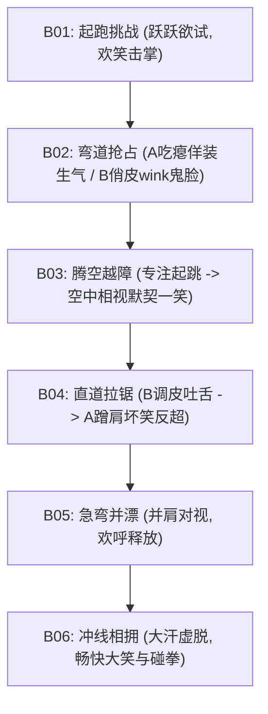

# 情绪连续性链 (Emotion Continuity Chains) - girls-skateboard-chase

本文件锁定本项目两名主角在 60 秒极速追逐中的**情感与微表情连续性链条 (Emotion Continuity Chain)**，确保剪辑时人物的表情转换自然、张力连贯。

---

## 1. 核心情绪流动图谱 (Emotional Arc)

本片的情绪走向呈 **“自信竞速 -> 趣味对抗 -> 极限默契 -> 痛快释放”** 的曲线：

---

## 2. 角色情绪状态与面部特写控制 (Micro-Expression Continuity)

### 🍊 女孩 A (开朗活力速度手)
*   **B01 (起跑线)**：
    *   *表情*：双眼大睁，眼带亮光，挑单边眉毛，大咧咧咧嘴笑。
    *   *视线*：挑衅对焦女孩 B。
*   **B02 (被内线超车)**：
    *   *表情*：瞳孔微放（惊恐），眉毛夸张呈倒八字，嘴角大张吃瘪，大喊“好狡猾！”。
    *   *视线*：眼角余光震惊地看着切入内线的女孩 B。
*   **B03 (空中翻板)**：
    *   *表情*：起跳前专注咬下唇，翻板成功瞬间转为灿烂张扬的大笑。
    *   *视线*：空中对准女孩 B 的滑板，碰板尾时抬头看向女孩 B 的眼睛。
*   **B04 (气流超车并蹭肩)**：
    *   *表情*：弓身时双眼微眯防风，蹭肩超车瞬间眯起眼露齿坏笑，下巴微扬。
    *   *视线*：紧盯前方，超车瞬间侧头飞快斜睨女孩 B。
*   **B05 (弯道双星并漂)**：
    *   *表情*：因强风阻面部皮肤轻微紧绷，大笑露出整齐的小白牙，呐喊。
    *   *视线*：与侧边的女孩 B 平行对视。
*   **B06 (终点躺地)**：
    *   *表情*：满头大汗，闭上眼睛畅快大笑，嘴角上扬，神态彻底释怀。
    *   *视线*：躺地时对视女孩 B，随后望向朝阳天空。

### 🌀 女孩 B (沉稳技巧特技手)
*   **B01 (起跑线)**：
    *   *表情*：冷静，嘴角带着若有若无的自信抿嘴微笑，眼神明亮平静。
    *   *视线*：微笑对焦女孩 A 的眼睛。
*   **B02 (内线超车瞬间)**：
    *   *表情*：标志性俏皮表情——微微偏头、单眼 Wink 眨眼、伸出粉红色舌尖做鬼脸。
    *   *视线*：在身位重合时，直视女孩 A 震惊的脸。
*   **B03 (空中飞跃)**：
    *   *表情*：Ollie 跃起瞬间微闭眼（享受滞空风感），随后睁眼露出清爽的笑容，发丝飞扬。
    *   *视线*：空中对焦女孩 A，Board-tap 瞬间看着两人的滑板板尾。
*   **B04 (前带被超车)**：
    *   *表情*：前滑时回头对女孩 A 吐舌头做鬼脸；被蹭肩超车时，微微蹙眉，随即无奈一笑，嘴角带有一抹宠溺。
    *   *视线*：向后斜视女孩 A，被蹭后看着女孩 A 领先的背影。
*   **B05 (弯道双星并漂)**：
    *   *表情*：面带大笑神色，双眼明亮清澈，面部肌肉因极速侧滑而绷紧。
    *   *视线*：与侧边的女孩 A 平行对视。
*   **B06 (终点躺地)**：
    *   *表情*：大口喘气，眼神温柔爽朗，满脸大汗但露出极其灿烂清爽的笑容。
    *   *视线*：侧头微笑着对焦女孩 A，拉手拥抱并高高举手碰拳。

---

## 3. 下游表现导演硬性约束 (Downstream Rules)
1.  **眼神对焦连续性**：B01（起跑对视）、B02（超车 Wink）、B03（空中相视）、B04（鬼脸拉锯）、B05（并漂对视）和 B06（草地对视）六个节点的视线对焦必须在镜头中清晰可辨，不得出现散光或虚焦，这是表现两人“损友兼知己”默契的核心。
2.  **微表情去写实化**：惊慌、大笑和呐喊时，面部形变幅度要符合 3D 卡通长片审美，眼睑的开合和眉骨的变动必须明显，避免出现僵硬冰冷的无表情状态。
3.  **情绪泄露补偿**：女孩 B 虽然沉稳，但在 B04 被肩膀蹭碰后，必须有一个“微蹙眉 -> 宠溺无奈笑”的微表情渐变，以展现其丰富的内心层次，严禁一成不变的“面瘫脸”。
