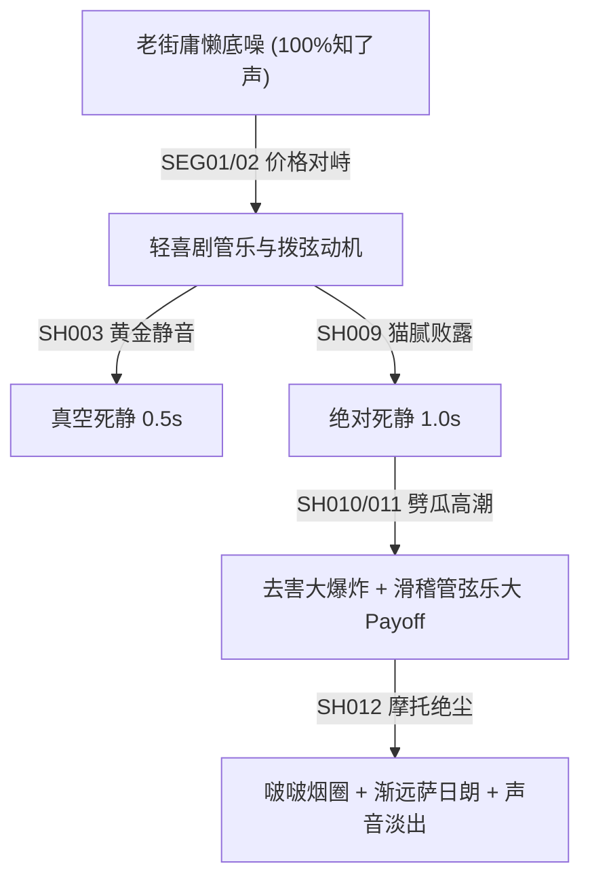
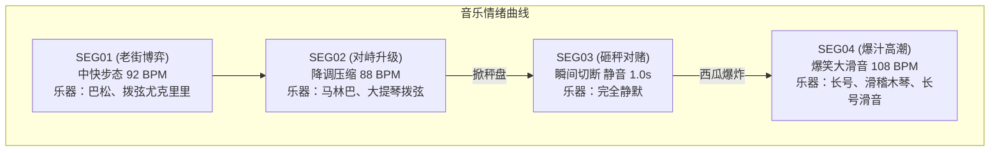

# 《华强买瓜》3D 动画电影版 - 角色声音导演方案 (v1.0)

本声音导演方案继承自分镜镜头表 (v1.0) 与角色表演导演表 (v1.0)。声音是 3D 动画长片（皮克斯风格）叙事极其关键的感官轨道。本方案彻底重构了写实配音，引入 **“音乐动机叙事、拟音角色化与戏剧性死寂”** 声音美学，在严格确保钝刀劈瓜去害化安全防线的同时，实现极具冷幽默张力与爆笑荒诞感的视听交响。

---

## 一、 顶层声音设计策略 (Director's Audio Strategy)

1. **配音口语化与气口叙事**：彻底消除播音腔，让呼吸、卡壳、咽口水和惊恐破音成为物理情绪的一部分。
2. **拟音 (Foley) 角色化与夸张化**：每个动作、物理回弹（如摩托避震、敲西瓜、秤盘弹跳、红色磁铁相撞）均有高精度的拟音反馈，放大喜剧质感。
3. **音乐是情绪的呼吸**：绝不用音乐铺满背景，乐器配置以温暖木管、轻快拨弦与马林巴为主；音乐通过**“三处死寂点”**的主动抽空，制造极其荒诞的死亡冷场。
4. **Segment 级音频连续性**：在 4 段 × 10 秒的技术切片中，使用**老街水泥路环境知了声**与**摩托发电机轰鸣声**作为物理连续性音频钩子，确保拼接无缝。

---

## 二、 角色级配音方向 (Voice Direction Profiles)

### 1. 华强 (Hua Qiang) — "深不见底的低频审判者"
* **Voice Age (声音年龄)**：32 - 38 岁成熟男性。
* **Voice Texture (声音质感)**：浑厚、低沉、平稳、带磁性共鸣，发音极其饱满且声调无颤音。
* **Emotional Tone (情绪声调)**：冷静自若、从容不迫，台词中隐含锋利的冷幽默与看穿一切的戏谑。
* **Pacing (语速节奏)**：中慢速，字与字之间逻辑停顿清晰，绝对稳健，展现无可动摇的掌控力。
* **Pause Pattern (气口停顿)**：台词“这瓜保熟吗”二次发问前，在鼻腔处保留 **0.4s 的深沉吸气**，声调微微下压，形成厚重的物理气流压迫。
* **Delivery Notes (配音提示)**：绝不能用咆哮或恶狠狠的语气说话，越平静、越优雅、越慢条斯理，压迫感就越实质化。在调侃“金子做的”时，尾音有极其细微的挑衅上扬。

### 2. 摊主老板 (Boss Vendor) — "即将炸裂的粗野低俗火药桶"
* **Voice Age (声音年龄)**：40 - 45 岁粗壮大汉。
* **Voice Texture (声音质感)**：粗粝、沙哑、浑浊、带有一点点由于常年叫卖导致的黏稠痰音。
* **Emotional Tone (情绪声调)**：蛮横、暴躁、傲慢，在受到质问时嗓门高扬，极力用音量来掩盖内心的心虚与欺诈败露的恐惧。
* **Pacing (语速节奏)**：快速抢话，说话句末紧凑短促，呼吸粗重，展现其急躁不耐烦的性格。
* **Pause Pattern (气口停顿)**：秤盘被反转掀开的刹那，摊主声音瞬间“卡壳”，嗓子像被塞住般完全失去声带振动，形成滑稽的死音。
* **Delivery Notes (配音提示)**：咬字极其粗重，尤其是“生瓜蛋子”与“故意找茬”等词汇要咬牙切齿。西瓜爆汁洗礼后，其愤怒嗓门必须**瞬间硬切为被水灌满喉咙的“咕噜咕噜”委屈发懵发愣的鼻音**。

### 3. 摊主小弟 (Vendor's Henchman) — "鬼祟惊恐的方言喜剧谐星"
* **Voice Age (声音年龄)**：22 - 26 岁年轻削瘦男子。
* **Voice Texture (声音质感)**：尖细、干瘪、偏高音、带有明显的漏风感与喜剧方言腔（如华北/河北方言土腔）。
* **Emotional Tone (情绪声调)**：谄媚、猥琐，狗仗人势时极其嚣张，大祸临头时瞬间切换为极度惊恐的颤抖破音。
* **Pacing (语速节奏)**：高频急促，说话字音细碎，附和老板时常用“对、对、对”的连串快速气口。
* **Pause Pattern (气口停顿)**：在吸铁石猫腻败露的死寂期，小弟喉结耸动，在真空静音中吞咽口水发出“咕噜”一声清晰湿响，极具幽默讽刺。
* **Delivery Notes (配音提示)**：附和老板时用“嘿嘿嘿”的鬼祟尖细笑声。劈瓜大爆炸时，其惊恐呐喊台词**“萨日朗！萨日朗！！”必须使用方言高昂破音尖叫**，且大喊声需在 SEG04 贡献一次**完美的声场距离拉远衰减与老街长通道物理混响效果**。

---

## 三、 配乐设计方案 (Music Design)

1. **Main Theme (主情绪主题)**：带有轻巧戏剧冲突色彩的“老街博弈主题”。使用温暖的巴松管和轻快的尤克里里低频铺底，勾勒出夏日燥热老街的庸懒与荒诞。
2. **Leitmotif (角色音乐动机)**：
   * **华强动机**：华强每次发问或识破骗局时，乐器中就会出现 **【3 个音的低沉马林巴琴敲击与低音提琴干涩单音拨弦】**。
   * **小弟动机**：小弟每当狐假虎威点头坏笑时，伴随 **【低音巴松管的短促单音颤音】**。
3. **Instrumentation (乐器编制)**：
   * 温暖巴松管 (Bassoon) —— 代表摊主老板的愚钝和笨重。
   * 尤克里里 (Ukulele) 与拨弦单簧管 —— 勾勒老老街背景的滑稽夏日色彩。
   * 马林巴琴 (Marimba) 与大提琴拨弦 (Cello Pizzicato) —— 表现华强冷静挑衅的敲击动感。
   * 爆笑大长号 (Sliding Trombone) —— 专门用于高潮爆汁受洗处的滑稽管乐大滑音。
4. **Tempo Range (速度范围)**：88 - 108 BPM (中等步速)。
5. **Silence Points (黄金静默设计)**：
   * `SP01` (所属镜头 `SH003` | SEG01 | 8.0s - 8.5s)：华强台词“金子做的”吐字结束瞬间，**完全抽空所有配乐 0.5s**，制造尴尬的冷场死寂。
   * `SP02` (所属镜头 `SH009` | SEG03 | 26.5s - 27.5s)：秤盘反转反面、**亮红吸铁石大白于天下的刹那，完全切断所有声音（进入 1.0s 绝对真空静音）**。
   * `SP03` (所属镜头 `SH011` | SEG04 | 33.5s - 34.0s)：西瓜汁高压消防水枪拍中老板大脸的瞬间，**音乐真空静止 0.5s**，突出老板满面红汁的呆滞和金星旋转特效。

---

## 四、 拟音角色化设计 (Foley Design)

为了最大化 Pixar-like 的质感与喜剧反馈，本片的拟音进行了高精度的角色化与卡通夸张化处理：

| 镜头编号 | 声音名称 (Sound Name) | 声音质感与物理反馈 (Tactile Texture & Physics) | 叙事/喜剧目的 (Narrative/Comic Purpose) |
| :--- | :--- | :--- | :--- |
| **SH001** | 摩托避震Q弹声 | 粗壮的不锈钢弹簧被重力极限下压产生的“吱溜——”压缩声，伴随回弹车架摩擦响。 | 放大弯梁车下压的卡通弹性，帅气登场带喜感。 |
| **SH001** | 排气烟圈声 | 摩托车刹停刹那，排气管发出一声轻爽清脆的“啵”气孔哨音。 | 与白烟圈喷出的画面完美卡点。 |
| **SH002** | 头盔敲击车把 | 黑色高亮钢盔挂在金属车把上，发出“当啷——”一声带高亮金属延音的碰撞。 | 表现华强动作的精准、稳重。 |
| **SH003** | 啐牙签撞击 | 摊主粗暴吐出牙签时发出“啐”的湿气流声，牙签击中松木箱发出“嗒”的细微响。 | 强化摊主市侩粗野的气势。 |
| **SH004** | 手指轻敲西瓜 | 黑色皮套手指敲击绿瓜皮发出“咚咚”清脆且空腔回音饱满的干涩敲击，西瓜藤蔓产生“啵嘤啵嘤”弹簧抖动声。 | 强化大西瓜的蜡质弹性，藤蔓弹抖喜感。 |
| **SH006** | 怒拍肥胖肉掌 | 摊主肥厚双手在胸前合击，发出极其响亮、发闷且肉质回弹的“啪！！”大肉掌拍击。 | 制造第一轮物理爆破声，突显其虚张声势。 |
| **SH007** | 西瓜砸秤重响 | 西瓜重重扣击金属秤盘，发出巨大的金属沉重撞击“当——”及电子秤橡皮避震弹簧的“当啷当啷”强烈颤声。 | 砸秤的力量感与夸张弹跳，强调博弈。 |
| **SH008** | 手套抵秤盘 | 黑色皮革在不锈钢上摩擦偏转，发出低沉短促的金属支架“咯吱”偏转音。 | 点穿作弊秤盘，悬疑气氛前摇。 |
| **SH009** | 秤盘掀起与叮声 | 秤盘被快速反转，发出金属轴承锈蚀的干涩吱呀“吱呀——”，吸铁石脱离不锈钢盘心的瞬间发出清脆的亮响“叮——”。 | 猫腻暴露，金属扭曲声卡点，亮响大白天下。 |
| **SH010** | 刀刃锃亮星芒 | 钝圆头水果刀拔出划过半空，发出锃地一声卡通尖亮“锃——”金属闪光音，划破空气发出“呼啸”声。 | 出刀劈西瓜的高潮动作动能。 |
| **SH011** | 水球大爆炸 | 西瓜像橡胶水球爆裂，发出一声极其沉重、带湿水汽的大闷爆闷响“嘭——啪！”，伴随碎片激射。 | 去害化劈瓜大爆发，抛弃流血展现。 |
| **SH011** | 高压水枪冲刷 | 巨量红色果汁迎面冲击摊主老板肥大面部，发出高压水枪般的“哗啦啦——”大水激射冲刷声。 | 甜美果汁拍脸的狼狈滑稽感。 |
| **SH012** | 排气管三连烟圈 | 摩托车发动，油门卡点喷出三个烟圈，发出“啵、啵、啵”由高到低三个高矮递减的气孔弹跳音。 | 华强帅气绝尘的完美余韵收尾。 |

---

## 五、 环境音设计 (Ambience Design)

1. **老街夏日知了音床 (The Hot Summer Bed)**：
   * 采用高频、致密但声场较宽的夏日知了叫声，作为 SEG01 和 SEG02 的情绪基底（占声场 100%），烘托正午刺眼阳光的闷热与焦躁感。
   * **环境音降级机制**：在 SEG02 华强发问“保熟吗”及摊主怒拍大肉掌时，知了声的音量和高频段被戏剧性地向下压低 6dB，让角色的台词、呼吸和皮套摩擦声更显尖锐。
2. **高潮后耳鸣与空灵声场**：
   * 在 SEG04 西瓜汁大爆炸瞬间，环境知了叫声彻底被掐断，取而代之的是一次**短暂的 1000Hz 喜剧性耳鸣高频单音（持续 0.8s，由响转弱）**，突出大爆炸对摊主和小弟的听觉震颤。
3. **音频无缝拼接钩子 (Audio Continuity Loop)**：
   * 每一个 Segment 结束的最后一秒，知了声环境底噪的频率与声场分布必须与下一个 Segment 保持 100% 对齐，防止视频拼接处产生任何数字音频断裂感。

---

## 六、 技术分段声音计划 (Segment Audio Plan)

### SEG01 (0.0s - 10.0s) — 【第一幕：登场与调侃价格】
* **涵盖镜头**：`SH001` - `SH003`
* **配音重点**：华强下车问价，语气沉稳清晰；摊主漫不经心剔牙吐字。
* **配乐重点**：老街博弈主题尤克里里与巴松乐器淡入，中快节奏 92 BPM。
* **拟音重点**：摩托避震Q弹“吱溜”、挂头盔“当啷”、剔牙啐签“啐嗒”完美卡点。
* **静默点控制**：华强调侃完“金子做的”台词后，在 8.0s 处**完全真空静音 0.5s**。
* **技术连续钩子**：华强摩托车发电机低频底噪在此段结尾处保留，无缝带入 SEG02。

### SEG02 (10.0s - 20.0s) — 【第二幕：挑瓜与保熟交锋】
* **涵盖镜头**：`SH004` - `SH006`
* **配音重点**：华强发问“保熟吗”声线压低加重，摊主粗暴咆哮“你要不要吧”。
* **配乐重点**：马林巴和提琴拨弦淡入，音乐声调略微压低至 88 BPM，压缩戏剧空间。
* **拟音重点**：敲瓜“咚咚”、藤蔓“啵嘤”弹抖、怒拍肥手掌“啪！！”重音震动。
* **静默点控制**：无。
* **技术连续钩子**：以老板“你要不要吧！！”粗重的怒气大喘息声和知了背景音连续带入 SEG03。

### SEG03 (20.0s - 30.0s) — 【第三幕：对赌上秤与揭穿猫腻】
* **涵盖镜头**：`SH007` - `SH009`
* **配音重点**：华强戏谑“你瞧瞧这秤盘子”；摊主把戏败露后呼吸粗重卡脖子。
* **配乐重点**：砸瓜瞬间马林巴突跳，翻转秤盘的一瞬间**音乐彻底切断**。
* **拟音重点**：砸瓜落秤巨大的金属撞“当——”及颤音，掀盘轴承“吱呀——”，吸铁石亮响“叮——”。
* **静默点控制**：秤盘反转露出鲜红磁铁的瞬间（26.5s - 27.5s），**完全进入 1.0s 绝对真空静音**，突出全员石化。
* **技术连续钩子**：以死静定格中，小弟喉结耸动咽口水的“咕噜”湿响和老板的粗气带入 SEG04。

### SEG04 (30.0s - 40.0s) — 【第四幕：去害化劈瓜与荒诞离场】
* **涵盖镜头**：`SH010` - `SH012`
* **配音重点**：小弟屁滚尿流逃命大喊“萨日朗！”，使用**方言破音破声大尖叫**，声场做距离拉远渐弱混响。
* **配乐重点**：西瓜汁大爆炸瞬间爆发**极具爆笑滑稽色彩的大长号滑音与滑稽木琴敲击（速度 108 BPM）**，随后随摩托绝尘渐弱淡出。
* **拟音重点**：钝刀破空“呼”、折射锃亮“锃”、水球爆裂大闷爆“嘭—啪”、消防水枪拍脸“哗啦啦”、排气管烟圈“啵、啵、啵”弹跳气孔音。
* **静默点控制**：大爆炸冲刷后（33.5s - 34.0s），老板粘西瓜籽发懵定格时，**完全静音 0.5s**。
* **技术连续钩子**：排气管“啵啵啵”喷烟圈声和绝尘而去的引擎声，伴随逐渐虚化淡入的老街知了叫声，画面渐暗淡出静音。

---

## 七、 视频提示词移交协议 (Video Prompt Handoff)

在下一阶段 `scene-video-prompt-builder` 中构建每段视频 Prompt 时，必须将以下声音特征强制写入对应 Segment 的文字描述中，以指导 AI 视频/音频生成器产生高连贯的物理声音：

1. **SEG01 整合**：
   * `Keywords to include`: "vintage black moped bouncing comically with squeaking spring sounds, glossy black helmet clanking on metallic handlebar, fat vendor spitting out toothpick with a 'tsui' sound, total silence freeze-frame for 0.5 seconds."
2. **SEG02 整合**：
   * `Keywords to include`: "gloved hand tapping green watermelon with hollow hollow sound, watermelon vine vibrating like a spring with pop-boiing sounds, angry vendor slamming fleshy palms together with loud flesh-slapping sound."
3. **SEG03 整合**：
   * `Keywords to include`: "watermelon hitting metallic scale plate with heavy loud 'clang' and springy vibrations, metallic squeak of scale plate flipping over, plastic magnet collision click sound, absolute acoustic silence and frozen reaction for 1.0 second."
4. **SEG04 整合**：
   * `Keywords to include`: "melon knife flashing silver starburst with high-pitched zeng sound, liquid watermelon explosion like a huge water balloon pop, high pressure red juice water-hose spraying vendor face with washing sound, lanky assistant falling over stool with clatter and screaming in terror, exhaust pipe puffing three white smoke rings in sequence with poof poof poof whistle sounds, sound fade out."
