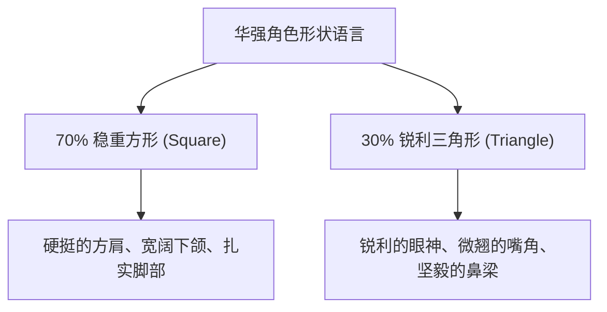
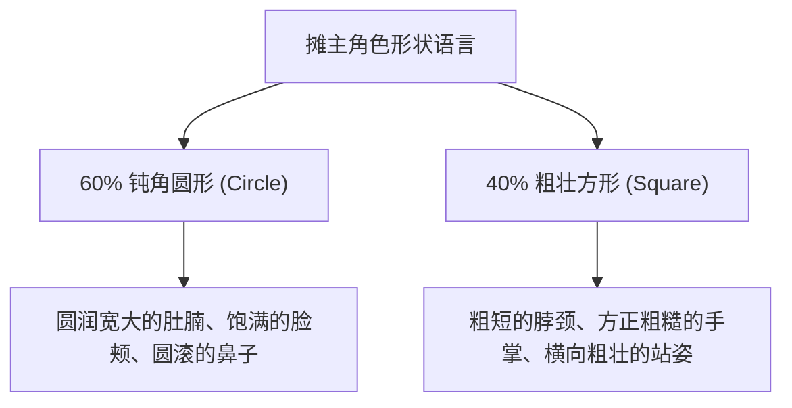
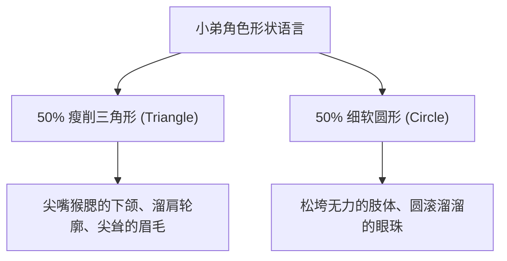

# 华强买瓜 3D 动画电影版 - 角色设定锁定卡 (v1.0)

本锁定卡定义了《华强买瓜》中两位核心角色“华强”与“摊主”的动画电影化设定。整体设计秉持“动画角色比例 + 真实材质表现”的原则，确保角色在黑影剪影下依然一眼可辨。

---

## 一、视觉基调与设计原则

1.  **概括优先**：避免写实真人演员脸换皮，主动简化面部皮肤、皱纹等微观细节，突出轮廓和特征。
2.  **动画比例 + 真实材质**：角色的头身比、五官尺寸和肢体粗细进行动画电影化夸张，但其穿着的皮夹克、棉质汗衫、头发发丝及皮肤毛孔仍保持电影级的真实质感。
3.  **剪影识别度**：华强的皮夹克硬挺轮廓与骑行姿态、摊主的粗壮身材与标志性搭肩白汗衫，保证了两人在纯黑影状态下仍具有极高辨识度。

---

## 二、角色一：华强 (Hua Qiang)

华强是本片的主动方，性格冷静、压迫感强，言行慢条斯理但带着不容置疑的强硬。

### 1. 形状语言与头身比
*   **核心形状**：**70% 方形 (Square) + 30% 三角形 (Triangle)**。方形体现在其硬挺的方肩（皮夹克垫肩）、宽阔平直的下颌和扎实的足部，表现其稳重与不可动摇；三角形体现在其微挑的眼角、坚毅有棱角的鼻梁和偶尔露出的微翘嘴角，暗示其危险和锐利。
*   **头身比**：**6.2 头身**。头身比略微压低，双腿强健，站姿挺拔，突显稳重感与气场。

### 2. 头部与五官设计
*   **发型策略**：极短的黑色寸头。发丝根根分明，边缘清晰概括，发际线略带方折。
*   **眼睛与眉骨**：眼睛比真人**放大 15%**。上眼睑呈平直的一字，眉骨略微压眼，形成专注、深邃的凝视感。眼神始终保持绝对的平静、机警与冷酷的审视。
*   **鼻梁与嘴唇**：鼻梁高挺坚毅，嘴唇薄而线条利落。不说话时微闭成一条平直的细线，笑时嘴角微抿，带着一种从容的冷幽默感。

### 3. 表情系统 (Emotion Gradient)
*   **平静 (Neutral)**：面部肌肉放松，双眼微合，眼神平静得像一潭深水。
*   **怀疑 (Suspicious)**：单侧眉毛微挑，眼睛半眯，头微微倾斜，带着审视感。
*   **轻蔑 (Contemptuous)**：一侧嘴角微翘，鼻翼微张，带着一丝冷冷的笑意。
*   **冷笑 (Smirk)**：双眼睁大，嘴角咧开一条利落弧线，露出整齐的牙齿，散发强大的心理压迫。
*   **压迫凝视 (Intense Stare)**：瞳孔微缩，眉骨用力压低，双眼死死锁定目标，极具震慑力。

### 4. 服装与材质
*   **外套**：硬挺的黑色复古机车皮夹克。拉链和金属扣呈现精细的拉丝金属质感，皮质表面有细微的皮革颗粒与多次穿着留下的物理折痕，肩膀挺拔。
*   **内搭**：深灰色棉质贴身圆领衫。布料纹理清晰，贴合身体轮廓。
*   **下装**：深蓝色耐磨粗糙牛仔裤，脚穿一双厚重的黑色高帮皮质骑行靴，鞋底有明显的泥沙颗粒和橡胶质感。

---

## 三、角色二：摊主 (Vendor / Watermelon Seller)

摊主是本片的被动方，性格急躁、粗鲁、横蛮蛮横，情绪容易失控爆发，充满虚张声势的市侩感。

### 1. 形状语言与头身比
*   **核心形状**：**60% 圆形 (Circle) + 40% 方形 (Square)**。圆形体现在其宽大圆润的肚腩、饱满略带下垂的圆脸颊、圆滚的酒槽鼻，表现其油腻与市侩；方形体现在其粗短的脖子、宽阔敦厚的方肩膀和粗糙肥大的手掌，突显粗鲁和物理力量。
*   **头身比**：**5.8 头身**。横向比例加宽，呈现一种矮壮、敦实且重心低矮的视觉剪影。

### 2. 头部与五官设计
*   **发型与面部**：凌乱微卷的黑色短发，带有一层油亮感。满脸粗糙的络腮胡茬，胡茬概括为细密的动画噪点点阵，而不是写实毛发。
*   **眼睛与眉骨**：眼睛比真人**放大 25%**。眼距较宽，带有明显的眼袋和黑眼圈。眉毛浓密杂乱，眉头经常紧锁。眼神平日里是不耐烦与蛮横，受惊时瞳孔剧烈放大，极具喜剧反差。
*   **鼻子与耳朵**：大而圆的蒜头鼻，鼻头微微发红。耳朵厚大，略带招风。

### 3. 表情系统 (Emotion Gradient)
*   **粗鲁不耐烦 (Rough / Impatient)**：嘴角向下耷拉，眉头紧锁，嘴巴半张，常做说话挑衅状。
*   **虚张声势 (Bluffing)**：扬起下巴，眼睛瞪大，牙齿咬紧，额头青筋暴起，露出横肉。
*   **震惊发愣 (Shocked / Frozen)**：嘴巴张成一个巨大的圆形，瞳孔缩成针尖大小，眉毛高高扬起，整个人呈滑稽的呆滞状态。
*   **失控暴怒 (Out of Control)**：双眼充血瞪圆，面部肌肉极度拉伸，大声嘶吼，脖子变粗。
*   **滑稽落汤鸡 (Drenched Comical)**：被西瓜汁浇满全身后的狼狈。眼睛紧闭，嘴角有果汁滴落，几片西瓜籽贴在额头和眼皮上，表情由暴怒变为委屈和懵逼。

### 4. 服装与材质
*   **上衣**：泛黄发旧的白色纯棉无袖背心。背心肩带略带松垮下垂，胸前有几处陈旧的黄色汗渍和西瓜汁留下的浅红色斑痕，背心材质呈现细密的棉线磨损起毛感。
*   **下装**：松垮的军绿色老旧短裤，腰间系着一根泛白磨损的编织腰带，挂着一大串叮当作响的钥匙扣。
*   **鞋子**：沾满黑色泥巴和西瓜泥的蓝色橡胶人字拖，脚趾粗短。

---

## 四、角色三：摊主小弟 (Vendor's Henchman / Assistant)

小弟是本片的协力喜剧角色，性格欺软怕硬、善于狗仗人势，但胆小如鼠，是经典动画式喜剧配角（Comic Relief）。

### 1. 形状语言与头身比
*   **核心形状**：**50% 瘦削三角形 (Triangle) + 50% 细软圆形 (Circle)**。三角形体现在他尖削的面部轮廓（尖嘴猴腮）、小尖下巴和吊脚眼，给人一种精明狡猾但器量狭小的感觉；圆形体现在他松垮无力的四肢曲线、略微驼背的圆形脊柱曲线和圆溜溜的眼珠。
*   **头身比**：**6.8 头身**。身材极其瘦长单薄，与横向粗壮的摊主老板（5.8头身）形成极其强烈的**反差萌胖瘦对比**（胖瘦双煞经典喜剧组合）。

### 2. 头部与五官设计
*   **发型与面部**：一头干枯、乱蓬蓬的黑发，额前有几缕滑稽下垂的刘海。上唇留着两撇稀疏的八字胡，下巴尖细。
*   **眼睛与五官**：两颗圆滚滚的豆豆眼，眼珠转动极快。嘴巴较大，常带有一种鬼祟的坏笑。两耳招风，脖子又细又长。

### 3. 表情系统 (Emotion Gradient)
*   **谄媚狗仗人势 (Smug / Bootlicking)**：半眯着眼睛，微微扬起一侧嘴角，跟在老板身后对华强指指点点，露出小人得志的滑稽神情。
*   **惊吓摔倒 (Terrified Fall)**：双眼圆睁，外凸，嘴巴大张，整个人向后摔得仰天八叉，四肢在空中滑稽乱蹬（经典卡通受惊动作）。
*   **夺路狂奔 (Panic Escape)**：双眼紧闭，面部肌肉因恐惧而极度扭曲，大汗淋漓。
*   **惊恐呐喊“萨日朗！” (Screaming "Sa Ri Lang!")**：面部大张到极限（夸张的拉长型大张嘴），脖子拉长，双手抱头或在空中滑稽挥舞，声嘶力竭地喊出“萨日朗！”。

### 4. 服装与材质
*   **上衣**：一件不合身、松松垮垮的浅蓝色旧无袖背心，领口低矮，隐约露出排骨般明显的胸肋骨线条。
*   **下装**：松散的深灰色土布长裤，两个裤脚卷起的高度不一。
*   **鞋子**：一双沾满泥尘的老旧黑布鞋，其中一只鞋后跟被习惯性地踩在脚底当拖鞋穿。

---

## 五、后续推进注意事项

*   **剧本改编建议**：剧本中要特意为华强的“冷笑”、“审视”、摊主的“蛮横”、“愣住”以及**小弟的“狗仗人势”与“惊慌倒地”**设计节拍停顿，让三人的表情包和对比萌感能够完美发挥。
*   **高潮动作建议**：在 SEG04 的“劈瓜/捅刀”高潮戏中，摊主的“失控暴怒/落汤鸡”与**小弟惊恐万分地从矮凳上翻倒、屁滚尿流爬起来、双手挥舞狂奔大喊“萨日朗！”**的戏剧化肢体语言，是全片最大的喜剧爽点，必须在分镜和视频 prompt 中给予极高的视觉描绘权重。
