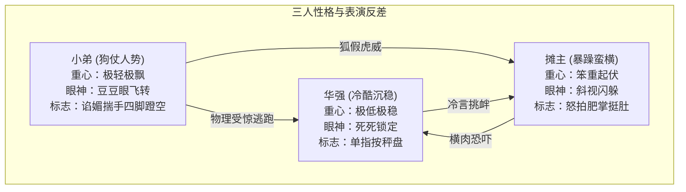

# 《华强买瓜》3D 动画电影版 - 角色表演导演表 (v1.0)

本表演导演表将剧本文字节拍和 Story Beats 转化为符合 **高品质 3D 动画电影（Pixar-like 风格）** 要求的角色表演方案。设计重心在于通过**眼神移动、微表情梯度、肢体语言、重心转移、喜剧停顿和情绪泄露**，勾勒出三位角色的极致性格张力与滑稽的物理碰撞感。

---

## 一、 顶层导演意图 (Director's Visual Strategy)
1. **风格基调**：**夸张搞笑化 (`exaggerated_comedy`)**。人物比例与物理反馈带有卡通弹性，但材质纹理、光影与材质渲染保持写实电影级质感。
2. **三人张力模型**：
   * **华强**：冷静从容的“定海神针”，眼神锐利，动作慢条斯理但精准致命，属于**冷色调压迫者**。
   * **摊主**：蛮横易怒的“红色火药桶”，横肉暴起，肢体大开大合，属于**暖色调膨胀者**。
   * **小弟**：滑稽多变的“变色龙”，溜肩驼背，动作高频碎步，是**物理反馈与爆破的喜剧放大器**。
3. **喜剧三字诀 (The Comic Flywheel)**：
   * **铺垫 (Setup)**：常规行为带有不常规的节奏感或弹力（如Q弹刹车、剔牙吐签）。
   * **停顿 (Pause)**：在博弈交锋和猫腻败露的瞬间，保留 **0.5s - 1.0s** 的戏剧性死寂，眼部进行高频的微表情颤动，蓄积能量。
   * **释放 (Payoff)**：物理反应被夸大（砸秤的剧烈震颤、反转秤盘露红磁铁、去害化西瓜水球大爆炸、小弟摔跟头“萨日朗”逃跑）。

---

## 二、 角色级表演档案 (Character Performance Profiles)

### 1. 华强 (Hua Qiang) — "绝对的冷场掌控者"
* **Acting Energy (表演能量)**：`restrained_but_precise` (克制且精准)。动作频率低但帧速快，带有行云流水的冷酷帅气感。
* **Eye Focus Pattern (眼神策略)**：死死锁定，绝不游离。眼部上眼睑拉平呈一字型，眉骨深压。一旦视线对准某处（摊主、西瓜、秤底），便保持专注凝视。审视时头会极其轻微地偏转5度，但视线焦点纹丝不动。
* **Facial Expression Range (表情系统)**：
  * **Neutral (深水平静)**：面部肌肉紧绷放松，无任何抖动，双眼微合，眼神深邃。
  * **Smirk (戏谑冷笑)**：一侧嘴角微微挑起3毫米，露出转瞬即逝的讽刺意味，眼角微缩。
  * **Intense Stare (死亡压迫)**：双眉猛烈压低，瞳孔缩紧，眉间皱起浅浅的“川”字，散发实质性杀气。
* **Body Language (肢体语言)**：站姿挺拔如松，双脚开立与肩同宽，肩膀下沉展平。从容迈步，双手动作缓慢，但一旦发力（翻秤盘、出刀），动作以极高帧率爆发，行云流水毫无阻滞。
* **Body Weight (身体重心)**：重心极稳，分布于双足，无论摩托车如何颠簸或空气如何紧绷，其身体重心始终保持几何中心，给人不可动摇的磐石感。
* **Hand Action Pattern (手部小动作)**：戴着黑色皮手套的手指极其沉稳，平日微握，发力前有短暂的一帧完全静止，随后以最直接的轨迹出手。
* **Signature Gesture (标志动作)**：
  * **【摘盔俯视】**：单手利落脱盔挂车把，下颌微抬，用居高临下的深邃眼神锁定摊主。
  * **【单指抵秤】**：伸出右手食指，指尖极轻但沉稳地按在电子秤盘的银色边缘，指尖下压令秤盘发生微幅倾斜。
* **Emotional Leak (情绪泄露)**：其冷静的外表下，唯一的情绪泄露是**左侧眉毛极轻微地挑动**与**皮手套手指在案板上沉闷的单次敲击**。
* **Comedy Reaction Rule (喜剧反应)**：反差冷面。面对摊主的喧嚣叫骂，他不为所动，甚至眼皮都不眨一下，用长达 1.0s 的绝对死寂让摊主的暴怒沦为滑稽的独角戏。

### 2. 摊主老板 (Boss Vendor) — "即将炸裂的虚胖火药桶"
* **Acting Energy (表演能量)**：`explosive_but_unstable` (爆发且不稳定)。动作幅度极大，情绪转变如闪电，充满外强中干的市侩小民气。
* **Eye Focus Pattern (眼神策略)**：斜视、频繁闪烁。说话时眼珠大范围转动，企图通过瞪眼来压倒对手，但由于心中有鬼，视线不敢与华强长久对视，会频繁在西瓜、秤和华强衣领之间切换。
* **Facial Expression Range (表情系统)**：
  * **Impatient (剔牙傲慢)**：嘴角耷拉，斜眼瞅人，眼袋下垂，大蒜鼻孔高频喷气。
  * **Bluffing (横肉恐吓)**：扬起大胖下巴，眼珠瞪圆，脸颊横肉暴起并微幅抖动，额头青筋凸起。
  * **Shocked (猫腻破产)**：嘴巴张得滚圆，下巴拉长至脱臼感，豆豆瞳孔缩至针尖大小，额头大汗滑落。
  * **Drenched Comical (懵逼落汤鸡)**：高潮爆汁后。双眼委屈地紧闭，西瓜汁顺着络腮胡嘀嗒滴落，额头上贴着三颗亮黑色西瓜子，眼眶冒出一圈卡通金星。
* **Body Language (肢体语言)**：挺着大肚腩，站立时两腿大字撇开，双臂夸张地架在身体两侧，说话时用手指指点点，拍打桌箱时伴随全身肥肉的弹簧般回弹。
* **Body Weight (身体重心)**：重心偏高且飘忽。愤怒时肩膀频繁耸动，身体前倾，抢刀时由于脚底蓝色人字拖打滑，重心失衡产生一次滑稽的趔趄。
* **Hand Action Pattern (手部小动作)**：粗鲁狂暴。抓西瓜时用两只肉掌合围狠狠抱起，拍打秤盘时肥肉颤动。
* **Signature Gesture (标志动作)**：
  * **【吐签挺肚】**：剔牙完毕后狠狠朝地上“啐”出牙签，双手一掐肥腰，用力向前挺出皮球般的大肚子。
  * **【暴怒拍掌】**：在吼叫“故意找茬”时，肥厚的两只肉掌在胸前“啪！！”地大声合击一次，同时震起脸颊横肉的余波。
* **Emotional Leak (情绪泄露)**：慌张时大蒜鼻翼剧烈翕张，频繁地吞咽口水，粗短的脖颈在谎言被华强单指点破时会瞬间染红。
* **Comedy Reaction Rule (喜剧反应)**：硬切转变。从极其高调的愤怒到绝对冰封的呆滞（秤盘翻开时），面部表情转换只用1帧完成，没有任何过渡，从而产生强烈的“卡壳”滑稽感。

### 3. 摊主小弟 (Vendor's Henchman) — "狐假虎威的喜剧软骨头"
* **Acting Energy (表演能量)**：`jittery_and_comedic` (神经质与喜剧化)。动作频率极高，身形经常发生可爱的拉伸与挤压（Squash & Stretch），充满小人得志的鬼祟感。
* **Eye Focus Pattern (眼神策略)**：高频眼珠飞转。小小的豆豆眼在眼眶内如同弹球般上下左右疯狂乱窜，带着尖嘴猴腮的贼相。
* **Facial Expression Range (表情系统)**：
  * **Smug (狐假虎威坏笑)**：半闭着豆豆眼，嘴角朝两侧裂开成滑稽的弯月状，上唇的两撇八字胡高频抖动，头跟着老板的话不断鸡啄米式点头。
  * **Terrified (极度惊恐)**：下巴拉长到极限，嘴巴张成一个长条的空腔，眼珠子几乎脱眶飞出，头顶立起几根黑发。
  * **Panic Escape (屁滚尿流)**：双眼紧闭成两个大“X”型，泪水汗水呈卡通水珠状朝两侧飞溅，面部肌肉完全因恐惧而扭曲。
* **Body Language (肢体语言)**：溜肩、极度驼背。平日双手揣在背心兜里或拢在衣袖中，整个人像一根干瘪的豆角缩在老板巨大的阴影下。跑动时两手在身体两侧作滑稽的小鸭摆动，或者双手抱头。
* **Body Weight (身体重心)**：重心极高、身子极轻。受到任何声响刺激都会像弹簧一样向上滑稽弹跳一下。
* **Hand Action Pattern (手部小动作)**：高频抓挠。猥琐地手搓衣角，嗑瓜子时手指像松鼠般快速倒腾，惊吓时十指在空中像乱弹琴般颤抖乱抓。
* **Signature Gesture (标志动作)**：
  * **【谄媚揣手】**：双手拢在浅蓝色背心底端，缩着脖子探出尖嘴，像只鬼祟的黄鼠狼般附和老板。
  * **【四脚蹬空】**：翻凳子摔倒时，整个人四脚朝天仰面躺在地上，双布鞋在空中以极快的速度作自行车蹬车轮状的滑稽挣扎。
* **Comedy Reaction Rule (喜剧反应)**：作为全片**动态高潮与物理破坏的放大器**。在西瓜爆炸瞬间，他必须贡献全片幅度最大、最具卡通质感的“向后仰天翻车”动作，并以夸张的破音大喊“萨日朗！”来将喜剧荒荒诞推向极点。

---

## 三、 Beat-by-Beat 角色表演分层设计 (Beat Performance Matrix)

### SEG01 (0.0s - 10.0s) — 【第一幕：登场与调侃价格】
* **情绪目标**：建立华强深沉冷静的压迫感与摊主蛮横傲慢的市侩气之间的鲜明并置，拉开戏剧张力帷幕。

| 角色 | 眼神策略 (Eyes) | 脸部微表情 (Facial) | 肢体与重心 (Body/Weight) | 手部与次级动作 (Hands) |
| :--- | :--- | :--- | :--- | :--- |
| **华强** | 视线锁定摊位，双眼皮平整，眉骨压低，眼神深不见底。 | 面部平静，摘下头盔的一刻下颌微微上扬10度，带着冷静审视。 | 下车步态平稳缓慢，背部挺直，肩膀松弛展平，重心从摩托平滑转至双脚。 | 单脚踢开摩托支架，戴黑色皮手套的双手动作利落，手抱头盔自然踱步。 |
| **摊主** | 斜着眼球，眼角耷拉，漫不经心地打量着华强，充满市侩。 | 鼓着两腮剔牙，被问价时嘴角撇了撇。听到调侃时，猛地吐掉牙签，横肉猛地一抽。 | 斜靠椅背的重心猛地前倾，站起身时挺起圆滚的大肚子，双手掐着肥腰。 | 肥厚的手掌夹着牙签“啐”地一吹，站立时胸口随之剧烈起伏一下。 |
| **小弟** | 豆豆眼骨碌一转，视线飞速地在华强的皮夹克和老板的大皮带间来回。 | 蹲在矮凳上鬼祟地咧嘴嬉笑，门牙外露，两撇八字胡跟着他嗑瓜子的频率一抖一抖。 | 蹲姿极其松垮，溜肩严重，整个人像个干缩的土豆，缩在老板躺椅侧面。 | 双手快速抓起瓜子送进嘴里，头随着嗑瓜子的节奏做小幅度、滑稽的啄米状。 |

* **喜剧停顿 (Pause or Hold)**：华强调侃完“金子做的”台词后，镜头在此处保留 **0.5s 的绝对死寂**。摊主剔牙的动作瞬间定格15帧，牙签黏在嘴角，华强面无表情地回视，形成极其尴尬的冷场。
* **反应节奏 (Reaction)**：停顿打破后，摊主猛地吐掉牙签并起立，动作帧率极快，挺肚动作产生了一次全身肥肉的卡通回弹颤动。

---

### SEG02 (10.0s - 20.0s) — 【第二幕：挑瓜与保熟交锋】
* **情绪目标**：对峙升级。华强的极度冷静发问与摊主的极度恼羞成怒形成极致的动静反差，令博弈达到沸点。

| 角色 | 眼神策略 (Eyes) | 脸部微表情 (Facial) | 肢体与重心 (Body/Weight) | 手部与次级动作 (Hands) |
| :--- | :--- | :--- | :--- | :--- |
| **华强** | 视线垂直向下锁定大西瓜。问“保熟吗”时，眼神瞬间切回水平，死死钉入摊主瞳孔。 | 拍西瓜时面部肌肉完全静止。眼神变冷，眼角下拉，流露出不容置疑的冷静威严。 | 踱步至西瓜堆前，身体微微前倾15度，肩膀如盾牌般挺括，重心微移向左脚。 | 右手戴着皮手套在翠绿西瓜皮上轻轻“咚咚”一敲，敲击动作弹性十足。 |
| **摊主** | 华强敲瓜时他眼皮狂跳，华强逼视时他瞳孔收缩，随后用蛮横的瞪眼掩盖慌张。 | 额头青筋随着呼吸高频蠕动，怒拍木箱时嘴唇大张露出黄牙，蒜头鼻大张。 | 身体猛地向前挺，肩膀高耸，用极其横蛮的横向站姿挡在水果案板前。 | 两只肥手狠狠地在胸前“啪”地合击一次，接着右手指着华强的鼻子剧烈颤抖。 |
| **小弟** | 豆豆眼缩成两个小黑点，紧紧贴着华强的动作，眼神谄媚鬼祟。 | 见老板撑腰，嘴角咧到极限，露出狗仗人势的狐假虎威笑，挑起稀疏的眉毛。 | 从矮凳上站起，弓着背，像只缩头小鬼一样把身体紧紧依附在老板宽厚的左侧。 | 双手猥琐地抓在一起高频揉搓，偶尔探出尖指头指点一下西瓜，作挑衅状。 |

* **喜剧物理特效 (Physical Gag)**：华强轻轻拍打西瓜时，西瓜上长长的褐色弯藤产生像**弹簧般的Q弹剧烈抖动**（振幅上下达5厘米），并且从西瓜皮接触点滑稽地震出一小圈白色灰尘微粒，增加了动画感。
* **反应节奏 (Reaction)**：摊主在华强二次平静发问时，面部横肉僵化0.3s，随后恼羞成怒地怒拍双手，这声“啪”的巴掌与全身的横肉余震构成极具爆发力的声画卡点。

---

### SEG03 (20.0s - 30.0s) — 【第三幕：对赌上秤与揭穿猫腻】
* **情绪目标**：戏剧博弈高潮点。猫腻大白于天下时，华强的戏谑、摊主的僵死与小弟的石化构成极具幽默感的名场面定格。

| 角色 | 眼神策略 (Eyes) | 脸部微表情 (Facial) | 肢体与重心 (Body/Weight) | 手部与次级动作 (Hands) |
| :--- | :--- | :--- | :--- | :--- |
| **华强** | 对秤数时眼神带着戏谑。翻转秤盘时视线如红外线般定死在反面那颗大红磁铁上。 | 嘴角掠过一抹戏谑的冷笑。掀翻秤盘时，面部重回绝对冷静，眼神带着极强的戏谑。 | 身体站立纹丝不动，仅有左臂做极其迅捷、行云流水般的翻转秤盘大动作。 | 伸出右手食指，指尖极轻但沉稳地按住秤盘边缘。随后左手如闪电般伸出，**一指反转秤盘**。 |
| **摊主** | 砸西瓜上秤时眼神凶狠。秤盘被翻开的一瞬间，他的双眼呆死，眼珠停止转动。 | 嘴巴微张，大蒜鼻孔高频喷气。秤盘反转后，满脸横肉彻底冻结，额角流下一滴大汗。 | 狠狠抓瓜砸秤，身体重心产生一次剧烈下压。秤盘被翻开后，整个人僵立如石雕。 | 粗暴地用肥手抱瓜砸向秤盘，报数时手指指向绿字。秤盘被掀后，指向绿字的手指僵在半空。 |
| **小弟** | 瞪着两颗圆溜溜的豆豆眼，眼皮大张，视线死死落在被掀开的秤底红磁铁上。 | 小人得志的鬼祟笑在秤盘反转后一帧内硬切为**下巴脱臼、嘴巴张得老大**的滑稽痴呆脸。 | 站立重心瞬间垮塌，双膝由于恐惧而开始微微打战，整个人朝后方微微缩了缩。 | 原本高频揉搓的双手瞬间僵住，五指张开在身体两侧滑稽地呈颤抖的“鹰爪”状。 |

* **秤盘Q弹物理反馈**：西瓜砸中秤盘的瞬间，电子秤发生极度夸张的**Q弹剧烈震动**，秤盘上下摇摆（振幅达3厘米），液晶数显屏幕疯狂跳字，最终卡顿0.2s定格在亮绿色的“`20.00`”上。
* **吸铁石微距视觉冲击**：秤盘反转后，镜头切为极度夸张的微距特写（Extreme Close-up），银色秤底金属的扭曲反射中，**一颗鲜红色、圆滚滚的圆形塑料吸铁石**处于屏幕正中心，构成强烈的色彩视觉冲击。
* **戏剧停顿 (Pause or Hold)**：秤盘被翻开、露出红色磁铁的一瞬间，画面**强行保留 1.0s 的绝对死静与定格**。没有台词、没有音效，只有小弟眼珠颤动与摊主脸上一滴大汗滑落，喜剧死寂张力在此处蓄积到顶点。

---

### SEG04 (30.0s - 40.0s) — 【第四幕：去害化劈瓜与荒诞离场】
* **情绪目标**：去害化高潮爆发。爆汁的滑稽与惊恐逃跑构成极致的荒诞谢幕，给观众以酣畅淋漓的搞笑爽感。

| 角色 | 眼神策略 (Eyes) | 脸部微表情 (Facial) | 肢体与重心 (Body/Weight) | 手部与次级动作 (Hands) |
| :--- | :--- | :--- | :--- | :--- |
| **华强** | 刀尖折射星芒时不看摊主，只看西瓜。跨车绝尘而去时，视线冷酷地直视前方。 | 拔刀、劈瓜动作极其连贯威严，跨上摩托车发动时眼神无比冷竣、面色波澜不惊。 | 慢动作夺步上前，侧身出刀，劈瓜后帅气收刀。跨上摩托动作沉稳洒脱。 | 戴着皮套的左手反手瞬间拔刀，银刃在空中划出完美弧线劈下，收刀时利落一插。 |
| **摊主** | 见把戏败露眼神凶狠暴虐。被爆汁直喷面门时，双眼痛苦并委屈地紧闭。 | 满脸通红青筋暴起。被果汁喷溅后，面部硬切为**满脸透红西瓜汁、两眼直冒金星的呆滞委屈脸**。 | 扑向案板抓刀时重心前倾。被高压果汁喷中后面门向后仰，狼狈地连退两步险些跌倒。 | 肥手狂暴地抓向刀柄。被爆汁冲击后，双手滑稽地在身体两侧做抓瞎抓狂的弹动动作。 |
| **小弟** | 两眼圆睁，瞳孔几乎缩没了，只有眼白，视线惊恐万分。 | 面部大张到极限（夸张的拉长型大张嘴），嘴角拉至耳根，鼻涕眼泪呈卡通喷洒状。 | 受到爆炸巨响惊吓，身子瞬间滑稽向后弹起，**屁股下的矮凳侧翻**，整个人四脚朝天摔倒。 | 翻车倒地时双手在空中作弹钢琴般的狂乱挥舞。爬起后**双手抱头，疯狂逃窜入背景深处**。 |

* **去害化劈瓜爆裂机制 (PG-rated Explosion)**：
  * **流体爆裂**：水果刀切下西瓜的瞬间，画面不出现任何写实物理切口，而是大西瓜像一个**装满高饱和红色果汁的橡胶水球般“砰”地剧烈大爆炸**！
  * **高压水枪喷泉**：无数西瓜皮碎片呈弧线向四周激射，西瓜核心处喷出一股呈抛物线、如**消防高压水枪般的红色果汁喷泉**，伴随着卡通三角形粉红瓜肉。
  * **落汤鸡荒诞受击**：这股红色的“消防果汁水枪”迎面狠狠拍在摊主老板脸上，强大的冲击力将他整个人往后推。水流散去后，老板整个人变成了“甜甜的落汤鸡”，头发贴在额头，腮帮子黏着西瓜子，眼冒金星，表情由狂暴硬切为无限委屈。
* **小弟“萨日朗”滑稽逃跑**：
  * **仰天翻车**：小弟在西瓜爆裂的一瞬间，吓得身体瞬间向后大跨度平移，屁股下的松木矮凳“扑棱”一声直接侧翻，他整个人来了个滑稽的四脚朝天大跌跤，双脚在空中飞速蹬了几下空气。
  * **抱头狂奔**：他连滚带爬地爬起来，面部张大拉长，双手死死抱住头，鞋底在泥地里高频打滑产生烟尘后，以极快的“碎步”拖着溜肩的脊柱，声嘶力竭大喊“萨日朗！萨日朗！！”狂奔逃进背景的水泥老街深处，跑动姿势呈极其可笑的弓背缩头状。
* **华强荒诞收尾**：华强面无表情，利落跨上黑色复古弯梁车，踩下踏板。伴随着摩托排气管帅气的油门音，摩托车喷出**三个高矮递减的圆形卡通白烟圈**，在“萨日朗”渐行渐远的破音背景声中绝尘而去，镜头逐渐拉远拉高，荒诞喜剧的黑色幽默在此刻完全释放。

---

## 四、 表演连续性规则 (Continuity Rules)

1. **表情演进梯度的方向性**：
   * **华强**：必须遵循 `冷静 (Neutral) -> 微带挑衅的冷笑 (Smirk) -> 瞬间冷静收紧 (Stare)` 的阶梯，任何时候都不能有大张嘴、大摇晃等情绪失控动作。
   * **摊主**：必须遵循 `傲慢不屑 -> 横肉暴怒 -> 秤底揭穿后的瞬间石化卡壳 -> 爆汁后的甜美委屈` 的情绪硬切，呆滞定格的瞬间必须绝对静止，以突出戏剧效果。
   * **小弟**：必须遵循 `鬼祟嬉笑 -> 狐假虎威点头 -> 翻盘后的瞳孔地震 -> 爆裂瞬间的肢体大变形仰翻 -> 抱头呐喊逃窜` 的卡通连贯大变形。
2. **动作节奏连续性**：
   * **华强的黑皮手套**：从摘头盔、轻敲西瓜、单指抵秤盘边缘到反转秤盘，这一只黑皮手套是华强表演的视线聚焦点。手套的磨损皮革质感在所有近景和中景中必须保持一致，手指的沉稳发力动作要连贯，指尖每次顿挫动作都要卡在关键帧上。
   * **摊主的大肚子**：大肚子的肥厚体态和白色背心的黄色西瓜汁渍，必须在所有中景镜头中作为标志性剪影出现。抢刀时大肚皮的前倾抖动和退后时肚皮的脂肪余震必须在动力学逻辑上连贯。
   * **小弟的黑布鞋**：小弟踩着后跟的滑稽布鞋，在 SEG01 嗑瓜子时的踩鞋跟姿态、SEG03 腿抖时的鞋跟微颤、SEG04 仰天翻车时鞋子在空中的摆动，以及爬起来打滑逃跑时布鞋与地面的高频摩擦烟雾，必须形成完整的道具连续性故事。

---

## 五、 分镜导演移交提示 (Storyboard Handoff Guidelines)

1. **镜头焦点移交 (Camera Focus)**：
   * **SEG01 重点**：必须以一个**排气管滑稽喷烟圈**与**避震Q弹**的特写切入华强登场，随后给华强摘下头盔后**双眼和冷峻下颌**的低角度仰拍仰角特写，建立压迫感。
   * **SEG02 重点**：必须有**华强手指轻敲西瓜**的近景特写，捕捉西瓜藤蔓如弹簧般可爱抖动和震起一圈白色微小灰尘的卡通细节。
   * **SEG03 重点**：
     * **电子秤颤抖**：西瓜砸上秤时，必须给一个**秤底避震橡皮脚Q弹跳跃、绿字跳动定格**的特写。
     * **磁铁微距特写**：翻开秤盘的瞬间，镜头必须**切为极致微距**。在银色不锈钢秤盘反面底座中心的内凹处，那一块**亮红色的圆形塑料磁铁**必须占据画面正中心，与金属光泽形成极其强烈的色差对比。
     * **名场想定格**：红色磁铁露出后，必须切换为一个**横向大中景镜头**，将华强的从容戏谑、摊主的绝对石化、小弟的惊愕腿抖和张大的大嘴框定在同一个画面里，保持 1.0s 绝对不剪辑的定格。
   * **SEG04 重点**：
     * **夺刀劈瓜**：华强抢先一步反手抓起绝缘胶带钢刀，刀身划过弧线时带有一闪而过的**卡通亮银色星芒**。
     * **爆汁喷泉特写**：大西瓜像水球般爆开，消防水枪般的红色甜果汁迎面冲刷在摊主脸上，满脸红汁和黏在胡茬、额头上的西瓜籽必须有滑稽的近景特写。
     * **小弟翻凳特写**：必须给小弟仰天滑倒、凳子侧翻、双腿在空中乱蹬的喜剧动作一个独立的滑稽特写。
     * **小弟狂奔**：给小弟弓着驼背、双手抱头朝背景深处老街狂奔的后视拉远镜头，并伴随“萨日朗！”的字眼。
     * **烟圈离场特写**：最后跨上摩托车发动时，给摩托车排气管特写，随着油门发动机声喷出**三个高矮递减的圆形卡通白烟圈**，完成华丽收尾。

2. **剪辑节奏与停顿 (Timing Guidelines)**：
   * 严禁在以下三个**黄金停顿点**进行镜头切碎，必须保留镜头内的死寂，让角色微表情和空气冻结产生最大喜剧快感：
     1. **SEG01 “金子做的”**：华强调侃台词后，华强与剔牙摊主之间 **0.5s** 的静止。
     2. **SEG03 “翻开秤盘”**：亮红磁铁露出的瞬间，三人定格的 **1.0s** 死寂。
     3. **SEG04 “爆汁受洗后”**：老板被冲成落汤鸡、满面西瓜汁直冒金星的瞬间，在小弟呐喊前保留 **0.5s** 的呆滞。

---

## 六、 风险与防范边界 (Risk & Safety Boundaries)

1. **绝对刀具去害化 (Anti-Violence PG-rated Design)**：
   * 水果刀必须有明显的**圆角钝化刀尖**（消除利刃的尖锐杀伤感），刀身较厚，质感更偏向动画片中的钝意切瓜刀，严禁展现任何锋利刺穿、劈砍人体的镜头。
   * 华强的刀**绝不对准任何角色**。在 SEG04 的动作中，华强以极其利落的弧线劈下，刀刃仅接触西瓜。西瓜被劈开时产生流体大爆炸，华强没有挥刀指向摊主的跟进动作，随后将刀直接插在案板上。
2. **西瓜爆裂非暴力卡通化 (PG-rated Explosion Visuals)**：
   * 西瓜被劈开绝对不展现类似血肉的物理撕裂，其内部的沙瓤概括为**水润亮丽的高饱和粉红色**。
   * 爆裂的物理效果设计为“**流体西瓜汁水球爆炸 + 三角形甜果肉激射**”。喷射在老板脸上的红色西瓜汁具有极高的通透度与高饱和果肉质感，伴随滑稽的粘稠泡沫，强化“甜美与狼狈”的荒诞滑稽感，彻底消除血腥感。
3. **避免真人侵权风险 (Anti-Infringement Design)**：
   * 华强、摊主、小弟的面部造型和骨骼五官基于**几何体形状概括**（方形、钝角圆形、细软三角形），比例高度夸张（大眼睛、长脖子、胖瘦萌对比），避免复刻任何真人演员的写实特征，防止侵犯肖像权。
   * 三人的动作与声音表达抽象为“经典动画片胖瘦反差喜剧”的通用套路，不借鉴任何写实电影的特定表演镜头细节。
