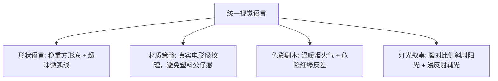
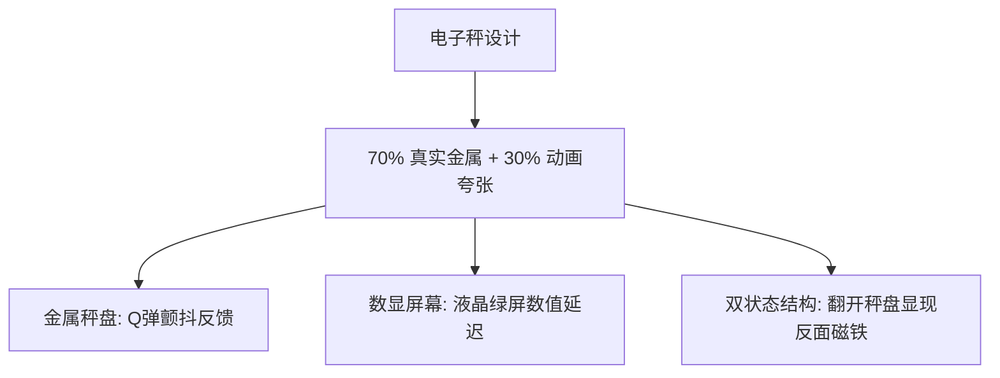
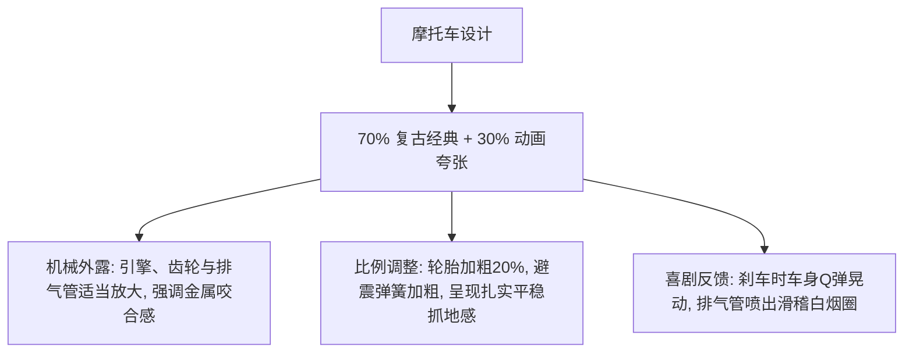
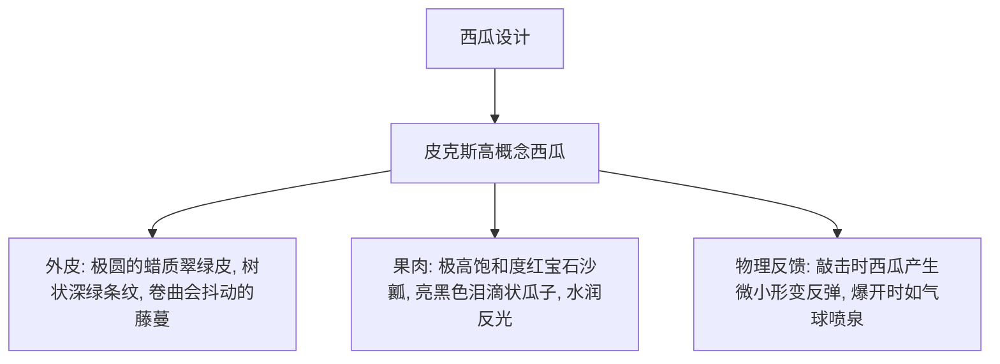

# 华强买瓜 3D 动画电影版 - 场景与道具设定锁定卡 (v1.0)

本锁定卡定义了《华强买瓜》中核心场景“街角水果摊”及关键道具“电子秤”的动画电影化设定。整体视觉遵循“动画比例 + 真实材质 + 电影灯光”的统合语言基线，确保环境与角色浑然一体，绝无拼凑感。

---

## 一、项目统一视觉语言基线 (Visual Baseline)

为了让角色、场景、道具在 3D 动画长片中呈现高度融合的统一美感，本片确立了以下视觉语言规范：

1.  **形状语言 (Shape Language)**：整个世界以**稳重的方形结构**为基石（街角墙面、水果箱、秤体），但所有边缘、转角都进行了**圆角和微弧线设计**。这消除了现实世界冰冷的直线，增添了手作的温度与动画趣味。
2.  **比例策略 (Proportion)**：采用“**70% 真实比例 + 30% 动画夸张**”。水果摊的木箱、招牌尺寸适当放大；西瓜的圆度、电子秤的受力物理下沉反馈显著增强；摩托车排气管和轮胎略微加粗，让一切都富有性格。
3.  **材质策略 (Material)**：坚持“**动画比例 + 真实材质**”。不采用玩具塑料感和廉价游戏低模感。木箱上有清晰干燥的松木纤维纹路，西瓜皮有细密的蜡质光泽与逼真条纹，电子秤有略带磨损生锈的金属质感。
4.  **色彩剧本 (Color Script)**：
    *   **基底色**：温暖古旧的街道灰、斑驳的砖红墙面（占 60%）。
    *   **功能色**：水果摊绿色的西瓜堆、木箱的松木黄（占 30%）。
    *   **强调色**：刀刃亮银、劈开后西瓜瓤的**高饱和危险红色**（占 10%）。
5.  **灯光与氛围 (Lighting)**：采用**夏日正午偏侧方的亮烈阳光**。主光以 45 度角打在水果摊上，投影深邃而清晰。角色背光面有柔和的黄色反射光，勾勒出电影长片级别的黄金轮廓光（Rim Light），极富质感。

---

## 二、场景设计：街角水果摊 (Street Corner Fruit Stand)

水果摊不仅是背景，更是发生冲突的戏剧性舞台。其布局要完美支持摩托车刹停、两人隔摊对峙以及最后的去害化爆发动作。

### 1. 空间与动线设计
*   **街角定位**：老式街道一角，背后是斑驳泛黄的灰色水泥墙，墙角有青苔印记和老旧的水泥电线杆。背景建筑的窗框、排水管有轻微的倾斜与弧度设计。
*   **摊位主体**：由几个高低错落的粗糙松木箱堆叠而成。木箱里塞满了稻草和堆成金字塔型的绿色西瓜。摊位木板有轻微的受力弯曲，木纹质感极强，带有多次摩擦留下的暗淡木色。
*   **遮阳棚**：摊位上方拉着一块斜斜的红蓝相间帆布遮阳棚。帆布边缘有轻微的磨损脱线，在阳光照射下，帆布呈现半透明的材质感，在摊位上投下柔和的红色与蓝色偏色阴影，极富胶片感。

### 2. 视觉一致性要求
*   西瓜的摆放、水果箱的倾斜度在所有镜头中必须保持严格的一致性。
*   环境中的空气微尘在阳光直射的区域有细微的闪烁，增添画面的空间通透感和夏日燥热感。

---

## 三、关键道具：电子秤 (Electronic Scale)

电子秤是引发高潮的导火索，也是华强揭穿欺诈的核心线索，必须进行高度“角色化”及“双状态视角形态”的设计。

### 1. 视觉与双状态角色化设计
*   **造型比例**：老式台式液晶电子秤。秤体外壳呈现暗淡的深灰色磨损烤漆，表面有泥印与斑驳的锈迹。不锈钢秤盘边缘圆润，盘面因长期使用而略微向下受力凹陷。
*   **屏幕显示**：荧光绿底黑字的液晶数显屏。数值跳动有延迟与闪烁卡顿感，西瓜落秤时疯狂闪烁并定格在虚假夸张的“`20.00` 斤”。
*   **翻开双状态结构 (Flipped Platter Two-State Structure)**：
    *   **状态 A（正常称重）**：秤盘平整平铺在秤座上，吸铁石完全隐藏在盘底内部，外观无任何异常。
    *   **状态 B（秤盘翻开，猫腻暴露）**：华强用手**翻开、抬起或反转秤盘**。此时，在**金属秤盘反面（背面）凹陷的中心位置**，牢牢吸附着一块**高饱和度鲜红色的圆形塑料磁铁（吸铁石）**！亮红色的磁铁与银色拉丝秤盘反面形成戏剧性极强的视觉焦点，让观众瞬间看清摊主的欺诈猫腻。

### 2. 物理与反馈动作约束
*   **受力颤抖**：秤盘必须支持夸张的避震受力反馈，当西瓜落秤时整个秤盘伴随“Q弹”剧烈颤抖。
*   **高潮爆裂**：在 SEG04 的高潮中，秤盘被刀气或物理冲撞撞飞出秤座，在空中高速旋转，盘底那块红色磁铁在飞旋中脱落，伴随液晶屏爆出卡通电火花，视觉张力拉满。

---

## 四、核心载具：摩托车 (Hua Qiang's Motorcycle)

摩托车是华强酷炫登场与从容离场的关键载具，设计上必须具备强烈的 3D 动画电影“性格”，而不是普通工业写实车模。

### 1. 造型比例与细节
*   **车型定位**：经典的黑色复古弯梁摩托车。车身骨架进行了概括和轻微弯曲设计，去除了生硬的现代工业锐角。圆形的复古大灯采用暖黄色偏光玻璃，两只圆形后视镜的镜杆细长而有微弧。
*   **引擎与排气管**：发动机箱和外露的机械齿轮适当放大 15%，展示亮银色与暗灰色金属的咬合结构。排气管采用加粗的圆筒设计，表面涂有一层哑光黑色耐热漆，管口处有长年排气留下的微量炭黑沉积。
*   **轮胎与避震**：前后橡胶轮胎**横向加宽 20%**，胎面有极为清晰的防滑颗粒花纹。前后金属避震弹簧明显加粗，圈数清晰，以完美承载刹车时的弹簧受力压缩动作。

### 2. 材质表现与喜剧反馈
*   **车身材质**：车身黑色烤漆呈现高亮镜面反射，在烈日下反射出刺眼的条状阳光高光。皮质车座为红褐色，表面有手作的双针缝线纹理，带有细微的皮革皱褶。
*   **物理反馈**：摩托车刹车停下时，整车要有一次**弹簧避震的向前收缩与向后反弹**，车身伴随轻微“Q弹”晃动。排气管在摩托车启动和刹停时，能喷出一口饱满的、滑稽的白色烟雾圆圈（经典卡通排气烟雾）。

---

## 五、动作道具：水果刀 (Vendor's Action Knife)

水果刀是引发高潮冲突的动作载具，其设计必须在满足“安全去害化”规则的同时，具备极高的视听张力。

### 1. 安全去害化造型
*   **刀刃设计**：典型的长款切西瓜钢刀。为了绝对规避血腥和暴力感，**刀尖部分进行了显著的圆角钝化处理**（去害化圆头），消除尖锐的刺入威胁感。刀刃表面极为平整亮银，像一面镜子，边缘折射出刺眼的金属偏光。
*   **刀柄设计**：粗短的暗红色松木刀柄。刀柄表面缠绕着多层发粘、泛旧的黑色绝缘胶带，胶带表面有磨损脱线和手汗留下的滑腻反光，透出下层木质的暗沉颗粒。

### 2. 电影级镜面反光策略
*   **眼神反射**：在特写镜头（Close-up）中，亮银色的刀刃要被设计成镜面，能够反射出华强冰冷、锐利的双眼，或摊主因贪婪和愤怒而扭曲的五官，以此在不发生写实冲突的情况下，拉满拔刀弩张的戏剧张力。
*   **刀刃闪光**：刀柄挥动时，刀刃边缘会在特定帧捕捉到烈日的反光，产生清脆的“闪光星芒”卡通特效（Glint Effect），伴随尖锐的金属划空声（“锃——”）。

---

## 六、交互道具：西瓜 (Interactive Watermelon)

西瓜是贯穿全剧本的线索道具，其敲击手感、受力反馈及最后的爆裂效果是全片的核心特写担当。

### 1. 外皮与沙瓤材质设计
*   **外皮质感**：近乎完美圆形的西瓜。表皮呈现饱满的翠绿色，带有树枝状分叉的墨绿色条纹，条纹边缘有轻微的晕染感。瓜皮表面有一层温润的天然蜡质反光。西瓜顶部带有一截滑稽微卷的褐色藤蔓，在敲击或移动西瓜时，藤蔓会产生可爱的弹簧般抖动。
*   **内部结构**：高饱和度的红宝石色沙瓤果肉。沙瓤表面呈现细密的半透明冰晶状沙颗粒（沙瓤质感），饱含水分，在光照下折射出极强的水润诱人光泽。瓜子为亮黑色、规则的泪滴状，整齐嵌入红果肉中。

### 2. 物理手感与去害化爆裂
*   **敲击反馈**：华强弯腰轻敲西瓜时，瓜皮在手指撞击点要产生**极其微小的下陷与瞬间反弹**。音效上呈现低沉、厚实且带有一点空腔回音的“咚咚”声，敲击点会震出几颗滑稽的灰尘粒子。
*   **去害化爆裂（PG-rated Balloon Burst）**：在 SEG04 的高潮劈瓜中，西瓜被刀刃劈中后，**绝不进行写实物理切割**。西瓜会像一个充满果汁的水球气球一样瞬间“爆开”！
    *   **视觉效果**：西瓜皮向四周弹射飞出，核心处瞬间喷涌出呈抛物线状的**巨量高饱和红色西瓜汁喷泉**与大量三角形状的美味瓜瓤碎片。果汁粒子圆润、饱满、闪闪发光，完全是黏稠果汁的喜剧化流体物理效果，没有任何写实血腥或伤害感，带来极度痛快、清凉的荒诞喜剧高潮。

---

## 七、后续推进注意事项

*   **剧本与表演衔接**：
    *   在 SEG03 中，华强指向秤底“你瞧瞧这秤盘子，这底下……”时，镜头必须给电子秤和那块红色磁铁一个极具戏剧张力的**微距特写（Extreme Close-up）**。
    *   在 SEG04 中，西瓜爆开的果汁高压水枪喷射，必须完美对准摊主的胖脸，将其彻底淋成“懵逼落汤鸡”。
*   **声音设计衔接**：
    *   西瓜落秤的金属撞击声（“当——”）和磁铁被华强拿下来时的吸附声（“啪——”）要进行夸张处理，用清脆、响亮的声音强化博弈感。
    *   华强敲瓜时的“咚咚”声要与西瓜藤的抖动视觉完美对齐。
