# 《华强买瓜》3D 动画电影版 - 导演分镜镜头表 (v1.0)

本分镜表继承自剧本 (v2.0) 与角色表演导演表 (v1.0)。分镜设计秉持 **“动画电影化镜头语言”** 核心，使用景别、机位、镜头运动、光影脉络与声音意图深度融合的模式，绝不照搬或复刻原版影视拍法，而是全面使用 **夸张搞笑化 (`exaggerated_comedy`)** 的卡通节奏与戏剧死寂定格，重构这一经典买瓜名场面。

---

## 一、 顶层分镜技术指标 (Technical Specifications)

* **分段方案 (Segment Plan)**：整片 **40 秒**，采用 **4 段 × 10 秒** 拼接架构，段落衔接点通过连续性的音效与摩托引擎声扣合。
* **镜头统计 (Shot Count)**：全片共 **12 个镜头** (`SH001` - `SH012`)，平均每个镜头时长约为 **3.0 秒 - 3.5 秒**，完美契合 AI 视频生成器单段 10 秒覆盖 3 个镜头的技术窗口。
* **画面比例**：标准电影宽银幕 **16:9**。
* **视觉锚点**：
  * **主色调**：以温暖烟火气的夏日街道灰色、原木松黄色为主底色（占 90%）；在翻秤盘和劈瓜瞬间，通过高饱和的西瓜皮翠绿、红瓤红以及磁铁的**大红色**作为点睛强调色（占 10%）。
  * **几何对比**：华强的硬挺方肩（皮外套）、老板的圆滚大肚子和小弟驼背溜肩，构成稳固的三角形、圆形与瘦削三角形的胖瘦喜剧剪影对比。

---

## 二、 镜头详情表 (Shotlist Details)

### SEG01 (0.0s - 10.0s) — 【第一幕：登场与调侃价格】
* **叙事功能**：华强Q弹疾驰登场，建立与剔牙胖老板、鬼祟瘦小弟的戏剧反差，拉开博弈序幕。
* **技术承接 (`continuity_in`)**：老街夏日知了叫声淡入，复古摩托引擎声从画外切入。
* **技术传递 (`continuity_out`)**：以华强调侃台词后 0.5s 的绝对死寂定格结束，交给下一段挑瓜博弈。

```mermaid
gantt
    title SEG01 (0-10s) 镜头时间线
    dateFormat X
    axisFormat %s
    section 镜头分布
    SH001 (Q弹刹停) : 0, 3
    SH002 (利落脱盔) : 3, 6.5
    SH003 (金子调侃) : 6.5, 10
```



#### SH001 (0.0s - 3.0s)
* **所属 Beat**：`B01` (登场与调侃价格)
* **景别与机位**：全景 (Full Shot) | 低角度侧拍 (Low-angle Profile)
* **镜头运动**：摇平移 (Pan & Tracking Shot)，随着弯梁摩托车从右至左疾驰，在车头刹停瞬间，镜头以明显的惯性缓冲微幅向前推入。
* **镜头意图**：以帅气且带有卡通弹性的物理运动切入，建立夏日灰色水泥老街的通透感，瞬间吸引眼球。
* **角色动作**：华强骑着黑色高亮漆面弯梁摩托疾驰冲入画面，在水果摊木箱前稳稳刹停。摩托车的前后粗大避震弹簧产生一次极其滑稽的“Q弹”剧烈下压与起伏晃动。
* **表情变化**：华强头戴黑色高亮头盔，面部隐藏在反光镜片后，前视锁定摊位。
* **场景调度**：摩托车最终停在松木水果案板的左前侧，遮阳雨棚斜拉在其上方。
* **光影变化**：刺眼强烈的夏日正午阳光从左上方斜射，摩托车轮胎在灰水泥地面上拉出短促的黑影。
* **台词与声音提示**：
  * 【台词】无（纯画面与动作）。
  * 【音效】复古摩托“轰隆——”发电机声由远及近，刹车时避震发出滑稽弹簧扭曲声“吱溜——”，摩托刹停的刹那排气管“啵”地随之喷出一个白烟圈。
* **声音意图**：用排气管喷烟圈声和刹车声卡点，奠定本片卡通物理喜剧的底色。
* **情绪功能**：帅气拉风中流露出可爱的卡通喜剧感。
* **转场方式**：动作惯性切镜。

#### SH002 (3.0s - 6.5s)
* **所属 Beat**：`B01` (登场与调侃价格)
* **景别与机位**：中近景 (Medium Close-up) | 华强正面仰拍 (Hua Qiang Front-facing)
* **镜头运动**：微幅推镜头 (Subtle Dolly In)，缓慢拉向华强的下颌。
* **镜头意图**：建立华强绝对沉稳、不可动摇的硬挺方肩（皮夹克）轮廓，放大其角色压迫气场。
* **角色动作**：华强单脚稳稳支地，右手松开皮套把手，极其帅气利落地单手摘下黑色头盔挂在左车把上。他下颌微抬，双眼冷静而深邃地锁定前方的摊位。
* **表情变化**：露出边缘清晰硬挺的黑色寸头。眼皮平整，眉骨下压，瞳孔内敛，没有丝毫情绪波动，平静审视。
* **场景调度**：华强居于画面黄金分割线，头盔挂在左侧，车把反光镜折射阳光。
* **光影变化**：阳光照亮其右侧脸部，在其平直宽阔的下颌与棱角笔直的鼻梁上投下刀削般的明暗交界。
* **台词与声音提示**：
  * **华强**（平静且富有磁性）：“老板，这瓜多少钱一斤？”
  * 【音效】机车夹克皮革拉动时的沙沙摩擦声，头盔挂在车把上发出“当啷”一声清脆的不锈钢撞击声。
* **声音意图**：清脆的不锈钢撞击声卡在台词前，暗示其动作的稳、准、狠。
* **情绪功能**：气场拉满，戏剧冲突开始凝聚。
* **转场方式**：视线反打切镜。

#### SH003 (6.5s - 10.0s)
* **所属 Beat**：`B01` (登场与调侃价格)
* **景别与机位**：越肩中景 (OTS Medium Shot) | 越过华强肩膀拍摊位
* **镜头运动**：静态观察镜头 (Static Observation)
* **镜头意图**：展现摊主老板的肥壮与剔牙傲慢、小弟谄媚多动，呈现胖瘦反差的喜感，并引入第一轮价格对赌。
* **角色动作**：摊主大胖肚皮挺起，斜躺在竹椅上用牙签剔牙，斜眼瞅人。华强踱步走近西瓜箱。听到金子调侃后，摊主猛地吐掉牙签，一巴掌拍在肥肚皮上霍然起身；小弟蹲在小凳上如松鼠般快速嗑瓜子。
* **表情变化**：摊主从漫不经心斜眼，在听到“金子做的”瞬间横肉一抽，眉头锁紧暴怒；小弟咧嘴露门牙，笑得贼眉鼠眼，八字胡抖动。
* **场景调度**：华强的黑皮衣背影在左侧近景，摊主的圆滚大肚子和白色小吊带背心在右侧中景，小弟贴在老板躺椅旁。
* **光影变化**：遮阳雨棚下的半阴影笼罩着水果摊，地面的松木箱泛着干枯的木质反光。
* **台词与声音提示**：
  * **摊主**（剔牙，大蒜鼻孔出气）：“两块钱一斤。”
  * **华强**（慢条斯理，似笑非笑）：“聚聚，你这瓜皮是金子做的，还是这瓜粒子是金子做的？”
  * **摊主**（怒吐牙签起立）：“你嫌贵我还嫌贵呢！挑一个？”
  * 【音效】牙签被啐出时的“啐”声，竹椅承受重力起立时的“吱呀”摩擦，牙签弹射在木箱上的细微撞击。
* **声音意图**：吐牙签声与台词卡点，表现市侩蛮横。
* **情绪功能**：口舌博弈，冷幽默的张力极佳。
* **黄金停顿 (Pause)**：**在华强台词“金子做的”之后，画面保留 0.5 秒绝对的静止**，音效全部抽空，摊主剔牙手指黏在嘴角动弹不得，小弟嗑瓜子嘴型定格，产生戏剧性尴尬。
* **转场方式**：切镜。

---

### SEG02 (10.0s - 20.0s) — 【第二幕：挑瓜与保熟交锋】
* **叙事功能**：华强手敲西瓜展现Q弹藤蔓，发出保熟之问，摊主恼羞成怒怒拍巴掌，对峙升级到沸点。
* **技术承接 (`continuity_in`)**：摊主愤怒吐气的呼呼声和拍巴掌余波震起的水果箱木削微粒。
* **技术传递 (`continuity_out`)**：摊主气急败坏的“你要不要吧”咆哮声尾音，交给下一段上秤砸瓜。

```mermaid
gantt
    title SEG02 (10-20s) 镜头时间线
    dateFormat X
    axisFormat %s
    section 镜头分布
    SH004 (敲瓜Q弹) : 10, 13.5
    SH005 (保熟三叠) : 13.5, 16.5
    SH006 (拍掌暴怒) : 16.5, 20
```

#### SH004 (10.0s - 13.5s)
* **所属 Beat**：`B02` (挑瓜与保熟交锋)
* **景别与机位**：特写 (Close-up Shot) | 低机位拍绿色瓜堆
* **镜头运动**：静态 (Static)，在手指轻敲西瓜的刹那，镜头产生一次滑稽的、带Q弹感的画面轻微震颤。
* **镜头意图**：展现大西瓜圆润翠绿的 waxy 蜡质卡通形变，传递极致的物理触觉质感。
* **角色动作**：华强戴黑色皮手套的手从画面左侧伸入，在焦点处极圆、带褐色弯藤的西瓜上轻轻拍敲击了两次。敲击处西瓜皮微微凹陷并弹回。
* **表情变化**：仅展示手与西瓜，背景中小弟的裤脚高频抖动。
* **场景调度**：大西瓜占据画面的绝对中心，绿莹莹的西瓜条纹泛着莹润的光泽。
* **光影变化**：西瓜表皮上折射出头顶遮阳棚缝隙漏下的几缕亮白阳光光斑。
* **台词与声音提示**：
  * 【台词】无。
  * 【音效】轻拍瓜皮发出“咚咚”清脆且带微弱物理空腔回弹的声响。西瓜藤蔓产生像**弹簧般的剧烈Q弹抖动**（振幅达5厘米），皮手套拍瓜震起一圈滑稽可爱的白色灰尘微粒。
* **声音意图**：用“咚咚”空腔回响与Q弹藤抖的视觉完美咬合，极大丰富西瓜的饱满体感。
* **情绪功能**：挑瓜动作被卡通拟人化，富有喜剧趣味。
* **转场方式**：视线切镜。

#### SH005 (13.5s - 16.5s)
* **所属 Beat**：`B02` (挑瓜与保熟交锋)
* **景别与机位**：越肩中景 (OTS Medium Shot) | 越过瓜堆仰拍华强正面
* **镜头运动**：缓慢推进至华强双眼特写 (Slow Zoom In to Eyes)，空间被压缩。
* **镜头意图**：突出华强死死锁定摊主、坚信不移的眼神，以及小弟狐假虎威鬼祟坏笑的对比。
* **角色动作**：华强双手抱臂在胸前，直视前方，身形纹丝不动。小弟缩着细脖子弓着背，在老板左侧对华强不停地谄媚坏笑、缩身点头。
* **表情变化**：华强眼睑拉平，眼神如刀锋般冰冷，充满绝对掌控力。小弟眉毛吊起，龇着牙，豆豆眼转得飞快。
* **场景调度**：华强皮衣硬挺肩膀居于画面右侧，小弟在左侧做猥琐滑稽附和。
* **光影变化**：华强左侧半边脸隐没在棚顶阴影中，双眼的反光点格外凝聚、明亮。
* **台词与声音提示**：
  * **华强**（语气毫无波澜，一字一顿）：“这瓜保熟吗？”
  * **摊主**（画外音，蛮横粗鲁）：“我开水果摊的，能卖给你生瓜蛋子？！”
* **声音意图**：华强沉稳、慢条斯理的嗓音与摊主粗暴抢答的声音形成强烈动静反差。
* **情绪功能**：博弈升级，戏剧气流开始收窄、绷紧。
* **转场方式**：反打切镜。

#### SH006 (16.5s - 20.0s)
* **所属 Beat**：`B02` (挑瓜与保熟交锋)
* **景别与机位**：中景 (Medium Shot) | 正对摊主老板
* **镜头运动**：在摊主猛拍大胖手的刹那，镜头极速推入其面部近景 (Fast Dolly In to Close-up)。
* **镜头意图**：展现摊主被华强眼神逼出破绽后气急败坏的横肉暴跳与大字横蛮体态。
* **角色动作**：摊主面孔涨红，猛地一拍自己毛茸茸的肥肉掌，指着华强鼻子高频指点，庞大的肚皮随着吼叫剧烈起伏。小弟被巴掌巨响吓得猛地一哆嗦，谄媚笑僵在脸上，双手往背心兜里猛地一缩。
* **表情变化**：摊主双眼怒瞪，大蒜鼻翼怒张，满脸络腮胡茬（以密致动画点阵表现）跟着横肉一起抖动；小弟惊慌地吐了吐舌头。
* **场景调度**：大吊带背心摊主宽横的体态霸占画面核心，大肚子几乎顶到镜头边缘，小弟在其左臂下做蜷缩状。
* **光影变化**：摊主挺肚向前时，遮蔽了大半天光，水果案板上的金属刀具折射出锋利的冷光。
* **台词与声音提示**：
  * **华强**（画外音，声音低沉加重）：“我问你这瓜保熟吗？”
  * **摊主**（暴怒大吼，唾沫星子乱飞）：“你故意找茬是不是？！你要不要吧！”
  * 【音效】摊主肉厚大掌在空气中“啪！！”大声合击拍肉音，大肚子由于起立回弹发出的滑稽肚皮“啵噜”颤动声。
* **声音意图**：响亮的合掌肉拍音强行切断对话，作为音效炸点，卡在“找茬”大喊上，极大强化其气急败坏的虚张声势。
* **情绪功能**：对峙达到极点，火药味十足。
* **转场方式**：切镜。

---

### SEG03 (20.0s - 30.0s) — 【第三幕：对赌上秤与揭穿猫腻】
* **叙事功能**：对赌砸瓜上秤，数显延迟卡顿虚指定格，华强单指反转秤盘，大红吸铁石猫腻暴露，名定格搞笑全员石化。
* **技术承接 (`continuity_in`)**：上秤瞬间电子秤剧烈颤音，小弟倒吸凉气的细微“嘶”声。
* **技术传递 (`continuity_out`)**：磁铁暴露后死寂一秒，传出老板把戏败露的低沉咆哮和慌乱抓刀摩擦声。

```mermaid
gantt
    title SEG03 (20-30s) 镜头时间线
    dateFormat X
    axisFormat %s
    section 镜头分布
    SH007 (砸瓜对赌) : 20, 23.5
    SH008 (指按绿屏) : 23.5, 26.5
    SH009 (磁铁暴露) : 26.5, 30
```

#### SH007 (20.0s - 23.5s)
* **所属 Beat**：`B03` (对赌上秤与揭穿猫腻)
* **景别与机位**：中景 (Medium Shot) | 侧面中景双人同框
* **镜头运动**：静态 (Static)，在瓜砸秤盘的瞬间，画面出现上下剧烈弹跳反馈。
* **镜头意图**：表现砸瓜的力量与电子秤夸张的卡通Q弹，放大对赌赌注押下的戏剧效果。
* **角色动作**：华强左边负手而立，嘴角勾起一抹玩味的戏谑微冷笑。摊主气鼓鼓地抱起那颗翠绿大瓜，狠狠“砸”在金属电子秤盘上。
* **表情变化**：华强面带一丝戏谑的冷笑 (`Smirk`)，眼神冷眼旁观；摊主咬牙切齿；小弟在一旁瞪大豆豆眼，双手揣兜，紧张得两腿打摆子。
* **场景调度**：灰色金属电子秤位于画面的水平黄金中心线，华强在左，摊主在右，小弟缩在右后方。
* **光影变化**：西瓜砸上秤时，金属秤盘晃动折射出刺眼的反光，液晶屏的绿色背景灯闪烁亮起。
* **台词与声音提示**：
  * **华强**（从容戏谑）：“这瓜要是熟我肯定要啊。那它要是不熟怎么办呀？”
  * **摊主**（气势汹汹抓砸瓜）：“要是不熟，我自己吃了它，满意了吧？！”
  * 【音效】大西瓜狠狠拍在金属秤盘上，发出巨大的金属沉重撞击声“当——”及秤盘在空中的“当啷当啷”强烈弹跳颤声。
* **声音意图**：沉重的金属撞击声与大震颤音在空气中回荡，突显摊主虚张声势动作之猛。
* **情绪功能**：冲突向物理层面转折，悬念汇聚。
* **转场方式**：切镜。

#### SH008 (23.5s - 26.5s)
* **所属 Beat**：`B03` (对赌上秤与揭穿猫腻)
* **景别与机位**：特写 (Close-up Shot) | 秤盘与液晶屏正面俯拍
* **镜头运动**：微距推入 (Zoom In to Close-up)，随着华强右手食指点入，镜头死死锁定金属秤盘边缘。
* **镜头意图**：特写虚假读数，放大华强极度平静中点穿作弊的戏剧效果，为掀秤盘做前摇。
* **角色动作**：秤盘液晶屏数字在一帧内瞬间闪烁定格为极其虚假的“`20.00`”斤。华强一只戴黑色皮手套的右手食指从左侧伸入画面，指尖以极轻但无法动摇的力道，轻轻“抵”在金属秤盘的银色边缘上，秤盘随之产生微微的侧面下沉倾斜。
* **表情变化**：仅展示皮手套指尖、电子秤液晶屏及秤盘。
* **场景调度**：虚假的绿色亮绿字“`20.00`”在画面上方，银色不锈钢秤盘在画面下方，华强的指尖死死按住秤盘左缘。
* **光影变化**：液晶数显的莹绿光晕投射在黑色皮革手套上，反光颗粒清晰。
* **台词与声音提示**：
  * **摊主**（画外音，扯着破铜锣嗓子大喊）：“15斤，30块！”
  * **华强**（声音极其平稳缓慢）：“15斤？你这秤不够数啊。”
  * 【音效】液晶数字闪烁读数定格时的“滋滋”延迟卡顿电流音，华强黑皮手套按秤盘的“咯吱”微弱不锈钢偏转音。
* **声音意图**：数码卡顿音和皮革挤压音结合，营造谎言被死死按住的悬疑质感。
* **情绪功能**：拆穿谎言的千钧一发时刻。
* **转场方式**：极速卡点切镜。

#### SH009 (26.5s - 30.0s)
* **所属 Beat**：`B03` (对赌上秤与揭穿猫腻)
* **景别与机位**：极微距 (Extreme Close-up) -> 宽幅大中景 (Wide Shot)
* **镜头运动**：在华强一掀的瞬间，镜头从秤底极微距以惊人的动能快速往后拉开 (Fast Dolly Out) 变为宽幅大中景。
* **镜头意图**：第一视觉重击露出亮红吸铁石，完美呈现三人同框的石化表情包名定格。
* **角色动作**：华强左手如闪电般伸出，利落无比地**一指将银色金属秤盘反转掀翻了过来**！秤盘背面凹陷底部正中心，**吸附着一颗极高饱和度鲜红色的圆形塑料磁铁**。随后，画面强制冻结石化：摊主抬起指秤的肥手僵在半空，小弟下巴大张，两膝颤抖，华强似笑非笑。
* **表情变化**：前1.5s给秤盘底部特写；后2.0s切到大中景，摊主大脸木讷，额头浮现一大颗极速滑落的透明汗珠；小弟两豆豆眼几乎脱眶，大张长条嘴。
* **场景调度**：红银对比极强的秤底磁铁在第一阶段占满屏幕；第二阶段三人呈喜剧铁三角分布在老街灰色水泥墙前。
* **光影变化**：在银灰色秤底的不锈钢反射中，高亮红色的圆形磁铁刺眼夺目，猫腻大白于天下。
* **台词与声音提示**：
  * **华强**（声音戏谑，指尖微翘）：“你瞧瞧这秤盘子，这底下……”
  * 【音效】反转秤盘发出清脆刺耳的金属扭曲磨损声“吱呀——”，吸铁石脱离电子秤底座产生滑稽的清脆反差亮音效“叮——”，全场音乐和环境声瞬间归零。
* **声音意图**：掀盘的吱呀声和磁铁的“叮——”卡点咬合，配以绝对的死寂，将谎言大白于天下的冷幽默效果放大至极限。
* **情绪功能**：痛快、荒诞与喜剧性石化的极限反差爽感。
* **黄金停顿 (Pause)**：**秤盘掀开露出大红磁铁的刹那，画面强制进入长达 1.0 秒的绝对死寂与定格**。全员石化一动不动，只有摊主额头一滴大汗沿脸颊滑落的滑稽动态，蓄积爆发能量。
* **转场方式**：切镜。

---

### SEG04 (30.0s - 40.0s) — 【第四幕：去害化劈瓜与荒诞离场】
* **叙事功能**：华强优美夺刀去害化劈瓜，大西瓜水球大爆炸，老板满面红汁变懵逼落汤鸡，小弟仰天滑倒大哭“萨日朗”逃跑，华强帅气喷烟圈跨车离场，荒诞完美谢幕。
* **技术承接 (`continuity_in`)**：西瓜爆炸的红色水雾扩散，小弟皮屁股在灰地面上快速倒退的灰尘。
* **技术传递 (`continuity_out`)**：小弟呐喊声随画面渐暗，引擎声卡在摩托车排气管最后一个烟圈上淡出。

```mermaid
gantt
    title SEG04 (30-40s) 镜头时间线
    dateFormat X
    axisFormat %s
    section 镜头分布
    SH010 (夺刀劈瓜) : 30, 33.5
    SH011 (爆汁萨日朗) : 33.5, 37
    SH012 (烟圈谢幕) : 37, 40
```



#### SH010 (30.0s - 33.5s)
* **所属 Beat**：`B04` (去害化劈瓜与荒诞离场)
* **景别与机位**：中景 -> 特写 (Medium to Close-up) | 刀光仰拍
* **镜头运动**：在华强夺步拔刀的刹那，镜头转为极具张力的动画电影慢动作拉伸 (Slow-motion Stretch)，随即出刀劈瓜的瞬间以极快帧率快切推进。
* **镜头意图**：展现华强帅气、不可思议的拔刀劈瓜过程，以慢动作突出其行云流水的帅气，圆头刀尖与避开人体动作贯彻 PG 去害化边界。
* **角色动作**：摊主把戏败露恼羞成怒，粗暴抢夺案板上的切瓜刀。华强后发先至，慢动作侧身夺步，右手以极其优美的抛物线，**瞬间拔出了那把缠绕黑色绝缘胶带的钝圆头水果刀**。刀身在半空划出一道闪亮弧线，爆发一闪而过的卡通星芒，坚决果断地一刀劈在案板上的大西瓜上！
* **表情变化**：华强眼神如电锁定西瓜，嘴唇紧闭，冷酷如一尊帅气雕像。摊主双目凸起，面色赤红。
* **场景调度**：华强皮夹克袖子从画面左下角斜划至右上角，缠绕黑色胶带的粗糙刀柄在阳光下细节丰富，西瓜在刀刃压下瞬间发生卡通形变。
* **光影变化**：钝刀折射阳光爆发出一个亮银色的亮眼卡通星芒（Star Flare），照亮华强半张冷竣的方脸。
* **台词与声音提示**：
  * 【台词】无（动作爆发期）。
  * 【音效】钝刀出鞘发出锃地一声卡通金属闪光音“锃——”，刀身斩裂空气发出滑稽的重低音划空声“呼——”，刀落砍中西瓜发出沉闷的冲击音。
* **声音意图**：锃地闪光声卡在出刀瞬间，加强动作的力量与潇洒感。
* **情绪功能**：动作戏爆发，视觉高潮开启。
* **转场方式**：西瓜大爆裂的无缝流体转场。

#### SH011 (33.5s - 37.0s)
* **所属 Beat**：`B04` (去害化劈瓜与荒诞离场)
* **景别与机位**：近景特写 (Close-up Shot) | 斜仰拍摊主与小弟
* **镜头运动**：在爆炸的刹那，镜头剧烈晃动 (Intense Camera Shake)，大量红色液体迎面朝镜头激射，大爆破冲击感。
* **镜头意图**：去害化流体爆裂的完美Payoff，通过落汤鸡老板与小弟的仰天大跤蹬自行车表现，营造爆笑喜剧爽感。
* **角色动作**：西瓜像充满果汁的橡胶水球般“砰”地剧烈大爆炸！无数绿皮朝四周激射，**一股如高压消防水枪般的亮红色西瓜汁喷泉喷薄而出**，精准地拍在摊主脸上，将他冲退两步。一旁的小弟被大爆炸吓尿，屁股下的松木矮凳直接侧翻，他整个人四脚朝天摔个大屁墩，穿黑布鞋的双腿在空中作自行车蹬车轮状滑稽挣扎，爬起后双手抱头，鞋底打滑，大喊逃跑。
* **表情变化**：摊主被喷退后眼睛委屈地闭紧，额头黏着西瓜籽，面若桃花；小弟面部大张到极限（长条型大张嘴），眼泪鼻涕卡通激激射，眼珠凸起。
* **场景调度**：大西瓜爆炸的高压红汁水从左向右冲刷，摊主胖身子在中心摇晃，小弟在右侧翻车倒地，背景中松木箱散落一地。
* **光影变化**：粉红晶莹的西瓜汁流体在正午阳光中折射出滑稽的水雾彩虹光芒。
* **台词与声音提示**：
  * **小弟**（惊恐破音呐喊，方言发音，滑稽拉满）：“萨日朗！萨日朗！！”
  * 【音效】西瓜爆裂发出“嘭——啪！”的巨大水汽球爆炸闷响，红色甜果汁高压水枪喷射冲刷脸部的“哗啦啦”大激射声，小弟凳子翻侧的“扑棱”响，小弟破音撕裂的颤抖音尖叫“萨日朗！”（带物理移动衰减）。
* **声音意图**：爆炸闷响和水枪喷射声卡点轰鸣，完美配合“萨日朗”呐喊，让观众在听觉上获得无与伦比的爆笑爽快感。
* **情绪功能**：高潮大释放，喜剧荒诞性达到顶峰。
* **黄金停顿 (Pause)**：**爆汁冲刷后，老板满面黏糊西瓜汁、额头黏子冒金星的呆滞委屈脸孔在画面强制定格 0.5 秒**，以强化喜剧荒诞受击效果。
* **转场方式**：动能平移切镜。

#### SH012 (37.0s - 40.0s)
* **所属 Beat**：`B04` (去害化劈瓜与荒诞离场)
* **景别与机位**：中景 -> 俯仰拉远全景 (Bird's Eye Pullback)
* **镜头运动**：镜头从中景平滑向后拉远、拉高 (Zoom Out & Crane Up)，直至俯拍整条老水泥街道。
* **镜头意图**：华强沉稳跨车，排气管有节奏地喷出卡通白烟圈绝尘离去，与背景狼狈逃亡形成终极荒诞黑色幽默谢幕。
* **角色动作**：华强面色依旧平静似水，将沾满汁水的水果刀往案板上利落一插，带上黑色头盔，优雅跨上黑色复古弯梁车，踩下油门。摩托排气管卡点喷出三个高矮递减的圆形卡通白烟圈，朝街道远方驶去。背景中，落汤鸡老板在废墟中呆滞，小弟双手抱头、缩脖溜肩地朝反方向一路打滑逃向老街深处。
* **表情变化**：华强冷静目视前方，寸头倒退挂影。老板呆若木鸡，小弟大张的惊恐大嘴在远景逐渐模糊。
* **场景调度**：华强摩托车从右下角绝尘骑向左上角，老街两旁的灰墙折射夕阳余晖。
* **光影变化**：镜头拉高拉远，正午刺眼的阳光转为温暖柔和的夕阳斜射，老街电线杆和建筑拉出长长斜黑影。
* **台词与声音提示**：
  * 【音效】弯梁摩托车极其清爽动听的油门轰鸣声“轰隆——”，摩托车排气管卡点喷出三个烟圈的清脆弹跳气孔音“啵、啵、啵”，背景中瘦小弟渐行渐远、带重叠回音的惊恐破音呼喊“萨日朗……”，最终一切声音渐行渐远，淡出。
* **声音意图**：排气管烟圈“啵、啵、啵”喷气声和绝尘引擎声与渐远的“萨日朗”重合卡点，用完美的荒诞黑色幽默画上句号。
* **情绪功能**：帅气绝尘离场，荒诞谢幕，黑色幽默余韵悠长。
* **转场方式**：画面逐渐淡出至全黑 (Fade to Black)。

---

## 三、 镜头连续性规则 (Continuity Rules)

1. **角色造型一致性**：
   * **华强**：高亮漆面皮外套材质上的自然皮革颗粒折痕在 SH001、SH002、SH003、SH005、SH010 中保持高度一致；其平直方扁的下颌与黑色寸头的刀削边缘在多视角中锚定统一。
   * **摊主**：泛黄白色吊带衫上的两处淡黄色西瓜汁陈旧污渍在所有中景镜头中都位于左胸口上方。被爆汁后的狼狈落汤鸡造型中，额头正中心黏附的**三颗黑西瓜籽**保持 SH011 与 SH012 的连续物理投射。
   * **小弟**：极其单薄溜肩的驼背轮廓在 SH001、SH003、SH005 中作为固定剪影。受惊摔倒后，其踩后跟的右鞋脱落，在 SH012 抱头狂奔逃亡时，双脚一穿鞋一赤脚的滑稽残缺感需要保留。
2. **场景空间一致性**：
   * 街角水果摊的**红蓝双色条纹遮阳雨棚**在所有镜头中提供恒定的几何透视参考。
   * 水果摊前堆放的三个干枯木质松木水果箱在 SH001、SH003、SH006、SH007、SH011、SH012 中的摆放位置和倾斜方向严格吻合，高潮后木箱侧翻、西瓜滚落的物理残骸需连续。
3. **物理动能一致性**：
   * SH001 摩托车刹停时的避震Q弹惯性，与 SH012 发动跨车时的车身Q弹下压动作首尾呼应。
   * SH007 西瓜砸秤的弹跳幅度，与 SH008 指按秤盘的秤体微微下陷，共享电子秤的高精度卡通物理骨骼模型。
   * SH010 华强出刀斩下西瓜时刀尖闪烁的亮银卡通星芒，与 SH011 炸开后西瓜汁喷射抛物线光影连续。
4. **声音与声场连续性**：
   * **背景知了叫声**：夏日老街闷热燥热的环境知了叫声贯穿 SH001 至 SH010，在 SH003（0.5s）、SH009（1.0s）两个黄金死寂点被戏剧性地完全切断为真空静音，在 SH011 爆炸后知了叫声彻底消失，转为耳鸣嗡嗡声，最后在 SH012 摩托绝尘而去时随摩托引擎声一同淡出。

---

## 四、 声音导演移交协议 (Audio Handoff Priorities)

交给下一阶段 `scene-audio-director` 的关键设计提示：

1. **配音语速与语气控制**：
   * **华强**：语速刻意保持在中慢节奏，每个字吐字清晰、充满冷峻的磁性，绝无焦躁。台词“这瓜保熟吗”两次发问音调平稳，第二次声调微沉，压迫感极大。
   * **摊主**：语速急躁，破铜锣嗓子。台词“你要不要吧”和“我自己吃了它”声嘶力竭，暴怒粗野。
   * **小弟**：谄媚笑声带有“嘿嘿嘿”的破锣磨砂音；高潮受惊喊“萨日朗”必须使用极度惊恐、破音尖叫的方言发音，且大喊“萨日朗”需在 SH012 贡献一次**完美的声场距离衰减与物理渐远混响效果**。
2. **黄金拟音 (Foley Priority)**：
   * 摩托避震Q弹的弹簧吱呀声。
   * 剔牙剔到一半猛地啐牙签撞击木箱的“啐——当”清脆撞击声。
   * 手指皮套轻拍西瓜，西瓜发出空腔“咚咚”清脆闷响与藤蔓弹簧剧烈抖动的可爱弹跳摩擦声。
   * 摊主肥厚双手合击拍大肉掌的“啪！！”响声。
   * 西瓜砸秤盘的沉重不锈钢砸地声“当——”及秤盘空气弹跳颤动余音。
   * 反转秤盘时金属轴承锈蚀的干涩吱呀声“吱呀——”，吸铁石中心撞击的“叮——”亮音色。
   * 劈瓜瞬间钝刀破空撕裂声“呼——”和钝刀折射阳光的“锃——”卡通高频反差音。
   * 西瓜汁像橡胶水球爆裂的闷爆响“嘭——啪！”与消防高压水枪喷射冲刷脸部的“哗啦啦”激流冲击声。
   * 摩托排气管卡点喷出三个烟圈的圆形“啵、啵、啵”弹跳孔哨音。
3. **音乐与死寂卡点**：
   * 整片使用干枯的夏日街道底噪，不使用冗余的背景背景乐。
   * 两个死寂点（SH003的 0.5s，SH009的 1.0s）必须**达到声学意义上的绝对虚无（真空静音）**，极大凸显其冷幽默压抑感。
   * 劈瓜瞬间 SH010 到 SH011，爆发一次戏剧性爆笑管弦乐卡点（如滑稽的长号滑音或木琴快速滑音卡点），配合大爆炸。
