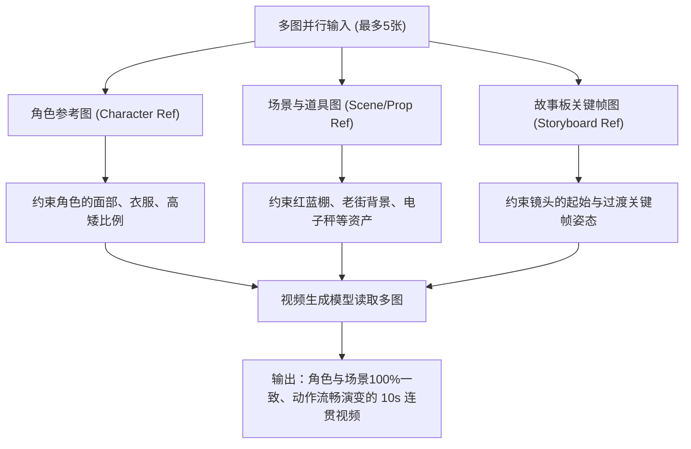

# 《华强买瓜》3D 动画电影版 - 多图参考控制流 (Multi-Image Reference Flow) 视频生成指南 (v2.0)

本指南完全废弃传统的单图“首尾帧递进法”，全面升级为更先进、更高效的 **“多图参考控制流 (Multi-Image Reference Flow)”**。

由于现代顶尖视频生成大模型（如 **Kling 1.5 (可灵多图参考版)**、**Runway Gen-3 Multi-ControlNet**、**Luma Dream Machine 2.0**）均已支持同时喂入最多 5 张参考图片（包括**角色一致性参考图 Character Ref**、**场景道具一致性参考图 Style/Object Ref** 以及**故事板关键分镜参考图 Storyboard Ref**）。通过这种多图并行输入，视频大模型能够自动读取这本“视觉圣经”，实现无需逐段导出首尾帧的、高度连贯的长视频分段生成。

---

## 一、 多图参考控制机制 (How Multi-Image Reference Works)

在分段生成 10 秒视频时，您需要向模型的图像参考框（Image Reference Slots）中同时喂入三类图片，并在提示词中明确建立它们与动作的映射关系：



* **核心优势**：大模型同时看清了角色、场景和动作蓝图，它能自动在分镜图 1（SH001）和分镜图 2（SH002）之间进行超平滑的动态插帧与内容过渡，生成连贯但不同的片段。

---

## 二、 4 段视频的“多图配比单”与专用生成提示词

### 1. SEG01：0.0s - 10.0s 【第一幕：登场与调侃价格】
#### 📸 多图参考配比单 (最多5张)
1. **[参考图 1] 华强角色锁定卡**（约束华强平头、方颌、黑皮夹克特征）
2. **[参考图 2] 摊主与小弟双人设定图**（约束胖老板背心与瘦小弟溜肩特征）
3. **[参考图 3] 老街水果棚场景设计图**（约束斑驳灰墙与红蓝雨棚条纹一致性）
4. **[参考图 4] 故事板分镜 SH001 (Q弹刹车登场)**（提供 0s 起始的低角度侧面镜头及摩托姿态）
5. **[参考图 5] 故事板分镜 SH002 (利落脱盔直视)**（提供 3s 处的正面中近景仰拍及挂头盔姿态）

#### ✍️ 专用生成提示词 (中英双语版)

##### 中文版提示词 (可灵 Kling 1.5 / PixVerse)
```text
基于所上传的5张参考图片生成视频。保持参考图1（华强）和参考图2（摊主、小弟）的角色形象100%不变，保持参考图3的水果棚老街场景结构。
【前3秒动态】：视频从参考图4（分镜SH001）的低角度侧面全景平滑开始。画面中，华强骑着复古摩托车疾驰而入，并在街角水果摊前帅气刹停，摩托避震发生Q弹可爱的压缩回弹，排气管喷出一个卡通白色烟圈。
【第3到6.5秒动态】：镜头以平滑剪辑或摇镜头，无缝过渡到参考图5（分镜SH002）的正面仰拍中商。华强单脚支地，右手利落地取下头盔挂在左把手上，露出冷峻的平头脸庞，冷静逼视前方。
【第6.5到10秒动态】：镜头切换为越肩中景。胖摊主（参考图2中的大肚男）原本剔着牙，听到调侃后猛啐牙签愤怒地大声怒吼起立，全身肥肉颤动；旁边溜肩的小弟蹲在矮凳上嗑瓜子猥琐嬉笑。
高品质3D动画电影风格，皮克斯3D粘土质感，柔和电影级光影，光线追踪渲染，16:9比例。
```

##### 英文版提示词 (Runway Gen-3 / Luma)
```text
Generate a continuous 3D animated video based on the 5 uploaded reference images. Maintain 100% identity of Character Ref 1 (Huaqiang) and Character Ref 2 (Vendor & Assistant). Keep the exact environment details of Scene Ref 3.
[0s to 3s]: Smoothly start from Storyboard Ref 4 (SH001) in a low-angle panning full shot. The cool rider sits on a black moped and brakes comically with exaggerated Q-elastic suspension compression in front of the fruit stand. A cartoon smoke ring puffs from the exhaust.
[3s to 6.5s]: Transition smoothly to Storyboard Ref 5 (SH002) in a medium close-up, front low-angle. He takes off his black helmet and hangs it on the handlebar, locking his flat square jawline and icy-cold eyes directly forward with an intimidating gaze.
[6s to 10s]: Move to an OTS shot over his leather-jacketed shoulder. The fat vendor wearing a sleeveless tank top angrily stands up in fury. Beside him, his thin helper smirks wickedly on a stool.
High-quality 3D digital animation style, Pixar clay-like style, soft warm cinematic lighting, ray tracing, 16:9.
```

---

### 2. SEG02：10.0s - 20.0s 【第二幕：挑瓜与保熟交锋】
#### 📸 多图参考配比单 (最多5张)
1. **[参考图 1] 华强角色锁定卡**（约束华强皮衣与冷静神态）
2. **[参考图 2] 摊主与小弟双人设定图**（约束胖老板大肚皮特征）
3. **[参考图 3] 故事板分镜 SH004 (手拍西瓜)**（提供 10s 起始的极近特写镜头与敲击姿态）
4. **[参考图 4] 故事板分镜 SH005 (保熟凝视)**（提供 13.5s 处越过瓜堆仰拍华强的构图）
5. **[参考图 5] 故事板分镜 SH006 (老板怒拍恐吓)**（提供 16.5s 处胖老板拍掌大怒的姿态）

#### ✍️ 专用生成提示词 (中英双语版)

##### 中文版提示词 (可灵 Kling 1.5 / PixVerse)
```text
基于所上传的5张参考图片生成视频。保持参考图1和参考图2中的人物结构完全一致。
【前3.5秒动态】：视频从参考图3（分镜SH004）的极近景特写开始。华强戴着黑色骑行皮手套的右手伸入画面，在翠绿西瓜上轻轻拍了两下。西瓜皮发生卡通的微凹陷，顶部褐色藤蔓呈弹簧般剧烈弹跳抖动，震起一圈小白灰尘，镜头随敲击发生Q弹微颤。
【第3.5到6.5秒动态】：平滑剪辑到参考图4（分镜SH005）的越肩低仰角中景。华强双手抱胸站在西瓜堆前，眼神充满冰冷审视。旁边瘦小溜肩的小弟双手高频揉搓，缩着脖子咧歪嘴坏笑。
【第6.5到10秒动态】：切换到参考图5（分镜SH006）的中景。满脸胡茬的胖老板面色通红，在胸前“啪”地合击拍响大肉掌，激起一圈卡通灰尘，横肉狂震，粗大手指颤抖地指点威吓前方。小弟被吓得缩没了脖子，呆滞僵死。
高品质3D动画电影风格，皮克斯3D粘土质感，柔和电影级光影，光线追踪渲染，16:9比例。
```

##### 英文版提示词 (Runway Gen-3 / Luma)
```text
Generate a continuous 3D animated video based on the 5 uploaded reference images. Maintain exact character models from Ref 1 and Ref 2.
[0s to 3.5s]: Start from Storyboard Ref 3 (SH004) in an extreme close-up on watermelons. A hand in a black leather glove taps a green striped watermelon. The tap causes a cartoon squash indentation, and the curly vine wiggles wildly like a spring with a tiny ring of white dust. Camera shakes comically.
[3.5s to 6.5s]: Smoothly cut to Storyboard Ref 4 (SH005) in a low-angle OTS shot over watermelons. The cool man stands with arms crossed, staring down icy-cold. Beside him, the sneaky lanky helper rubbing his hands under the hot noon sun.
[6.5s to 10s]: Transition to Storyboard Ref 5 (SH006) in a medium shot. The heavy, angry Chinese vendor yelling with a wide-open mouth, slamming his thick palms together with force, causing flesh ripples. Beside him, the assistant gasps and freezes in fear.
High-quality 3D digital animation style, Pixar clay style, soft warm cinematic lighting, ray tracing, 16:9.
```

---

### 3. SEG03：20.0s - 30.0s 【第三幕：对赌上秤与揭穿猫腻】
#### 📸 多图参考配比单 (最多5张)
1. **[参考图 1] 华强角色锁定卡**（约束华强戏谑冷笑表情）
2. **[参考图 2] 电子秤双形态设定图**（提供秤盘正面、背面金属结构及鲜红吸铁石磁铁位置）
3. **[参考图 3] 故事板分镜 SH007 (砸瓜上秤)**（提供 20s 水平中景砸秤及避震Q弹姿态）
4. **[参考图 4] 故事板分镜 SH008 (指点不够数)**（提供 23.5s 高角度俯视绿液晶数显读数画面）
5. **[参考图 5] 故事板分镜 SH009 (秤底反转磁铁暴露)**（提供 26.5s 掀开秤盘、红色磁铁刺眼醒目与三人呆死定格画面）

#### ✍️ 专用生成提示词 (中英双语版)

##### 中文版提示词 (可灵 Kling 1.5 / PixVerse)
```text
基于所上传的5张参考图片生成视频。保持参考图1的角色特征，并以参考图2的电子秤和高饱和度亮红色磁铁为固定道具参考。
【前3.5秒动态】：视频从参考图3（分镜SH007）的中景水平视角开始。胖老板双手狠狠将西瓜砸在金属秤盘上，底座橡胶避震产生极度夸张的卡通Q弹，在半空狂暴上下起伏跳动，摄像机同步剧烈弹跳。华强在左侧似笑非笑。
【第3.5到6.5秒动态】：平滑切至参考图4（分镜SH008）的俯视特写。绿色数显液晶屏亮起，闪烁定格在“20.00”上。华强戴着黑色手套的右手食指伸入，沉稳按在银色秤盘边缘导致微倾斜，绿色数字的反光投射在手套皮质颗粒上。
【第6.5到10秒动态】：视频无缝演变为参考图5（分镜SH009）的画面。华强左手猛地反转掀起秤盘，露出底座背面中心那颗刺眼的鲜红色圆形塑料磁铁。镜头极速向后拉开，三人同框并进入喜剧性的戏剧石想定格（无任何动作）：老板脑门流下一大滴缓慢下滑的透明汗；小弟大张着长嘴巴双膝打滑抖动，华强在一旁冷笑。
高品质3D动画电影风格，皮克斯3D粘土质感，柔和电影级光影，光线追踪渲染，16:9比例。
```

##### 英文版提示词 (Runway Gen-3 / Luma)
```text
Generate a continuous 3D animated video based on the 5 uploaded reference images. Maintain character models and use Object Ref 2 for the vintage electronic scale and the saturated red circular magnet details.
[0s to 3.5s]: Start from Storyboard Ref 3 (SH007) in a side angle medium shot. The angry fat vendor violently slams a watermelon onto the scale. The silver scale bounces and vibrates wildly with elastic cartoon physics. Camera shakes. On the left, the cool man smirks sarcastically.
[3.5s to 6.5s]: Smoothly cut to Storyboard Ref 4 (SH008) in a high-angle close-up. The scale screen glows with a green digital display "20.00". A black gloved finger firmly presses the scale edge, causing a tilt. Green light reflects onto the glove.
[6.5s to 10s]: Transition dynamically to Storyboard Ref 5 (SH009). The man's hand flips the plate upside down, exposing a bright saturated red circular magnet. Camera fast dollies out to a wide shot of three characters frozen in shock: the vendor has a massive sweat drop on his dazed face, the helper gasps with a huge open mouth and trembling knees, and the cool man smirks.
High-quality 3D digital animation style, Pixar clay style, soft warm cinematic lighting, ray tracing, 16:9.
```

---

### 4. SEG04：30.0s - 40.0s 【第四幕：去害化劈瓜与荒诞离场】
#### 📸 多图参考配比单 (最多5张)
1. **[参考图 1] 华强角色锁定卡**（约束华强面部和动作帅气特征）
2. **[参考图 2] 钝圆头西瓜刀道具卡**（约束把手胶带与钝化圆弧安全刀尖特征）
3. **[参考图 3] 故事板分镜 SH010 (拔刀劈瓜)**（提供 30s 起始的拔刀姿态与刀光折射星芒闪光）
4. **[参考图 4] 故事板分镜 SH011 (果汁爆炸小弟翻车)**（提供 33.5s 处西瓜流体水球大爆炸、高压果汁消防水枪拍脸与小弟躺地四脚蹬空姿态）
5. **[参考图 5] 故事板分镜 SH012 (白烟圈离去全景)**（提供 37s 处排气管三个大小递减白烟圈、华强跨车夕阳离场及小弟抱头赤脚逃跑的全景）

#### ✍️ 专用生成提示词 (中英双语版)

##### 中文版提示词 (可灵 Kling 1.5 / PixVerse)
```text
基于所上传的5张参考图片生成视频。保持参考图1人物面部，并以参考图2的缠胶带钝圆头刀为固定道具参考。
【前3.5秒动态】：视频从参考图3（分镜SH010）的动作特写开始。华强以行云流水的优美慢动作跨步上前，右手反手拔出圆头水果刀，刀身在空中划过完美的抛物线，折射出一道耀眼刺目的亮银色卡通星芒闪光，极其坚决精准地一刀劈在案板的翠绿西瓜上。
【第3.5到7秒动态】：镜头无缝过渡到参考图4（分镜SH011）的滑稽高潮。西瓜没有血腥裂开，而是像红色流体水球大爆炸！大股消防水枪般的鲜红果汁狠狠拍在老板大脸上将他冲退，老板贴着瓜籽满脸通红眼冒圈圈金星。右侧的小弟木凳侧翻仰面摔大跤，双布鞋在半空狂蹬自行车。画面因爆炸产生强烈的戏剧性抖动。
【第7到10秒动态】：镜头无缝演变为参考图5（分镜SH012）的拉高鸟瞰全景。华强戴盔跨上黑色复古摩托车踩踏板，排气管卡点“啵、啵、啵”喷出三个依次递减的圆形卡通白烟圈，绝尘奔向远方夕阳老街。胖老板在废墟中湿透呆立，小弟双手抱头、一脚穿黑鞋一脚赤脚丫在泥地上打滑尖叫狂奔。画面渐暗淡出全黑。
高品质3D动画电影风格，皮克斯3D粘土质感，柔和电影级光影，光线追踪渲染，16:9比例。
```

##### 英文版提示词 (Runway Gen-3 / Luma)
```text
Generate a continuous 3D animated video based on the 5 uploaded reference images. Use Object Ref 2 for the melon cleaver wrapped with black tape and a dull round tip.
[0s to 3.5s]: Start from Storyboard Ref 3 (SH010) in a close-up action shot. The cool man in a black leather jacket sweeps a dull round-tipped cleaver in a perfect slow-motion arc, flashing a brilliant white starburst gleam in the air as he slashes down at the green watermelon.
[3.5s to 7s]: Smoothly transition to Storyboard Ref 4 (SH011) in a medium close-up comical explosion. The watermelon explodes like a massive red liquid water balloon, blasting a high-pressure jet stream of bright red juice onto the fat vendor's face, pushing him back. Beside him, his thin helper falls flat on his back, kicking the air in a bicycling motion, crying tears. High energy liquid splash, camera shakes.
[7s to 10s]: Move to Storyboard Ref 5 (SH012) in a pullback crane shot of sunset alley. The cool man rides his moped away into the warm summer sunset down a concrete alley. Three round white cartoon smoke rings puff in sequence from the exhaust pipe. In the background, the drenched vendor stands dazed, while his helper, with one shoe missing, runs away frantically clutching his head. Fade to black.
High-quality 3D digital animation style, Pixar clay style, soft warm cinematic lighting, 16:9, dramatic exit.
```

---

## 三、 多图参考控制流实操三板斧

在您真正把图片和提示词喂入视频模型时，请记住以下三项实操法则，以将模型的能力发挥到极致：

1. **设置合理的权重 (Reference Strength / Weight)**：
   * **角色参考卡 (Ref 1 & Ref 2)**：权重建议设为 **高 (High, 约 0.8-0.9)**。我们要确保华强的皮夹克、短寸头，摊主大肚皮，小弟溜肩在 10 秒钟内绝对不能变形或改变衣服颜色。
   * **场景参考图 (Ref 3)**：权重设为 **中等 (Medium, 约 0.6-0.7)**。允许模型在 10 秒的镜头拉推平移中，对雨棚和水果箱的微小物理形变和阴影进行合理的动态计算。
   * **故事板关键分镜参考图 (Ref 4 & Ref 5)**：权重设为 **中等 (Medium, 约 0.5-0.6)**。这至关重要！如果故事板关键帧权重过高，模型会被“石化”在原地不肯动弹；如果过低，动作轨迹会偏离。设置为中等权重，大模型会最完美地把 `Ref 4` 作为起跑点，在 10 秒钟内，向着 `Ref 5` 的终点画面进行超流畅的动态插帧与姿态演变。
2. **文字提示词与多图序号的卡点呼应**：
   * 在您的提示词中，一定要像我上面写的那样，明确用词汇将“第几秒”与“第几个参考图 (Ref X)”绑定起来（如：`从参考图 4 开始... 过渡到参考图 5...`）。这相当于在大模型的隐空间中为它拉起了一条时序导轨，极大提升了模型对长动作的控制力。
3. **保持环境噪声种子 (Noise Seed) 一致（进阶技巧）**：
   * 如果生成平台允许您锁定 **Seed** 或 **Noise Pattern**，建议在 SEG01 到 SEG04 的独立生成中，尽量使用相同或相近的种子，这样可以进一步压制画面细微噪点和光影频闪的漂移，让整部片子的颗粒感更加浑然一体。
