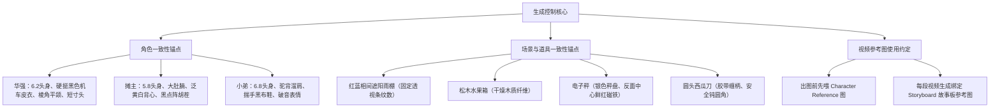
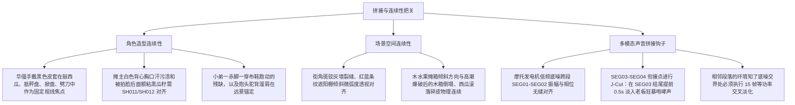

# 《华强买瓜》3D 动画电影版 - 视频分段提示词包 (v1.0)

本提示词包继承自角色与场景设定锁定卡 (v1.0)、分镜镜头表 (v1.0) 以及声音导演方案 (v1.0)。本包整合了最终可用于生成 4 段 10 秒视频片段（共计 40 秒）的 Segment Prompts。设计上采用了 **“视听交响高度整合”** 架构，将角色几何造型、眼神微动作、镜头调度、台词气口、拟音与音乐指示完全内嵌于每一段提示词中，最大化确保生成效果与拼接连续性。

---

## 一、 全局生成与渲染约束 (Global Generation Constraints)

在将本提示词输入各大主流 3D 视频生成器（如 Sora, Kling, Runway Gen-3, Luma Dream Machine, PixVerse 等）时，必须将以下**全局视觉与材质控制参数**强制作为全局预置输入：

### 1. 统一视觉基调 (Universal Visual Style Anchor)
* **中文主干词**：高品质 3D 动画电影关键帧，柔和温暖的电影级光影，光线追踪渲染，丰富的物理材质纹理（硬挺皮革夹克折痕、纯棉泛黄背心起毛、干燥松木水果箱纤维、金属磨损电子秤拉丝、蜡质翠绿西瓜表皮），细腻的粘土质感角色皮肤，微表情表情流，比例高度夸张的胖瘦角色剪影。
* **英文适配器 (English Prompt Anchor)**：
  ```text
  3D animated movie keyframe, high-quality 3D digital animation style, soft warm cinematic lighting, ray tracing, octane render, vivid colors, detailed textures, clay-like smooth skin shader, micro-expressions, rich tactile materials (leather jacket, cotton vest, wooden crates, metal scales), highly expressive characters, 16:9 aspect ratio, dramatic atmosphere, PG-rated comical physical humor.
  ```

### 2. 全局负向约束 (Global Negative Constraints)
* `Negative Prompt`: `photorealistic, real-life actors, 2D illustration, flat cartoon, sketch, line art, low resolution, noisy render, bloody wounds, gory impact, knife pointing directly at neck/person, modern smartphone, brand logos, sudden camera angle shifts inside a single segment, jittery frame rate.`

---

## 二、 核心资产与一致性锚点 (Consistency Anchors)

为了确保跨段落（Segment 01 至 Segment 04）出图不发生材质、几何和光影漂移，生成时必须提供以下参考资产（Reference Assets）：



1. **角色造型一致性约束**：
   * **华强 (`hua_qiang`)**：`6.2头身` 方扁平颌，平直一字眼，极短利落寸头。黑亮皮衣的垫肩挺括与物理折痕在 SH001、SH002、SH003、SH005、SH010 中锚定。
   * **摊主 (`boss_vendor`)**：`5.8头身` 横向加宽，挺起如球的大肚腩，白色背心左胸的汗渍陈旧发黄。爆汁后脸上的甜美西瓜汁与额头正中心的**三颗黑色西瓜籽**需在 SH011 与 SH012 完美继承。
   * **小弟 (`vendors_henchman`)**：`6.8头身` 极其削瘦溜肩，双手总拢在浅蓝色背心底端。受惊摔倒后，其**踩后跟的右布鞋脱落**，SH012 逃跑时必须保持一脚赤脚、一脚穿黑鞋的状态。
2. **场景与道具一致性约束**：
   * **老街水果摊**：斑驳灰墙的裂缝走向与红蓝帆布遮阳雨棚的条纹比例、微弧透视在所有对立中景镜头中保持恒定。
   * **西瓜与道具**：翠绿条纹的 waxy 瓜皮反射、翻秤盘时背面凹陷中心的**亮红色圆形吸铁石**、缠绕黑色绝缘胶带的圆头钝切瓜刀在出画和入画中无缝连贯。

---

## 三、 分段视频提示词详情 (Segment Prompts Pack)

### 1. SEG01：0.0s - 10.0s 【第一幕：登场与调侃价格】
* **技术段定位**：`SEG01`
* **时长**：10.0 秒
* **覆盖 Story Beat**：`B01` (登场与调侃价格)
* **覆盖镜头**：`SH001` (0-3.0s)、`SH002` (3.0-6.5s)、`SH003` (6.5-10s)
* **技术承接 (`continuity_in`)**：知了声环境底噪淡入，机车引擎轰鸣声入画。
* **分段视觉目标 (Visual Goal)**：展示华强利落、Q弹的骑车刹停登场，取下头盔露出压迫性冷俊审视，以及踱步水果摊、调侃瓜价是金子做的心态交锋，建立尴尬冷场。

```yaml
segment_prompt:
  segment_id: SEG01
  duration_seconds: 10
  covered_beats: [B01]
  covered_shots: [SH001, SH002, SH003]
  continuity_in: "知了声环境底噪淡入，机车引擎轰鸣声入画。"
  visual_goal: "华强骑复古摩托Q弹刹停，脱头盔展现深锁凝视，踱步向水果摊，挑衅发问价格是否金子做，引出摊主不耐烦起立。"
  camera_direction: "【SH001 0.0s-3.0s】全景，低角度横向摇平移，在摩托车刹停时微幅缓冲推近；【SH002 3.0s-6.5s】中近景，正面仰拍华强脸部，缓慢推镜头；【SH003 6.5s-10.0s】OTS中景，越过华强黑皮夹克右肩，静态摄像机观察躺椅上的摊主与蹲在小凳上的小弟。"
  character_action: "华强骑着黑色弯梁车从右至左疾驰刹停，前后粗避震发生Q弹起伏。华强单脚支地，利落脱下黑色头盔挂在左把手，下颌微抬，踱步至西瓜箱前。摊主原本躺着剔牙，听到华强调侃后猛啐牙签双手叉腰挺大肚起立。小弟在一旁蹲着鸡啄米式嗑瓜子，鬼祟发笑。"
  performance_direction: "华强表情完全紧绷平静，眼神深邃，动作慢条斯理但行云流水；摊主剔牙时斜眼瞅人漫不经心，起立挺大肚时全身肥肉卡通回弹；小弟溜肩驼背，尖下巴咧嘴谄媚嬉笑，八字胡高频抖动。"
  dialogue_direction: "华强语气平静带磁性：“老板，这瓜多少钱一斤？” -> 摊主漫不经心：“两块钱一斤。” -> 华强戏谑冷笑：“聚聚，你这瓜皮是金子做的，还是这瓜粒子是金子做的？” -> 摊主暴怒狂吼：“你嫌贵我还嫌贵呢！挑一个？”"
  foley_direction: "摩托避震发出Q弹弹簧吱呀压缩声，排气管“啵”的一声喷出卡通白烟圈；头盔挂在车把上的“当啷”金属碰撞声；剔牙“啐”的吐签湿声与牙签击木箱“嗒”声；竹椅承受起立重力的“吱呀”摩擦音。"
  music_direction: "轻松悠闲的尤克里里与 staccato 断奏巴松配乐起拍进入，节奏 92 BPM，不抢台词。"
  ambience_direction: "正午刺眼阳光，100% 强度的燥热老街知了叫声环境底噪。"
  silence_or_pause: "【黄金静默点 SP01 8.0s - 8.5s】：在华强台词“金子做的”最后一个字落地帧，完全静音所有音轨 0.5s，画面中剔牙手指和嗑瓜子动作定格石化，制造极限冷场尴尬。"
  continuity_out: "摊主暴怒“挑一个”大吼余波，华强摩托车发电机低频底噪在此段结尾处保留，无缝带入 SEG02。"
  reference_images: "角色设定卡 v1.0 华强、摊主、小弟；分镜故事板 SH001, SH002, SH003 构图图。"
  negative_constraints: "no real-life actors, no synth music, no blood, no modern smartphone, no brand logo."
  chinese_video_prompt: |
    参考上传的角色设定图、场景图和道具设定图，并根据故事板里分镜序号1至3（SH001、SH002、SH003）涉及的画面内容进行生成视频：
    3D动画电影10秒视频片段，高品质3D数字动画风格，皮克斯风格。
    【镜头1: 0s-3.0s】全景，低角度横向摇平移侧拍。阳光刺眼的夏日正午，一个戴着黑色高亮机车头盔、穿着挺拔黑色皮衣（拉丝银色拉链）的中国男子，骑着一辆高亮黑色复古弯梁摩托车疾驰冲入画面，在街角水果摊的松木西瓜箱前稳稳刹停。由于惯性，摩托车的前后粗避震发生Q弹可爱的极限下压与起伏回弹，车尾排气管“啵”地喷出一个白色的卡通烟雾圈。
    【镜头2: 3.0s-6.5s】中近景，正面仰拍。这位中国男子坐在摩托车上，右手利落地脱下黑色高亮头盔挂在左把手上。他微微抬起下颌，目光平静而深锁，充满极强的压迫审视感。阳光斜射照亮他坚毅宽平的下颌与笔直的鼻梁，皮肤呈现光滑细致的3D粘土材质。
    【镜头3: 6.5s-10.0s】OTS中景。越过黑色机车皮夹克男子的右肩背影。在水果摊斜跨的红蓝条纹遮阳棚下，高大敦实、挺着圆肚皮、身穿泛黄白色棉背心的胖摊主老板原本躺在竹椅上剔牙，听到调侃后猛啐掉剔牙签，一巴掌拍在大肚皮上霍然怒立；旁边一个极瘦、驼背溜肩的小弟缩在凳子上嗑瓜子，咧歪嘴露出鬼祟谄媚的坏笑。背景码放着木质西瓜箱。
    柔和温暖的电影级光影，光线追踪渲染，丰富的物理材质纹理，粘土滑润皮肤材质，16:9比例，富有戏剧性的荒诞喜剧氛围。
  english_video_prompt: |
    Referencing the uploaded character design sheets, scene concept sheet, and keyframe storyboards (frames 1 to 3, SH001 to SH003), generate a 10-second video:
    3D animated movie 10-second video segment, high-quality 3D digital animation style, Pixar style.
    [Shot 1: 0s-3.0s] Full shot, low-angle horizontal panning moped arrival. Under the blazing summer noon sun, a cool Chinese man in a tough black leather jacket and helmet rides a vintage black moped, stopping comically in front of a street fruit stand. The moped's suspension bounces and compresses with funny cartoon elastic physics. A white cartoon smoke ring puffs from the exhaust.
    [Shot 2: 3.0s-6.5s] Medium close-up, front low-angle facial shot. The cool man sits on the moped, takes off his glossy black helmet and hangs it on the handlebar, locking his intense calm eyes forward. Sharp sunbeams illuminate his flat square jaw and sharp nose with smooth clay skin shaders.
    [Shot 3: 6.5s-10.0s] OTS medium shot over the leather-jacketed man's shoulder. A heavy, chubby vendor in a white sleeveless tank top standing up angrily from his bamboo chair in fury under a striped awning. Next to him, a very thin, lanky helper sits on a stool, smirking wickedly and eating seeds. Watermelons are stacked in wooden crates.
    Soft warm cinematic lighting, ray tracing, octane render, detailed textures (leather, cotton, wood), clay-like smooth skin, highly expressive comical characters, 16:9 aspect ratio.
```

---

### 2. SEG02：10.0s - 20.0s 【第二幕：挑瓜与保熟交锋】
* **技术段定位**：`SEG02`
* **时长**：10.0 秒
* **覆盖 Story Beat**：`B02` (挑瓜与保熟交锋)
* **覆盖镜头**：`SH004` (10-13.5s)、`SH005` (13.5-16.5s)、`SH006` (16.5-20s)
* **技术承接 (`continuity_in`)**：摊主起立挺肚横肉颤抖，华强摩托低频发电机底噪和夏日知了背景音。
* **技术传递 (`continuity_out`)**：以摊主暴怒“你要不要吧！！”的狂吼尾音卡点，移交砸瓜上秤。
* **分段视觉目标 (Visual Goal)**：展现华强黑手套轻拍大西瓜，西瓜藤蔓产生弹簧般剧烈弹跳抖动并震起灰尘圈的物理喜感；华强平静“保熟吗”之问与摊主怒拍肥厚肉掌、横肉暴起恐吓的火药味对峙。

```yaml
segment_prompt:
  segment_id: SEG02
  duration_seconds: 10
  covered_beats: [B02]
  covered_shots: [SH004, SH005, SH006]
  continuity_in: "摩托车发电机低频底噪、知了背景音连续，老板起立挺肚动作顺延。"
  visual_goal: "华强手敲击翠绿西瓜引出藤蔓可爱弹簧颤抖，发出保熟之问，摊主恼羞成怒怒拍肥大掌横肉狂飙恐吓，小弟谄媚笑吓得缩头。"
  camera_direction: "【SH004 10.0s-13.5s】特写，低机位对准翠绿大西瓜，拍击刹那摄像机发生一次Q弹轻微震颤；【SH005 13.5s-16.5s】越肩OTS中景，越过瓜堆仰拍华强，缓慢推镜头拉向双眼；【SH006 16.5s-20.0s】中景，正对摊主大胖子，在其怒拍双掌时镜头极速 Dolly In 至面部近景。"
  character_action: "华强走近西瓜箱，伸出戴黑色皮套的手指，在圆润翠绿的西瓜上敲拍了两下。华强双臂抱胸，直视前方。小弟缩脖溜肩，弓背谄媚大咧歪嘴坏笑，双手高频揉搓附和。摊主横眉竖眼，在胸前啪地合击拍响两只肉掌，一根肥大手指颤抖地指点华强鼻子，肚皮起伏。"
  performance_direction: "华强面部肌肉完全静止，双眉压眼，眼睑拉平聚焦摊主，散发死亡压迫；西瓜被敲击处微凹反弹，顶部褐色藤蔓呈卡通弹簧般上下剧烈弹抖，激射一圈微小白灰尘；摊主额头青筋蠕动，眼球充血暴跳；小弟被巴掌巨响吓得谄媚嘴脸硬切为僵硬缩头。"
  dialogue_direction: "华强平静发问：“这瓜保熟吗？” -> 摊主眉头锁死大吼：“我开水果摊的，能卖给你生瓜蛋子？！” -> 华强眼神变冷低沉压迫：“我问你这瓜保熟吗？” -> 摊主暴跳狂叫：“你故意找茬是不是？！你要不要吧！”"
  foley_direction: "皮手套击瓜的“咚咚”清脆饱满空腔回音（带微弱 0.2s 混响），藤蔓剧烈弹簧抖动的“啵嘤啵嘤”小幅度弹跳音；摊主粗肥手掌在空气中“啪！！”地大肉掌合击肉拍响，尘灰震起音。"
  music_direction: "音乐降调压低转入 88 BPM，以大提琴不协和 pizzicato 单音拨弦和不安马林巴突点，极度压缩戏剧气流，强化火药味。"
  ambience_direction: "知了环境音量在此段华强踱步时平滑降低 6dB，削弱 4000Hz 以上高频，渲染压抑真空感。"
  silence_or_pause: "无。"
  continuity_out: "以摊主“你要不要吧！！”怒气尾音和大肉掌合拍余震声为音频钩子，移交砸瓜上秤。"
  reference_images: "角色设定卡 v1.0 华强、摊主、小弟；分镜故事板 SH004, SH005, SH006 构图图；西瓜道具大合集设计图。"
  negative_constraints: "no realistic textures, no high frequency metal noise, no phone, no knife pointing to skin."
  chinese_video_prompt: |
    参考上传的角色设定图、场景图和道具设定图，并根据故事板里分镜序号4至6（SH004、SH005、SH006）涉及的画面内容进行生成视频：
    3D动画电影10秒视频片段，高品质3D数字动画风格，皮克斯风格。
    【镜头1: 10.0s-13.5s】微距特写，低机位俯拍西瓜堆。一只戴着黑色骑行皮手套的右手伸入画面，在一颗极圆、翠绿条纹的西瓜皮上轻轻“咚咚”敲击了两下。瓜皮微凹陷，西瓜顶部的干枯藤蔓像弹簧般剧烈弹跳抖动，震起一圈小白灰尘，镜头随敲击发生Q弹微颤。
    【镜头2: 13.5s-16.5s】越肩中景。越过西瓜堆仰拍华强，缓慢推近。华强双臂抱胸，面部平静如冰，双眉深压，死死盯着前方。旁边那个瘦小溜肩的小弟贴着老板，双手高频揉搓，缩着细长脖子，露出得志小人般的谄媚冷笑。阳光在他们脸上投下戏剧性的直角阴影。
    【镜头3: 16.5s-20.0s】中景，正对胖老板。被逼急的胖老板额头青筋暴跳，满脸络腮胡茬颤动，在胸前“啪”地大力拍响胖手掌，全身肥肉和横肉跟着巴掌剧烈颤动，一根粗手指愤怒地直指前方。旁边的小弟被巨响吓得缩没了脖子，笑脸硬切成呆滞惊恐。
    柔和温暖的电影级光影，光线追踪渲染，丰富的物理材质纹理，粘土滑润皮肤材质，16:9比例，戏剧对峙张力。
  english_video_prompt: |
    Referencing the uploaded character design sheets, scene concept sheet, and keyframe storyboards (frames 4 to 6, SH004 to SH006), generate a 10-second video:
    3D animated movie 10-second video segment, high-quality 3D digital animation style, Pixar style.
    [Shot 1: 10.0s-13.5s] Extreme close-up on watermelons. A hand in a black leather glove gently taps a perfectly round striped watermelon. The tap causes a cartoon squash indentation, and the curly vine wiggles wildly like a spring. A tiny ring of white dust puffs up. Camera shakes comically.
    [Shot 2: 13.5s-16.5s] Low-angle OTS shot over watermelons zooming in. The cool man stands with arms crossed, staring down icy-cold. Beside him, the sneaky lanky helper in a blue tank top smirks and rubs his hands under the hot noon sun casting sharp shadows on smooth clay skin.
    [Shot 3: 16.5s-20.0s] Medium shot of the heavy angry Chinese vendor. He yells with a wide open mouth and slams his thick palms together with force, causing flesh ripples. Beside him, the thin helper gasps and freezes in fear. Wooden melon crates in the background.
    Soft warm cinematic lighting, ray tracing, octane render, detailed textures (leather, wood, cotton), clay-like smooth skin, highly expressive comical characters, 16:9 aspect ratio.
```

---

### 3. SEG03：20.0s - 30.0s 【第三幕：对赌上秤与揭穿猫腻】
* **技术段定位**：`SEG03`
* **时长**：10.0 秒
* **覆盖 Story Beat**：`B03` (对赌上秤与揭穿猫腻)
* **覆盖镜头**：`SH007` (20-23.5s)、`SH008` (23.5-26.5s)、`SH009` (26.5-30s)
* **技术承接 (`continuity_in`)**：摊主怒不可遏地劈手抓瓜，华强似笑非笑的嘴角戏谑。
* **技术传递 (`continuity_out`)**：掀开秤盘露出吸铁石瞬间静音一秒，移交高潮出刀。
* **分段视觉目标 (Visual Goal)**：呈现大西瓜砸上秤盘时，电子秤产生的夸张底座避震Q弹上下跳跃，数显屏延迟闪烁并定格在虚假“20.00”斤；华强食指按盘，利落无比一指反转秤盘，在银色背面底座凹陷处露出一颗**高饱和亮红色圆形塑料磁铁**，大白天下；展现名名定格三人石化尴尬表情。

```yaml
segment_prompt:
  segment_id: SEG03
  duration_seconds: 10
  covered_beats: [B03]
  covered_shots: [SH007, SH008, SH009]
  continuity_in: "摊主抓西瓜动作顺延，知了背景音和老板怒喘声连续。"
  visual_goal: "摊主砸西瓜落秤，电子秤发生避震Q弹剧烈跳动定格虚假20斤，华强单指按抵秤盘，左手利落掀翻反转秤盘，秤盘背面凹陷正中心露出一大块亮红吸铁石，猫腻揭穿，三人同框石化大定格。"
  camera_direction: "【SH007 20.0s-23.5s】中景，侧面静态机位，西瓜砸中秤盘的刹那摄像机发生一次剧烈上下弹跳抖动；【SH008 23.5s-26.5s】特写，俯视秤盘，镜头随华强右手食指点入而极速推入微距特写；【SH009 26.5s-30.0s】极微距，秤底特写，翻面刹那镜头以极高动能快速拉开 (Fast Dolly Out) 变为宽幅三人同框大中景。"
  character_action: "华强嘴角浮现戏谑冷笑。摊主气鼓鼓粗暴抓瓜狠狠砸砸在电子秤上，指点绿读数。华强右手戴着黑皮套伸出一根食指轻轻抵住秤盘边缘导致倾斜，眼神变冷，左手利落一把反转掀起秤盘，亮红色圆形塑料磁铁暴露。三人瞬间石化：摊主手指秤僵在空中，小弟大张嘴膝盖颤抖，华强似笑非笑。"
  performance_direction: "华强面呈戏谑冷笑 (`Smirk`)；电子秤避震橡胶脚产生Q弹弹簧剧烈颤动，绿屏卡顿跳读定格在“20.00”；掀开秤盘后，摊主大脸木讷，额头浮现一大滴极速往下滑落的透明汗滴；小弟嘴巴张得老宽呈长条空腔，豆豆眼脱眶，双手呈鹰爪状在两侧狂抖。"
  dialogue_direction: "华强戏谑从容：“这瓜要是熟我肯定要啊。那它要是不熟怎么办呀？” -> 摊主没好气狂吼：“要是不熟，我自己吃了它，满意了吧？！” -> 摊主指向绿屏大喊：“15斤，30块！” -> 华强平静指秤：“15斤？你这秤不够数啊。” -> 华强利落翻盘戏谑：“你瞧瞧这秤盘子，这底下……”"
  foley_direction: "西瓜砸秤盘的沉重不锈钢砸击“当——”及底座强弹颤声；液晶绿字跳指定格时的滋滋卡顿电流声；华强手套压秤盘的“咯吱”微弱偏转音；翻转秤盘锈蚀干涩吱呀声“吱呀——”，吸铁石撞击银盘心清脆反差音“叮——”。"
  music_direction: "砸西瓜瞬间配乐马林巴发生突跳，掀盘露出磁铁的一瞬间，情绪乐曲彻底掐断，进入绝对真空零声场。"
  ambience_direction: "掀开秤盘的刹那，背景知了叫声彻底掐断归零。"
  silence_or_pause: "【黄金静默点 SP02 26.5s - 27.5s】：不锈钢秤盘反转、亮红磁铁暴露的一瞬间，画面强制进入 1.0 秒绝对真空静音（无音乐、无音效、无环境音），三人呈戏剧性大石想定格，仅靠老板脸上一大滴汗缓慢滑落和小弟大嘴发抖营造冷幽默。"
  continuity_out: "静死一秒后，全真空静音中，以小弟因极度腿抖喉咙耸动、咽下一大口唾沫的“咕噜”一声清晰湿气音为连续钩子，引入老板气急败坏抓刀，带入 SEG04。"
  reference_images: "角色设定卡 v1.0 华强、摊主、小弟；分镜故事板 SH007, SH008, SH009 构图图；电子秤双形态吸铁石特写图。"
  negative_constraints: "no realistic wounds, no modern digital devices, no music during SP02, no frame jumps."
  chinese_video_prompt: |
    参考上传的角色设定图、场景图和电子秤道具图，并根据故事板里分镜序号7至9（SH007、SH008、SH009）涉及的画面内容进行生成视频：
    3D动画电影10秒视频片段，高品质3D数字动画风格，皮克斯风格。
    【镜头1: 20.0s-23.5s】中景侧面，西瓜砸秤。凶神恶煞的胖老板双手狠狠将翠绿西瓜砸在金属电子秤盘上，底座橡胶避震极度夸张地Q弹弹跳晃动，摄像机跟着同步剧烈上下弹跳颤抖。华强在左侧负手站立，嘴角勾起戏谑冷笑；小弟豆豆眼圆瞪。
    【镜头2: 23.5s-26.5s】高角度近景，俯视秤盘。电子秤绿色屏幕亮起，卡顿闪烁定格在虚假读数“20.00”上。华强一只戴着黑色皮手套的右手食指伸入画面，沉稳地按在银色金属秤盘边缘，使秤盘微倾斜，绿色数字的反光投射在黑色皮手套的质感颗粒上。
    【镜头3: 26.5s-30.0s】特写转大中景。华强左手猛地反转掀翻秤盘，露出背面金属凹陷处中心吸附的一颗高饱和度亮红色圆形塑料磁铁。镜头极速向后拉开变为三人宽中景，画面强制石化：胖老板整个人僵死，额头流下一大颗缓慢下滑的汗滴；小弟大张着长条大嘴，双膝剧烈打颤，双手呈鹰爪在两侧发抖；华强在一旁似笑非笑。
    柔和温暖的电影级光影，光线追踪渲染，丰富的物理材质纹理，粘土滑润皮肤材质，16:9比例，戏剧化静止幽默。
  english_video_prompt: |
    Referencing the uploaded character design sheets, scene concept sheet, and electronic scale prop sheet, and keyframe storyboards (frames 7 to 9, SH007 to SH009), generate a 10-second video:
    3D animated movie 10-second video segment, high-quality 3D digital animation style, Pixar style.
    [Shot 1: 20.0s-23.5s] Medium shot, static side angle moped scale bounce. An angry fat vendor slams a large green watermelon onto a vintage metal scale. The scale plate bounces and vibrates wildly with elastic physics, camera shaking comically. On the left, the cool man in a black leather jacket smirks. On the right, the lanky helper gasps.
    [Shot 2: 23.5s-26.5s] High angle close-up of a scale. A vintage electronic scale glows with a fake green digital display showing "20.00". A hand in a black leather glove extends in, press-pointing a single index finger firmly onto the edge of the silver metal plate, causing a slight tilt. Green light reflects on the glove.
    [Shot 3: 26.5s-30.0s] Extreme close-up of scale bottom, pulling out fast (fast dolly out) to a wide medium shot of three characters. The scale is flipped upside down, revealing a bright saturated red circular magnet on the silver concave underside. The characters freeze: the cool man smirks, the fat vendor stares blankly with a huge comical sweat drop on his forehead, and his helper gasps with a huge open mouth and shaking knees.
    Soft warm cinematic lighting, ray tracing, octane render, detailed textures, clay-like smooth skin, highly expressive comical characters, 16:9.
```

---

### 4. SEG04：30.0s - 40.0s 【第四幕：去害化劈瓜与荒诞离场】
* **技术段定位**：`SEG04`
* **时长**：10.0 秒
* **覆盖 Story Beat**：`B04` (去害化劈瓜与荒诞离场)
* **覆盖镜头**：`SH010` (30-33.5s)、`SH011` (33.5-37s)、`SH012` (37-40s)
* **技术承接 (`continuity_in`)**：【J-Cut】摊主败露狂暴抢刀的吼声，华强冷静如刀锋的前行。
* **技术传递 (`continuity_out`)**：摩托引擎轰鸣渐远，小弟逃跑呐喊在知了底噪重叠中淡出，Fade to Black。
* **分段视觉目标 (Visual Goal)**：呈现华强行云流水抢先夺下绝缘胶带缠绕的圆头钝切瓜刀，刀身折射卡通星芒闪烁；一刀劈下，西瓜像流体果汁水球剧烈闷爆，呈抛物线的大股鲜红色西瓜汁喷水枪迎面狠拍摊主大脸，将他冲成发懵冒金星的红甜落汤鸡；小弟被爆炸吓退，坐着松木矮凳直接侧翻，仰天摔大跤双脚在半空狂蹬自行车，爬起双手抱头打滑破音狂喊“萨日朗”逃亡；华强随手插刀跨摩托，排气管卡点喷出三个高矮大小递减的圆形卡通白烟圈，帅气绝尘离去，荒诞谢幕。

```yaml
segment_prompt:
  segment_id: SEG04
  duration_seconds: 10
  covered_beats: [B04]
  covered_shots: [SH010, SH011, SH012]
  continuity_in: "【J-Cut 音频提前淡入】摊主败露抢刀的狂暴喘气怒叫声，华强慢动作闪电上前夺刀动作承接。"
  visual_goal: "华强帅气反手夺刀劈瓜折射星芒，西瓜像果汁水球大爆炸高压水枪冲脸摊主成落汤鸡冒金星，小弟仰天滑倒四脚蹬空喊萨日朗双手抱头逃跑，华强随手插刀戴盔跨车，摩托排气管喷出三个白烟圈绝尘而去，夕阳老街俯瞰大谢幕。"
  camera_direction: "【SH010 30.0s-33.5s】中景转特写，刀光低角度仰拍，拔刀一刹画面切为慢动作拉伸；【SH011 33.5s-37.0s】近景特写转仰角，西瓜爆炸瞬间镜头发生强震颤，高压红汁激射镜头；【SH012 37.0s-40.0s】中景平滑向后、拉高为鸟瞰全景俯拍，拉长斜黑影。"
  character_action: "摊主抓刀恐吓，华强以不可思议慢动作抢先反手拔出圆头水果刀，折射星芒，精准一刀切在西瓜上。西瓜瞬间橡胶水球般大爆炸，高压消防水枪红色果汁拍脸将摊主推退两步，老板成甜红落汤鸡眼冒金星。小弟被震得矮凳倾倒仰面摔大跤，双布鞋在半空狂蹬，爬起来双手抱头一光脚一穿黑鞋打滑逃远。华强插刀戴盔跨上复古弯梁车轰油门，排气管卡点喷出三个卡通烟圈，疾驰驶向远方夕阳。"
  performance_direction: "华强面部冷酷平稳，出刀跨车行云流水极其潇洒；摊主被红色高压汁冲洗后面颊呆滞，委屈发懵；小弟面部大张到极限（长条型大嘴拉长），卡通泪水鼻涕狂甩，双手抱头，驼背弓身疯狂打滑狂奔。"
  dialogue_direction: "小弟（惊恐破音呐喊，方言发音，喜感拉满，声场渐行渐弱）：“萨日朗！萨日朗！！”"
  foley_direction: "钝刀出鞘尖亮“锃——”金属闪光音，划破空气重低音“呼——”；西瓜爆裂大闷爆“嘭——啪！”，高压果汁消防水枪激射拍脸冲刷“哗啦啦”；摩托踩下踏板踩油门“轰隆”发电机声，排气管卡点依次排出三个高矮递减烟圈的“啵、啵、啵”弹跳哨音，小弟狂奔布鞋泥土打滑声。"
  music_direction: "西瓜爆炸瞬间，音乐爆发出极具爆笑滑稽色彩的大长号滑音与长号滑奏、急促滑稽木琴打击大 PAYOFF（速度 108 BPM），并在最后随摩托引擎绝尘而去而依次减弱淡出。"
  ambience_direction: "爆炸瞬间加入 0.8s 喜剧耳鸣高频单音（由响转弱），老街知了叫声在摩托车绝尘而去时随发电机声一同完全淡出静音。"
  silence_or_pause: "【黄金静默点 SP03 33.5s - 34.0s】：大爆炸红色果汁冲脸老板后，老板粘着西瓜子两眼冒金星委屈定格瞬间，配乐强行静音 0.5s，仅留微弱粘稠的西瓜汁嘀嗒滴水声，强化滑稽懵逼感。"
  continuity_out: "摩托引擎声和排气管卡点烟圈音效卡在最后一个烟圈消失帧淡出静音，画面渐暗淡出全黑，完成荒诞喜剧谢幕。"
  reference_images: "角色设定卡 v1.0 华强、摊主、小弟；分镜故事板 SH010, SH011, SH012 构图图；圆头刀与水球西瓜爆汁细节图。"
  negative_constraints: "no sharp blood splashes, no raw gore textures, no electricity pop, no phone, fade to black."
  chinese_video_prompt: |
    参考上传的角色设定图、场景图和西瓜刀道具图，并根据故事板里分镜序号10至12（SH010、SH011、SH012）涉及的画面内容进行生成视频：
    3D动画电影10秒视频片段，高品质3D数字动画风格，皮克斯风格。
    【镜头1: 30.0s-33.5s】近景仰拍，夺刀劈瓜。胖老板败露抓刀恐吓，身穿黑色皮衣的冷酷华强以行云流水的优美慢动作闪电上前夺刀，右手拔出缠满黑色胶带的圆头西瓜刀。钝钝的银色刀刃在半空划过完美的慢动作弧线，折射出一道耀眼刺目的亮银色卡通星芒闪光，极其坚决精准地一刀劈向 counter 案板上的翠绿大西瓜。
    【镜头2: 33.5s-37.0s】中近景仰角，西瓜大爆炸。西瓜没有写实破裂，而是像红色流体水球般瞬间发生卡通大闷爆！无数绿皮飞射，大股消防水枪般的鲜红果汁正面狠狠拍在胖老板的大脸上，将他冲退两步。老板满头满脸都是红色西瓜汁、正额头粘着三颗西瓜子、双眼冒圈圈金星。一旁的小弟吓得木凳掀翻仰天摔大跤，四脚朝天脚丫子在空中滑稽“蹬自行车”挣扎，狂甩眼泪大哭大喊。画面因爆炸剧烈抖动。
    【镜头3: 37.0s-40.0s】后拉拉高鸟瞰全景。华强面无表情利落将瓜刀插在木案板上，戴上黑色机车头盔跨上高亮黑色复古摩托车轰起油门。车尾排气管卡点“啵、啵、啵”喷出三个由高到矮、依次递减的圆形卡通白烟圈，绝尘奔向远方夕阳老街。背景中，落汤鸡般的胖老板呆立发懵，而小弟右脚光脚、左脚黑鞋，双手抱头连滚带爬尖叫逃跑。柔和温暖的金色夕阳，拉长斜黑影，画面渐暗淡出。
    柔和温暖的电影级光影，光线追踪渲染，丰富的物理材质纹理，粘土滑润皮肤材质，16:9比例，极致荒诞幽默。
  english_video_prompt: |
    Referencing the uploaded character design sheets, scene concept sheet, cleaver knife prop sheet, and keyframe storyboards (frames 10 to 12, SH010 to SH012), generate a 10-second video:
    3D animated movie 10-second video segment, high-quality 3D digital animation style, Pixar style.
    [Shot 1: 30.0s-33.5s] Close-up, low-angle blade action. The cool man in a black leather jacket, in elegant slow-motion, unsheaths a melon cleaver wrapped with black tape on the handle. The dull round-tipped silver blade sweeps in a perfect arc, flashing a brilliant white cartoon starburst gleam as he slashes down at the green watermelon.
    [Shot 2: 33.5s-37.0s] Medium close-up, dramatic comical explosion. The watermelon explodes like a massive red liquid water balloon, blasting a high-pressure jet stream of bright red juice directly onto the fat vendor's face, pushing him back. The drenched vendor is covered in red juice with melon seeds on his face, cartoon stars spinning. Beside him, his helper falls backward as his stool flips over, lying on his back, legs kicking the air in a bicycling motion, crying tears. High energy liquid splash, camera shakes.
    [Shot 3: 37.0s-40.0s] Pullback crane shot of sunset alley. The cool rider rides his black moped away into the warm summer sunset down a concrete alley. Three round white cartoon smoke rings puff in sequence from the exhaust pipe. In the background, the drenched vendor stands dazed, while his assistant, with one shoe missing and one shoe on, runs away frantically clutching his head. Warm sunset glow, long shadows, fade to black.
    Soft warm cinematic lighting, ray tracing, octane render, detailed textures, clay-like smooth skin, highly expressive comical characters, 16:9.
```

---

## 四、 连续性约束与生成对接指南 (Consistency & Prompting Protocol)

为了在最终生成阶段取得 100% 连贯、完美的视频轨道，生成操纵师必须严格遵守以下拼接协议：



### 1. 角色造型连续性要点
* **华强的黑色皮手套**：从摘头盔、轻敲西瓜、单指抵秤盘边缘到反转秤盘，这一只黑色皮套右手是整部片子物理交互的视线第一焦点。手套的颗粒皮革质感在所有中景和特写镜头中必须保持连续。
* **摊主的黑西瓜籽**：高潮爆汁后贴在摊主面门和络腮胡上的**三颗大黑色西瓜籽**，在 SH011 拍脸特写和 SH012 跨车离场的背景虚化中，其物理吸附位置必须严格保持投影连续，不可发生跳变。
* **小弟的布鞋残缺**：小弟受惊仰天翻大跤时右脚黑布鞋脱落，SH012 他连滚带爬爬起来、双手抱头朝反方向一路打滑逃亡时，必须一脚赤脚丫子、一脚穿黑鞋在老街泥地上打滑喷出灰尘，突出可怜狼狈。

### 2. 场景空间连续性要点
* **红蓝条纹雨棚**：红蓝相间帆布遮阳棚在所有对立中景镜头中提供恒定的几何透视参考，条纹数量和倾斜微弧度需对齐。
* **松木箱残骸连续**：高潮爆破前三个木箱干燥松木的纹理，与 SH011 爆炸后木箱侧翻、木板散落、三角形粉红瓜肉滚地的物理残骸废墟必须在 SH012 的后拉大鸟瞰镜头中实现完美的物理连续性，雨棚下方的残骸堆叠需完全吻合。

### 3. 多模态音频拼轨对齐协议
* **发电机低音跨段连续**：在 SEG01 跨入 SEG02 处（10.0s 处），华强摩托车发电机的低频底噪是贯穿两个 Segment 的关键声学线索，需确保摩托低频音轨在 `9.5s - 10.5s` 跨接时波形绝对连续，无相位抵消。
* **咆哮声提前淡入 (J-Cut)**：在 SEG03 的 `29.5s` 处，**提前 0.5 秒淡入** 摊主暴跳如雷的低沉咆哮声，当画面在 30.0s 切换为 SEG04 的华强出刀时，声音冲突已经在听觉上提前爆发，强化剪辑流畅度。
* **知了声交叉淡化**：在相邻 Segment 交界处，老街背景的知了高频环境底噪必须执行 **15 帧等功率交叉淡化 (Equal Power Crossfade)**，以彻底消除任何拼轨喀哒音或音频真空裂缝。
