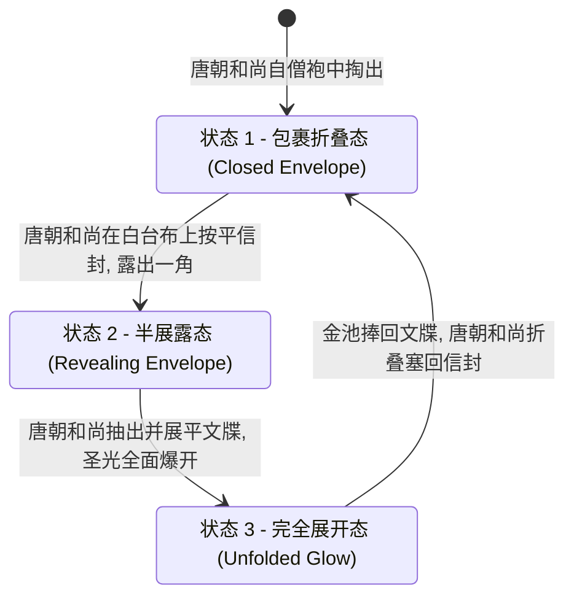

# 关键道具设计锁定卡 v1.0

本项目核心亮点道具为“黄金通关文牒”（替代原片的百万英镑支票）及其随附纸质信封，以及表现唐朝和尚吃相的“素面与筷子”。所有道具遵循 3D 卡通模型比例结合电影级物理反射效果的原则。

---

## 1. 黄金通关文牒 (The Golden Clearance Pass)

> **道具定位**：国家主权财富与权力的无限信用象征，大唐帝国最权威的关隘通行凭证，能让见钱眼开的老僧瞬间臣服的降维神物。

### 1.1 物理特征设计
*   **主体结构**：长约 45 厘米、宽约 20 厘米的卷轴。主体由纯金丝线与明黄色绸缎经纬交织而成，质地厚重而柔软。卷轴两端为黑檀木轴头，雕刻有祥云浮雕。
*   **表面文书与印章**：
    *   **大唐御笔**：文牒上以漆黑、苍劲有力的行草书写着“大唐敕命，御弟三藏，西天取经，关防无碍”等御笔字样。
    *   **传国玉玺**：文牒正中心盖有巨大的、朱红色的方形印章，印文为篆书八字：“受命于天，既寿永昌”（传国玉玺印记），印泥厚重，带有干涸的朱砂反光。
*   **视觉效果**：在没有光照时呈现暗哑的纯金织物感；一旦展开，金线在空气中触发折射，发出类似迪士尼/皮克斯特效的温暖、耀眼的**金色体积光晕 (Volumetric Golden Glow)**，伴有细微的金色尘埃微粒在光晕中漂浮。

### 1.2 随附纸质信封 (Envelope)
*   **物理特征**：一个脏兮兮、发黄变脆的宣纸信封，规格略大于折叠后的通关文牒。信封表面有几道明显的深褐色油污、菜汤渍和路途摩擦的毛边。
*   **喜剧反差**：极其破旧的包装信封与里面亮瞎双眼的黄金文牒形成强烈的视觉对比。

---

## 2. 黄金通关文牒状态机 (Prop State Machine)

为了配合剧本与镜头，文牒被赋予了三种物理状态：

### 2.1 状态 1：包裹折叠态 (State_Closed_Envelope)
*   **视觉呈现**：唐朝和尚从破旧僧袍里拿出的油污发黄大信封，平放在白色台布上。无任何光效，看起来像是一张废纸。
*   **允许交互**：唐朝和尚的手指按压信封，信封产生纸质折皱与纸屑粉尘摩擦声。
*   **安全边界**：油污与破损必须是卡通化的，严禁呈现污秽恶心感。

### 2.2 状态 2：半展露态 (State_Revealing_Envelope)
*   **视觉呈现**：信封被拆开，黄金文牒被抽出约三分之一，折叠平铺在桌面上。露出的那一角金线织金边缘在橘黄色的壁灯照耀下，折射出耀眼的一缕微弱金色高光。
*   **允许交互**：小二弯腰侧头，眼球凸出盯着露出的一角。
*   **安全边界**：此时只有高光反射，尚未产生体积圣光，为高潮爆发做铺垫。

### 3.3 状态 3：完全展开态 (State_Unfolded_Glow)
*   **视觉呈现**：文牒被完全推平，正中心的朱红“传国玉玺”印章赫然显现。文牒金线在空气中触发特效，爆发出向四周呈扇形辐射的暖金色圣光（Volumetric Light），照亮整张桌子，将周围人的脸庞投射为金色。
*   **允许交互**：金池长老手持放大镜凑近，镜片反射金光。小二下巴脱臼拉长。
*   **安全边界**：金色光晕必须温暖、神圣，严禁使用刺眼、锐利或带有攻击性的激光式强光。

---

## 3. 素面与竹筷 (Noodle Bowl & Chopsticks)

*   **素面陶碗**：一只粗糙的青灰色粗陶大碗，碗口有几处微小的卡通崩角。碗里盛着白皙的面条、清澈的汤底和三片绿油油的菜叶。
*   **进食印记**：唐朝和尚吃完面后，用手里的小面饼将碗底的汤汁和油渍擦拭得一干二净，使得陶碗内壁光洁如新，甚至能反照出小二傲慢的脸庞。
