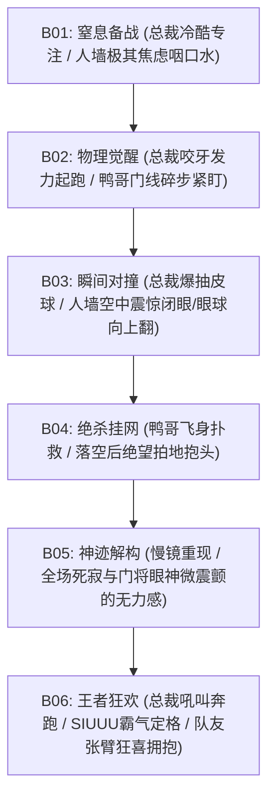

# 情绪连续性链 (Emotion Continuity Chains) - ronaldo-freekick-2018

本文件锁定 `ronaldo-freekick-2018` 项目中各角色在 35 秒经典任意球重现中的**情绪与微表情连续性链条 (Emotion Continuity Chain)**，确保剪辑和视频生成时人物神态的转换自然、戏剧张力层层递进。

---

## 1. 核心情绪流动图谱 (Emotional Arc)

本片情绪曲线呈现从 **“窒息博弈 $\rightarrow$ 瞬间爆发 $\rightarrow$ 极致落差 $\rightarrow$ 王者定格”** 的递进结构：

---

## 2. 角色情绪状态与面部特写控制 (Micro-Expression Continuity)

### 🔴 总裁 (葡萄牙进攻核心)
*   **B01 (窒息备战)**：
    *   *微表情*：眉头紧缩，眼神极其聚焦在右上死角，下唇抿紧，双颊微鼓。胸口剧烈鼓起吸气，呼出一股白汽冷气。
    *   *情绪*：绝对的冷酷与杀手般的冷静。
*   **B02 (提拉短裤与起跑)**：
    *   *微表情*：提拉短裤瞬间眼神微阖，大腿紧绷；起跑时双眼大睁，嘴角微抿咬紧，展现面部发力的肌肉线条。
    *   *情绪*：蓄能爆发与前冲的坚决。
*   **B03 (瞬间击球)**：
    *   *微表情*：身体侧倾击球瞬间，双眼圆瞪，眉头蹙至最深，牙齿紧咬（嘴角稍微向两侧拉扯）。
    *   *情绪*：绝对的力量集中与瞬间宣泄。
*   **B04 (绝杀挂网)**：
    *   *微表情*：保持击球后的单脚停顿姿态，面部发力松开，嘴角微扬，眼神追随足球破网，随后张大嘴发出一声无声的怒吼。
    *   *情绪*：得手后的狂放与胸有成竹。
*   **B06 (SIUUU庆祝)**：
    *   *微表情*：奔跑时张口狂吼，在起跳转体 180 度时嘴角紧闭蓄力；落地马步定格瞬间，头微低，随后傲然抬起，双眼瞪圆直视镜头，嘴里大喊“SIUUU！”，眉头挑起，展现霸王之姿。
    *   *情绪*：君临天下的狂傲与释放。

### ⚪ 白色人墙 (西班牙防守方)
*   **B01 (窒息备战)**：
    *   *微表情*：额头布满汗水，眼皮微颤，嘴巴微张，喉结上下滑动（生理性紧张）。
    *   *情绪*：面对总裁罚球仪式的极度焦虑与被动等待。
*   **B02 (总裁起跑)**：
    *   *微表情*：看到总裁起跑，瞳孔瞬间收缩，牙关咬紧，身体缩脖子护头。
    *   *情绪*：防御姿态的慌乱。
*   **B03 (子弹时间起跳)**：
    *   *微表情*：在半空子弹时间中，眼球滑稽地随着足球上升轨迹同步向上翻，面部肌肉因震惊而颤抖，部分队员闭眼不敢看。
    *   *情绪*：对完美飞行弧线的震惊与力所不及。
*   **B04 (球越人墙落地)**：
    *   *微表情*：转头目送，嘴巴大张呈滑稽的“吃瘪”状，面带绝望与茫然。
    *   *情绪*：防线失守的挫败。

### 🟡 鸭哥 (西班牙守门员)
*   **B01 (窒息备战)**：
    *   *微表情*：眉头紧锁，门线碎步横移，眼神死盯皮球与总裁脚尖，呼吸急促但动作紧凑。
    *   *情绪*：临战的极限紧绷。
*   **B03 (击球瞬间)**：
    *   *微表情*：皮球飞起瞬间，倒吸一口冷气，嘴角向下拉，身体快速向球门右上角斜跨飞跃。
    *   *情绪*：极限反应与身体能量觉醒。
*   **B04 (绝望飞扑落地)**：
    *   *微表情*：空中扑救差之毫厘时，双眼圆瞪到极限，眼角微拉（难以置信）；落地后单手拍地，双手抱头仰天闭眼，眉头深锁。
    *   *情绪*：极致飞扑无果的巨大落差与自我懊恼。
*   **B05 (慢镜回放)**：
    *   *微表情*：升格画面中特写其橙色手套指尖在空中微颤，面部呈极限专注与落空瞬间的“微弱战栗”。
    *   *情绪*：神迹被慢镜解构时的极致挫败与失神。

### 🔴 红衣队友 (葡萄牙进攻方)
*   **B01 (窒息备战)**：
    *   *微表情*：十指交叉抵住下巴，眼神在总裁和足球间滑动，眼神里满是祈祷与紧张，大气不敢喘。
    *   *情绪*：决定胜负时刻的焦虑祈盼。
*   **B04 (绝杀挂网)**：
    *   *微表情*：看到球挂网瞬间，十指猛然撒开，双眼大瞪，嘴张到最大发出狂叫，眼眉舒展。
    *   *情绪*：窒息感瞬间解除的疯狂宣泄。
*   **B06 (狂欢拥护)**：
    *   *微表情*：双眼发亮，大笑露出牙齿，奔向总裁时面带红晕和汗水，在总裁落地 SIUUU 爆开激波余波中狂喜大笑拥抱。
    *   *情绪*：绝平的狂喜与对巨星的无限拥戴。

---

## 3. 表演情感连续性去写实化硬性约束 (Downstream Rules)
1.  **禁忌的写实化痛苦**：鸭哥在扑救失败落地时，只允许表现“绝望抱头拍地”和“闭眼叹息”的失落神态，**严禁**出现任何写实的骨折痛苦特写、扭伤惨叫或写实流泪。白色人墙落地时也只允许抱头震惊吃瘪，不得出现被球闷到面部流血或痛苦写实特写。
2.  **情绪对焦锁死**：总裁深呼吸（B01）到提拉短裤起跑（B02）的情绪过渡，必须通过“深呼吸完毕呼气 $\rightarrow$ 眼神一冷”的面部微表情切换完成，眼神的冷酷杀气必须在起步前牢牢锁死，禁止眼神散漫或中途眨眼。
3.  **群像情绪烘托**：B06 总裁 SIUUU 定格瞬间是全片的高潮。总裁眼神的霸气孤傲，必须与背景中西班牙队员（白色人墙、鸭哥）如雕塑般的绝望瘫坐，以及飞奔而来的红衣队友的疯狂大笑形成三层情绪对比，突出“王者归来”的史诗氛围。
